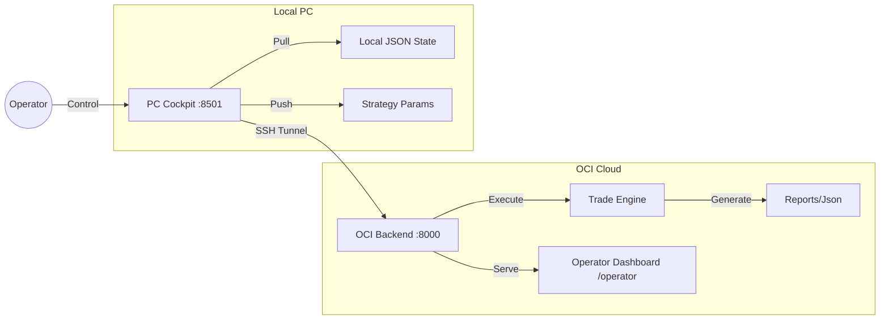

# 📈 KRX Alertor Modular (UI-First)

한국 ETF/주식 자동 매매 시스템 - **Safe & Silent Crisis Alpha Strategy**
User-Interface Driven Operations (Operator Cockpit & Dashboard)

[](https://www.python.org/downloads/)
[](https://opensource.org/licenses/MIT)

**System Version**: P146 (UI-First Operations)
**Last Update**: 2026-02-18

---

## 🚀 Project Status / Quick Start

이 시스템은 **PC Control Plane**과 **OCI Execution Plane**으로 분리되어 운영됩니다.

| 환경 | 역할 | 접속 주소 | 주요 기능 |
|------|------|-----------|-----------|
| **PC** | **Control Plane** (리모콘) | `http://localhost:8501` | **Cockpit**: Auto Ops 실행, 설정(파라미터) 관리, 결과 모니터링, SSH 터널링 |
| **OCI** | **Execution Plane** (엔진) | `http://<OCI_IP>:8000/operator` | **Operator Dashboard**: 보안 토큰 관리, 매매 Draft 검증, 주문 제출 본부 |

> ⚠️ **OCI 운영 주의사항**
> - **수동 실행 금지**: OCI에서 `uvicorn`을 직접 실행하지 마십시오. (포트 충돌 및 프로세스 고아화 원인)
> - **표준 재시작**: 반드시 `deploy/oci/restart_backend.sh` 또는 `sudo systemctl restart krx-backend`를 사용하십시오.

---

## 🔄 운영 루프 (Daily Ops Loop)

PC와 OCI는 "SSOT(Single Source of Truth)"와 "Artifact"를 통해 소통합니다.

| Action | 방향 | 내용 | 설명 |
|--------|------|------|------|
| **1. PUSH (OCI)** | PC → OCI | **Configuration** | PC에서 설정한 `Strategy Params`, `Universe` 등을 OCI로 전송합니다. |
| **2. Auto Ops** | PC(Trigger) | **Execution** | PC가 OCI에게 "매매 사이클 실행"을 명령합니다. (OCI가 스스로 리포트 생성) |
| **3. PULL (OCI)** | OCI → PC | **Sync State** | OCI의 `Ops Summary`, `Stage`, `Logs` 메타데이터를 PC로 가져와 화면을 갱신합니다**.* |

> ***주의**: PULL은 리포트 파일 전체를 미러링하지 않으며, 운영에 필요한 "상태값(State)"과 "최신 요약(Summary)"을 동기화합니다.

---

## 🏗️ UI-First 아키텍처



---

## 📚 표준 문서 (Documentation)

모든 운영은 **문서(Contract/Runbook)** 에 기반합니다.

### 1. 필독 운영 가이드
- **[STATE_LATEST.md](docs/handoff/STATE_LATEST.md)**: 현재 시스템 상태 및 최신 아키텍처 정의 (Living Document)
- **[runbook_ui_daily_ops_v1.md](docs/runbooks/runbook_ui_daily_ops_v1.md)**: **표준 UI 운영 매뉴얼** (매일 아침 수행)
- **[smoke_test.md](docs/ops/smoke_test.md)**: 배포 후 UI 기능 점검 리스트

### 2. 핵심 계약 (Contracts)
- **[contract_ops_summary_v1.md](docs/contracts/contract_ops_summary_v1.md)**: 운영 요약 스키마 (Ops Summary)
- **[contract_sync_v1.md](docs/contracts/contract_sync_v1.md)**: 동기화(Sync) 프로토콜 정의
- **[contracts_index.md](docs/contracts/contracts_index.md)**: 전체 계약 목록

---

## 🧪 개발 및 테스트

### 설치
```powershell
# Windows
py -3.10 -m venv .venv
.\.venv\Scripts\Activate.ps1
pip install -r requirements.txt
```

### 테스트 실행
```bash
pytest tests/ -v
```

---

## 📄 라이선스

MIT License

**Author**: Hyungsoo Kim
