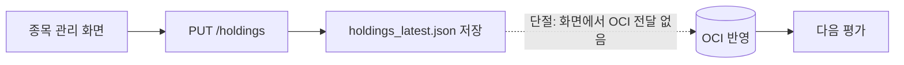
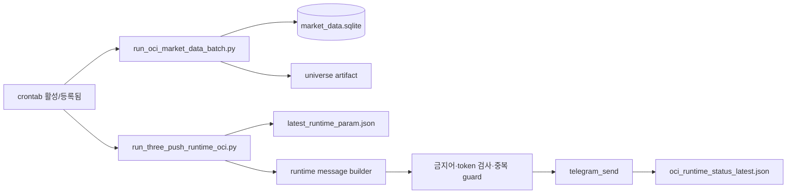

# PROGRAM_TRUTH.md

현행 프로그램 통합 설계서 (PROGRAM_TRUTH_RECONSTRUCTION_V1)

- **최종 반영**: 2026-08-10 — **POC3-08(종목 관리·보유 현황 그리드 UX 개선 A~D) 반영**. 종목 관리 입력에 종목코드 형식검증(영숫자 6자·저장 차단)·`etf_master` 종목명 자동조회(신규 GET `/holdings/etf-name`)·하단 고정 액션바·계좌 select 제한. `PUT /holdings` 저장 경로 strict_ticker=True. (그 전) 2026-08-06 POC3-07 반영: 메뉴 10키(diagnostics 신설·data_status·dashboard 흡수)·approval 축소·신규 API(`/oci/startup-status`·`/holdings/apply`)·기동 시 1회 OCI 읽기·Holdings 단일 payload OCI 적용.

---

## 0. 문서 권위와 사용 방법

- **목적**: 단계별 설계서·완료보고에 흩어진 사실을, "지금 소스가 실제로 무엇을 연결하고 있는가" 기준으로 하나로 정리한다. 앞으로 구조·실행 경로·PC/OCI 책임이 혼동되면 **가장 먼저 확인하는 canonical 문서**다.
- **적용 범위**: 현재 저장소(`e:/AI Study/krx_alertor_modular`)의 소스·설정·`state/` artifact. **OCI 호스트는 사용자 제공 실측 증거(2026-08-05)로 일부 RUNTIME_VERIFIED** — 아래 "OCI 런타임 실측(사용자 제공)" 참조.
- **OCI 런타임 실측 (사용자 제공 증거, 2026-08-05)**:
  - `crontab -l` 실측: Market 08:00 · Holdings 09:15/12:30/15:40 · 배치 07:20 · Spike 7틱 — **crontab 활성·등록됨**(DRAFT 아님).
  - `ls state/`: `runtime` Aug 5 15:40 · `universe`·`market` Aug 5 07:20 — **오늘 자동 실행 흔적**.
  - `logs/low_freq_push_cron.log`: holdings 35종목 처리 기록.
  - `state/three_push/oci_runtime_status_latest.json`: `"status":"sent"` · `"telegram_sent":true`(스냅샷은 2026-07-09자 spike, param manual_seed).
  - 사용자 증언: "OCI 크론탭 동작 + PUSH 잘 받고 있다."
  → **OCI 자동 운영(크론·배치·평가·Telegram 발송)은 RUNTIME_VERIFIED.** 단 `oci_runtime_status_latest.json` 최신 스냅샷 갱신 여부는 별도 확인 필요(아래 §14).
- **기준 revision / 조사일** (§10.1 실측):
  - branch: `main`
  - HEAD: `608907bc35ed11bffdd2e69a0f083c49d28fc0ca` (`608907bc`)
  - working tree: untracked 4건 — `.claude/hooks/result_doc_gate.sh`, `.claude/hooks/stop_verify_gate.sh`, `design/DESIGN-apple.md`, `docs.zip`. tracked 변경 0.
  - origin/main 대비 미push: **10 commit** (POC3-06 계열)
  - PC 배포 revision: `UNKNOWN` · OCI 배포 revision: `UNKNOWN`
  - 조사일시: 2026-08-05 (KST)
- **사실 등급**: `APPROVED_DESIGN` / `SOURCE_CONFIRMED` / `RUNTIME_VERIFIED` / `RUNTIME_UNVERIFIED` / `CONTRADICTION` / `UNKNOWN`. **SOURCE_CONFIRMED ≠ RUNTIME_VERIFIED** — 소스가 있다는 사실은 "OCI에서 실행 중"을 의미하지 않는다.
- **상태 분류**: `OPERATING` / `IMPLEMENTED_UNVERIFIED` / `CONNECTED_BUT_BROKEN` / `MOCK` / `DIAGNOSTIC` / `LEGACY` / `ORPHANED` / `DUPLICATED` / `UNKNOWN`. 필요 시 `주/보조`(예: `IMPLEMENTED_UNVERIFIED / DIAGNOSTIC`).
- **문서 충돌 우선순위**: 진행 상태는 `docs/STATE_LATEST.md`, 보류 항목은 `docs/backlog/BACKLOG.md`가 우선한다. 본 문서는 그 둘을 **대체하지 않는다**. 구조·연결·실행 경로 해석이 충돌하면 본 문서가 우선한다.
- **갱신 조건**: 화면/route/DB/스케줄/OCI 책임 변경 시 본 파일을 갱신(새 버전 파일 생성 금지).
- **본 문서 작성 중 부작용 0**: 소스·설정·DB·UI·테스트 무변경. Telegram 발송·OCI 전송·refresh 미실행. commit/push 미수행.

---

## 1. 프로그램의 원래 목적

`docs/PROJECT_ORIGIN_INTENT.md` (SOURCE_CONFIRMED):
- 한 줄 정의: **"AI와 함께 투자 방향 찾기"**.
- 사용자는 Python 초보. **인간이 최종 판단**하고 시스템은 관찰값·자료 상태를 제공한다(매수/매도 확정 문구 금지 — 여러 화면 주석·`KILL_SWITCHES` 확인).
- 현실 목표: 강한 흐름 섹터/ETF 발굴 → AI와 대화·판단, factor·ML 점진 도입.

---

## 2. 전체 시스템 구성

```mermaid
flowchart LR
  subgraph PC[PC — Windows]
    FE[Next.js Frontend\napp/page.tsx → MainPanel]
    BE[FastAPI Backend\napp/api.py]
    PCS[PC scripts\nscripts/*.py]
    SQL[(state/market/market_data.sqlite\nstate/runtime/runtime_state.sqlite\nstate/decision/decision_evidence.sqlite)]
    ART[state/*.json artifacts\nholdings_latest.json · runs/ · three_push/]
    CACHE[(state/market_cache/market_latest.json)]
  end
  subgraph EXT[외부 source]
    NAVER[Naver 시세]
    FDR[FinanceDataReader]
    PYKRX[pykrx]
  end
  subgraph OCI[OCI — Ubuntu /home/ubuntu/krx_hyungsoo — RUNTIME_VERIFIED 2026-08-05]
    OCIBATCH[run_oci_market_data_batch.py]
    OCIRUN[run_three_push_runtime_oci.py\n(정식) · run_three_push_oci.py(fallback)]
    CRON[crontab — 활성/등록됨]
  end
  TG[Telegram sendMessage]

  FE <-->|REST| BE
  BE --> SQL
  BE --> ART
  BE --> CACHE
  BE -->|/holdings/market/refresh| NAVER
  BE -->|/market/refresh BG job| FDR
  PCS -->|SSH/SCP| OCI
  OCIBATCH --> FDR
  OCIBATCH --> PYKRX
  OCIRUN --> TG
  CRON --> OCIBATCH
  CRON --> OCIRUN
```

경계 요약: **소스상 PC와 OCI 둘 다** 외부 시세 수집·메시지 생성 코드를 갖고 있다. **OCI 실행은 사용자 제공 실측(2026-08-05)으로 RUNTIME_VERIFIED** — crontab 활성, 오늘 배치·PUSH 실행 흔적 확인. PC→OCI 전달은 SSH/SCP 스크립트로만 존재(화면에서 트리거 안 함).

---

## 3. PC와 OCI 책임 계약 (승인 vs 현재 구현)

| 책임 | APPROVED_DESIGN (지시문 §3) | SOURCE_CONFIRMED (현재 소스) | 판정 |
|---|---|---|---|
| 시장 탐색·Market Discovery | PC | PC — `POST /market/refresh`(BG job, FDR) `app/api_market_topn.py :: @router.post("/market/refresh")` → `app/market_refresh_service.py` | 일치 |
| Holdings 입력·변경 | PC | PC — `PUT /holdings` `app/api.py`, `saveHoldings` | 일치 |
| Holdings 현재가 조회·평가 | **OCI** | **PC 도 수행** — `POST /holdings/market/refresh` `app/api.py :: post_market_refresh` 가 `market_naver.fetch_many` 직접 호출 | **CONTRADICTION** |
| 시세·시장 데이터 증분 최신화 | **OCI** | OCI 스크립트 존재(`run_oci_market_data_batch.py`) **+ PC 도 refresh 경로 보유**. OCI 배치 07:20 실측 실행(`state/universe`·`market` Aug 5 07:20) | **CONTRADICTION**(소스 이중) / **OCI RUNTIME_VERIFIED** |
| 메시지 artifact·초안 생성 | OCI | 양쪽 — PC `app/draft.py`, OCI `run_three_push_runtime_oci.py`. OCI 로그에 35종목 처리 기록 | 부분 CONTRADICTION / OCI RUNTIME_VERIFIED |
| Telegram PUSH 발송 | **OCI** | **PC 에도 직접 발송 함수 존재** — `app/three_push_runner_common.py :: telegram_send`. **정식 발송은 OCI crontab 이 수행**(사용자 "PUSH 잘 받고 있다" + `oci_runtime_status_latest.json` `telegram_sent:true`) | **CONTRADICTION**(PC 소스에도 존재·호출 가능) / **OCI 정식 발송 RUNTIME_VERIFIED** |
| freshness·중복·실패 기록 | OCI | OCI runner 소스에 존재(`oci_runtime_status_latest.json` `status:"sent"`) | SOURCE_CONFIRMED / RUNTIME_VERIFIED(스냅샷 2026-07-09자) |
| 정기 스케줄 | OCI crontab | **crontab 활성·등록됨**(사용자 `crontab -l` 실측: Market 08:00·Holdings 09:15/12:30/15:40·배치 07:20·Spike 7틱) | **RUNTIME_VERIFIED** |
| ML·백테스트·튜닝 | PC | PC — `scripts/run_ml_*.py`, `run_market_flow_*.py` | 일치 |

> 핵심: 지시문이 "OCI 전담"으로 승인한 **시세 갱신·평가·Telegram 발송이 PC 소스에도 구현되어 실행 가능**하다. 이는 이번 문서가 드러낸 최대 구조 불일치다(§13 참조).

---

## 4. 실행 환경과 진입점 (§10.2)

| 구분 | 진입점 | 근거 (파일 :: symbol) | 사실등급 |
|---|---|---|---|
| Frontend 시작 | Next.js app router | `frontend/app/page.tsx`, `frontend/app/layout.tsx`, `frontend/app/components/MainPanel.tsx :: MainPanel` | SOURCE_CONFIRMED |
| Backend 시작 | FastAPI app | `app/api.py :: app = FastAPI(...)` + 14× `include_router` | SOURCE_CONFIRMED |
| PC 시세 갱신(holdings) | REST 핸들러 | `app/api.py :: post_market_refresh` → `market_naver.fetch_many` | SOURCE_CONFIRMED |
| PC 시장 universe 갱신 | REST 핸들러(BG) | `app/api_market_topn.py :: @router.post("/market/refresh")` → `app/market_refresh_service.py` (FDR) | SOURCE_CONFIRMED |
| PC→OCI package 전달 | SSH/SCP 스크립트 | `scripts/sync_three_push_packages.py` | SOURCE_CONFIRMED / RUNTIME_UNVERIFIED |
| PC→OCI PARAM 전달 | SSH/SCP 스크립트 | `scripts/sync_three_push_runtime_param.py` | SOURCE_CONFIRMED / RUNTIME_UNVERIFIED |
| OCI 시장데이터 배치 | CLI(crontab 07:20) | `scripts/run_oci_market_data_batch.py` — 실측 실행(`state/market`·`universe` Aug 5 07:20) | SOURCE_CONFIRMED / RUNTIME_VERIFIED |
| OCI PUSH 정식 runner | CLI(crontab) | `scripts/run_three_push_runtime_oci.py` (PARAM runtime) — 실측 발송(`telegram_sent:true`) | SOURCE_CONFIRMED / RUNTIME_VERIFIED |
| OCI PUSH package fallback | CLI | `scripts/run_three_push_oci.py` (package 소비) | SOURCE_CONFIRMED / DUPLICATED / RUNTIME_UNVERIFIED |
| Telegram 실제 발송 | 함수 | `app/three_push_runner_common.py :: telegram_send` / `_telegram_send_one` | SOURCE_CONFIRMED |
| Telegram 메시지 생성 | 빌더 | `app/message_market_briefing.py`, `app/draft_message.py`, `app/three_push_runtime_message_builder.py` | SOURCE_CONFIRMED |
| DB 경로 결정 | 상수 | `market_data_store.py :: DEFAULT_DB_PATH`, `runtime_state_db.py :: DEFAULT_DB_PATH`, `decision_evidence_store.py :: DEFAULT_DB_PATH` (환경변수 override 미발견) | SOURCE_CONFIRMED |
| scheduler/cron | OCI crontab(활성) | 저장소 문서 `docs/handoff/OCI_LOW_FREQUENCY_TELEGRAM_PUSH_OPERATION_V1_CRONTAB.md` + **OCI 호스트 `crontab -l` 실측 활성** | RUNTIME_VERIFIED |

> crontab 은 **저장소에는 문서로만** 존재(`.service`/실제 crontab 파일은 저장소에 없음)하지만, **OCI 호스트에는 실제로 등록·활성**되어 있음이 사용자 `crontab -l` 실측(2026-08-05)으로 확인됨 → OCI 스케줄 = RUNTIME_VERIFIED. (저장소 tracked 아님 = 배포는 사람이 OCI 에 직접 등록.)

---

## 5. 화면 및 사용자 기능 (§10.3~10.4)

라우팅은 URL 폴더 분기가 아니라 `MainPanel` 의 클라이언트 상태(`MenuKey` switch)로 처리(`MainPanel.tsx :: switch(active)`). 좌측 5그룹(`LeftSidebar.tsx :: MENU_GROUPS`). 첫 진입 = `today_check`.

### 5.1 전체 화면 요약표

| MenuKey | 라벨 | 컴포넌트 | 그룹 | 성격 | 상태 |
|---|---|---|---|---|---|
| today_check | 오늘의 투자 점검 | `TodayInvestmentCheckView` | 오늘 확인 | 운영 대시보드 | IMPLEMENTED_UNVERIFIED (데이터 의존) |
| workbench | ETF 비교하기 | `JudgmentWorkbenchView` | 비교·판단 | 읽기 판단 | IMPLEMENTED_UNVERIFIED |
| market_discovery | 요즘 잘 오르는 ETF | `MarketDiscoveryView` | 비교·판단 | 운영(시장 갱신 트리거) | IMPLEMENTED_UNVERIFIED |
| etf_exposure | ETF 구성종목 | `ETFExposureView` | 비교·판단 | 조회 | IMPLEMENTED_UNVERIFIED |
| ai_sessions | AI 투자 세션 | `AISessionsView` | 비교·판단 | 기록 | IMPLEMENTED_UNVERIFIED |
| holdings | 보유 현황 | `HoldingsView` | 보유·자료 관리 | 평가·시세 갱신 | IMPLEMENTED_UNVERIFIED |
| holdings_manage | 종목 관리 | `HoldingsManageView` | 보유·자료 관리 | 입력·저장·**OCI 적용**(POC3-07)·**형식검증+종목명 자동조회**(POC3-08) | IMPLEMENTED_UNVERIFIED |
| holdings_evidence | 확인 근거 | `HoldingsEvidenceView` | 보유·자료 관리 | 읽기 근거 | IMPLEMENTED_UNVERIFIED |
| approval | 승인·적용 | `ApprovalTelegramView` | 승인·운영 | 운영(PARAM·seed OCI 적용) — POC3-07 역할 축소 | IMPLEMENTED_UNVERIFIED |
| diagnostics | 진단·상태 | `DiagnosticsView` | 진단·상태 | 진단·미리보기·LEGACY 흡수(POC3-07 신규) | DIAGNOSTIC |

> **POC3-07(2026-08-06) 메뉴 재편**: MenuKey 11→10. `data_status`·`dashboard` 제거 → `diagnostics` 신설·흡수. `DataStatusView`·`DashboardView` 컴포넌트는 존재하나 `DiagnosticsView` 내부에서만 참조(정상 메뉴 진입점 아님). `approval` 라벨 "승인·알림"→"승인·적용", 정보 PUSH 카드·미리보기·샘플은 `diagnostics`로 이동.

### 5.2 화면별 요지 (근거 symbol)

- **today_check** (`TodayInvestmentCheckView`): 최초 진입 시 `fetchMarketTopnLatest` · `fetchEnrichedHoldings` · `fetchHoldingsMarketEvidence` · `fetchNavDiscountLatest` 자동 조회. KOSPI 위치·국면·오늘 먼저 볼 보유 ETF 최대 3건(= backend `judgment_summary` 표시)·정비 큐. **표시 데이터가 저장 DB/캐시에 의존** → 데이터 부실 시 빈 화면(§13).
- **market_discovery** (`MarketDiscoveryView`): "최신 시장 데이터 갱신" 버튼 → `POST /market/refresh` (FDR BG job). **PC가 외부 수집을 트리거하는 운영 경로**.
- **holdings_manage**: `PUT /holdings`(saveHoldings) → `state/holdings/holdings_latest.json` 로컬 저장 + **POC3-07: `POST /holdings/apply`(OCI 적용 버튼)**. 저장과 OCI 적용은 **별도 동작**. 적용은 단일 payload atomic replace(별도 manifest 파일 없음, active 재독출 hash 확인). 사용자 명시 클릭만. **POC3-08 (A·B·D)**: 종목코드 입력 시 `GET /holdings/etf-name` 로 `etf_master` 종목명 자동조회(있으면 이름칸 자동채움·✓, 없으면 개별주 경고 ⚠·저장 허용). 형식(영숫자 6자) 위반은 저장 차단(✗) — `PUT /holdings` 가 `strict_ticker=True` 로 최종 방어(`app/holdings.py :: TICKER_PATTERN`). 단 `load()`(읽기)는 lenient 유지(기존 비정형 값 하위호환). 계좌는 추천 목록 select 로 제한(자유입력 차단). 저장 흐름(경고·오류→저장→결과)은 하단 고정 액션바.
- **holdings**(보유 현황): `POST /holdings/market/refresh`(Naver) + `fetchEnrichedHoldings`. 시세 갱신은 PC 직접.
- **approval**(승인·적용, POC3-07 축소): `ApprovalTelegramView` — `OciAlertHeader` + `ThreePushParamCard`(PARAM·seed OCI 적용)만. 정보 PUSH 카드·미리보기·샘플·개발호환·현재 run 표시는 **`diagnostics`로 이동**. 빈 승인 카드 안 만듦(직전 POC3 확정).
- **diagnostics**(진단·상태, POC3-07 신규): `DiagnosticsView` — (a) 기동 시 OCI 상태 상세(`GET /oci/startup-status`), (b) `DataStatusView`(placeholder 포함) 흡수, (c) 미리보기·샘플(`ManualPreviewSection`·`DevCompatSection`, PREVIEW/TEST 표기), (d) `DashboardView`(LEGACY, details 접힘). 정상 업무 아님.
- **첫 화면 OCI 한 줄**(POC3-07): `today_check` 상단에 `GET /oci/startup-status` 로 기동 시 읽은 OCI 상태 한 줄 + 진단·상태 링크. 이 GET 은 **백엔드 기동 시 1회 읽은 캐시** 반환(요청·새로고침으로 OCI 재조회 안 함).

> 전체 버튼→handler→API 매핑은 §6 API 표 + 부록 A 색인에서 교차 확인.

---

## 6. API 및 Backend 기능 (§10.5)

### 6.1 Frontend가 실제 호출하는 API (SOURCE_CONFIRMED)

`frontend/lib/api/*.ts` 의 export 함수 → route:

| FE 함수 | method path | 성격 |
|---|---|---|
| fetchHoldings / saveHoldings | GET·PUT `/holdings` | 운영 |
| fetchEnrichedHoldings | GET `/holdings/enriched` | 운영 |
| refreshMarket(holdings) | POST `/holdings/market/refresh` | 운영 (Naver 직접) |
| refreshMarket(universe) | POST `/market/refresh` | 운영 (FDR BG) |
| fetchMarketRefreshStatus | GET `/market/refresh/status` | 조회 |
| fetchMarketTopnLatest | GET `/market/topn/latest` | 운영 |
| fetchHoldingsMarketEvidence | GET `/holdings/market-evidence/latest` | 운영(judgment_summary 포함) |
| fetchNavDiscountLatest | GET `/market/nav-discount/latest` | 조회 |
| fetchPriceSeries / fetchBenchmarkSeries | GET `/market/price-series` | 조회 |
| fetchConstituentsAnalysis / refreshConstituents | GET·POST `/market/constituents/refresh` | 조회·갱신 |
| generateDraft / generateDraftFromHoldings | POST `/runs/generate` · `/runs/generate-from-holdings` | 운영(초안) |
| generateMarketBriefingDraft / generateSpikeAlertDraft | POST `/runs/generate` 계열 | 운영(초안) |
| fetchRun / approveRun / rejectRun | GET·POST `/runs/{id}`(+/approve,/reject) | 운영(승인 게이트) |
| createDecisionSession / fetchDecisionSession(s) | POST·GET `/decision/sessions` | 기록 |
| fetchMlReadinessLatest / fetchMlBaselineV0Latest / fetchMlFeatureSanityLatest / fetchMlJobsLatest / fetchMlBaselineEvidenceSnapshot | GET `/ml/*/latest` | 조회(ML evidence) |
| (evidence refresh) | POST `/ml/jobs/evidence-refresh` | 갱신 |
| fetchThreePushParamState / applyThreePushParamToOci | GET·POST `/three-push/param/state`·`/apply` | 조회·운영(OCI 적용 + content_sha256 표시) |
| fetchOciStartupStatus | GET `/oci/startup-status` | 조회(**POC3-07** 기동 시 1회 읽은 OCI 상태 캐시. 요청마다 재조회 안 함) |
| applyHoldingsToOci | POST `/holdings/apply` | 운영(**POC3-07** Holdings 단일 payload atomic replace, 사용자 명시 클릭만) |
| fetchEtfName | GET `/holdings/etf-name?ticker=` | 조회(**POC3-08** `etf_master` 종목명 자동조회 · found=false=개별주/미등록 경고용 · 읽기전용) |
| refreshUniverseMomentum | (universe) | 갱신 |

### 6.2 소비자 관점 분류

- **FE 사용 API**: 위 표.
- **router prefix 주의 (정정)**: 일부 라우터는 `APIRouter(prefix=...)` 를 쓰므로 라우터 내부의 상대 path(`/apply`,`/state`,`/run`)가 실제 full path 가 아니다. 실측 결과 **모두 FE 가 full path 로 호출**한다:
  - `/three-push/param/apply` · `/three-push/param/state` — `app/api_three_push_param.py`(prefix `/three-push/param`), FE `frontend/lib/api/threePushParam.ts`
  - `/market/relative-upside/run` — `app/api_ml_relative_upside.py`(prefix `/market/relative-upside`), FE `frontend/lib/api/mlRelativeUpside.ts`
  - `/decision-draft/preview` — `app/api_decision_draft_preview.py`, FE `frontend/lib/api/decisionDraftPreview.ts`
  → **이들은 ORPHANED 가 아니라 운영 API 다.** (초기 조사에서 상대 path 만 보고 오분류했던 것을 소스 재확인으로 정정.)
- **실제 ORPHANED 후보**: 현재까지 FE·스크립트 소비자를 확정하지 못한 것만 개별 재확인 대상으로 남긴다(부록 B). 상대 path 로 인한 오분류는 위에서 제거함.
- **승인 게이트 부작용**: `POST /runs/{id}/approve` → `app/api.py :: post_approve` 가 `BackgroundTasks` 로 **SCP OCI inbox 전달 워커**(`_execute_delivery`) 위임. `app/delivery.py :: deliver` 는 `OCI_SSH_TARGET`/`OCI_REMOTE_INBOX` 필요.
- **`200 OK ≠ 작업 성공` 경로**: `deliver`/approve 계열은 SCP 성공 여부가 OCI 환경변수·SSH에 의존 → HTTP 200이어도 실제 OCI 전달은 별개(§13).

---

## 7. DB·table·artifact (§10.6)

### 7.1 SQLite (3개, 모두 `state/` 로컬)

| 논리 이름 | 경로 | 결정 symbol | 주요 producer/consumer | 성격 |
|---|---|---|---|---|
| 시장 데이터 DB | `state/market/market_data.sqlite` | `market_data_store.py :: DEFAULT_DB_PATH` | producer: refresh 서비스·배치 / consumer: topn·evidence·nav·constituents·ml_feature | authoritative (시장 SSOT, `market_topn.py` 명시) |
| runtime state DB | `state/runtime/runtime_state.sqlite` | `runtime_state_db.py :: DEFAULT_DB_PATH` | active PARAM SSOT(Cutover v1) | authoritative(PARAM) |
| decision evidence DB | `state/decision/decision_evidence.sqlite` | `decision_evidence_store.py :: DEFAULT_DB_PATH` | decision sessions | authoritative(세션) |

> `etf_nav_store`·`etf_constituents_store`·`market_benchmark_store`·`ml_feature_store` 는 **같은 파일**(`market_data.sqlite`)에 별도 table 로 저장(각 파일 docstring). 환경변수 경로 override 미발견 → PC/OCI 모두 상대경로 `state/...` 사용.

### 7.2 주요 JSON artifact (`state/`)

| artifact | producer | 성격 |
|---|---|---|
| `state/holdings/holdings_latest.json` | `saveHoldings`(PUT /holdings) | authoritative 보유목록 |
| `state/market_cache/market_latest.json` | `/holdings/market/refresh`(Naver) | cache(현재가) |
| `state/runs/run_*.json` | 초안 생성(run) | run snapshot |
| `state/three_push/params/latest_runtime_param.json` | PARAM 생성 | OCI runtime 입력(SSOT) |
| `state/three_push/packages/latest_*.json` + `manifest.json` | PC package 생성 | OCI fallback 입력 (6/18자 — stale) |
| `state/ml/*_latest.json` / `.csv` | ML 스크립트 | ML evidence snapshot |
| `state/diagnostics/*_latest.json`, `state/market/*_diagnosis_latest.json` | 진단 스크립트 | DIAGNOSTIC |
| `*.bak-2026-07-05-150001` | 백업 | LEGACY/백업 |

> **DB 파일 존재 ≠ OCI 프로세스가 그 DB를 읽음**: 위 경로/타임스탬프는 PC 저장소 실측. OCI 호스트에서는 사용자 실측(2026-08-05)으로 `state/market`·`universe`(Aug 5 07:20)·`runtime`(Aug 5 15:40) artifact 가 crontab 실행으로 갱신됨이 확인됨(그 범위는 RUNTIME_VERIFIED). 단 OCI `state/runtime_state.sqlite` 가 0바이트(Jul 26)로 관측된 건과의 정합은 §14 미확인.

---

## 8. 외부 데이터 source (§10.7)

| source | 목적 | 진입점 (symbol) | 인증 | fallback | 현재 사용 | 등급 |
|---|---|---|---|---|---|---|
| Naver 시세 | holdings 현재가 | `app/market_cache.py`/`market_naver` ← `post_market_refresh` | 불요(비공식) | pykrx/yfinance = POC2-Step2A 이연(미구현) | PC 사용 | SOURCE_CONFIRMED |
| FinanceDataReader (FDR) | ETF universe·가격·KOSPI/VIX | `app/api_universe.py`, `market_benchmark_store.py`, `kospi_history_closeout.py` | 불요(비공식) | pykrx 일부 | PC·OCI | SOURCE_CONFIRMED |
| pykrx | ETF universe·NAV·구성종목 | `etf_constituents_fetcher.py`, `etf_nav_service.py` | 불요 | — | 사용(일부 empty 응답 이력) | SOURCE_CONFIRMED |

> fallback 존재해도 **동일 데이터 의미 보장은 별개**(설계서 §5.2·BACKLOG 기록). KRX Open API 잔존 의존은 미발견(진단 문서에 후보로만).
> **KOSPI 데이터 정상 확인**: `market_benchmark_daily_price` 의 KOSPI 저장값(6,690대)은 **실제 지수와 일치**함이 사용자 실측(2026-08-05 종가 6,598.26 +3.76%)으로 확인됨. 산식 정확·데이터 정상 — 이전 초안의 "스케일 이상/품질 의심"은 오판이었음(정정).

---

## 9. 종단 프로세스 (§11)

### 프로세스 A — Holdings 변경

- **APPROVED**: PC 입력 → PC 저장 → OCI 전달 → OCI 반영 → 다음 평가 사용.
- **SOURCE 현재**: `HoldingsManageView` → `PUT /holdings`(`saveHoldings`) → `state/holdings/holdings_latest.json` 저장 + **POC3-07: `POST /holdings/apply`(OCI 적용 버튼)** → 단일 payload atomic replace → active 재독출 hash 확인.
- **단절 지점 (POC3-07 이후 정정)**: 이제 화면에서 OCI 적용 가능(별도 sync 스크립트 불필요). 단 **저장·적용은 별도 2동작**(설계자 Q3 명시적 분리)이고, **실전 write 는 사용자 명시 클릭 필요**(개발자 dry-run만 — Q11). 실패 시 기존 active 보존.
- 등급: SOURCE_CONFIRMED(PC 저장·OCI 적용 코드) / RUNTIME_VERIFIED 미완(사용자 실클릭 전).



### 프로세스 B — 승인 기준(seed·PARAM) 전달

- **SOURCE**: PARAM = `state/three_push/params/latest_runtime_param.json`(runtime_state.sqlite SSOT). PC→OCI 전달 = `scripts/sync_three_push_runtime_param.py`(SSH/SCP, `OCI_SSH_TARGET` 필요).
- **최초 단절 지점**: 전달이 **화면 밖 수동 스크립트**. OCI 적용 실측 불가.
- 등급: SOURCE_CONFIRMED(스크립트 존재) / RUNTIME_UNVERIFIED(OCI 적용).

### 프로세스 C — OCI 자동 운영과 Telegram



- **RUNTIME_VERIFIED (사용자 실측 2026-08-05)**: crontab 활성(Market 08:00·Holdings 09:15/12:30/15:40·배치 07:20·Spike 7틱), `state/` Aug 5 갱신, 로그 35종목 처리, `oci_runtime_status_latest.json` `telegram_sent:true`, 사용자 "PUSH 잘 받고 있다". → **자동 운영 정상 작동**.
- **status 파일 성격 확정(실측)**: `oci_runtime_status_latest.json` 은 **spike push 1건(2026-07-09)의 status 만 유지**하며 kind 별 덮어쓰기 — 최근 Market·Holdings 발송은 이 파일을 갱신하지 않음. 이 파일 단독으로 job별 최신 상태를 판정하면 stale 오염(§14). 구분 불가 job 은 UNKNOWN.
- **DUPLICATED**: 정식 `run_three_push_runtime_oci.py`(PARAM runtime, 메시지 새로 생성) vs fallback `run_three_push_oci.py`(PC package 소비) 두 경로 공존.
- 등급: SOURCE_CONFIRMED(스크립트) / **RUNTIME_VERIFIED(스케줄·발송)**.

### 프로세스 D — PC 운영 점검

- **SOURCE**: `today_check`/`diagnostics`/`approval` 화면이 최신 topn·evidence·nav·run 상태를 조회. **POC3-07 이후 OCI 상태는 `diagnostics`(+today_check 한 줄)가 `GET /oci/startup-status`(기동 시 1회 읽은 캐시)로 표시** — 단 개별 PUSH job 최신 성공/실패는 UNKNOWN(단일 status 파일 한계).
- **최초 단절 지점**: **"OCI 최신 성공 시각·PUSH 결과 조회"** — PC 화면이 OCI 실행 결과를 가져오는 API/동기화 경로 미확인.
- 등급: SOURCE_CONFIRMED(PC 조회 화면) / UNKNOWN(OCI 결과 PC 노출).

### 기타 흐름
- Market Discovery(운영, PC FDR 갱신)·Workbench(읽기)·AI Sessions(기록)·ML(스크립트) 존재 — 상세는 §5·§6.

---

## 10. 자동 운영 구조 (§10.8)

- scheduler: **OCI crontab 활성**(사용자 `crontab -l` 실측) → Market 08:00·Holdings 09:15/12:30/15:40·배치 07:20·Spike 7틱. RUNTIME_VERIFIED.
- 최신화: `run_oci_market_data_batch.py`(OCI, crontab 07:20 실측 실행) + PC `/market/refresh`·`/holdings/market/refresh`.
- 평가: `holdings_market_evidence.build_holdings_market_evidence`(PC API), OCI 평가는 로그상 35종목 처리 RUNTIME_VERIFIED.
- artifact/Telegram/freshness/중복: OCI runner 소스에 존재, **crontab 으로 실행·발송됨**(`telegram_sent:true`) RUNTIME_VERIFIED.
- 로그: `logs/low_freq_push_cron.log`(OCI) — 사용자 tail 로 Aug 5 활동·holdings 35종목 확인.

---

## 11. 운영·진단·MOCK·LEGACY 분류

| 항목 | 분류 |
|---|---|
| today_check / holdings / holdings_manage / holdings_evidence / market_discovery / workbench / approval | IMPLEMENTED_UNVERIFIED (운영 의도, 런타임 데이터 의존) |
| diagnostics(진단·상태, POC3-07 신규) | DIAGNOSTIC (기동 OCI 상태·DataStatus·미리보기/샘플·LEGACY 대시보드 흡수) |
| `DataStatusView`(→diagnostics 흡수) | DIAGNOSTIC / 부분 MOCK (placeholder-card). 정상 메뉴 진입점 제거됨(POC3-07) |
| `DashboardView`(→diagnostics 내 LEGACY) | LEGACY. 정상 메뉴 진입점 제거됨(POC3-07) |
| `oci_startup_status.py`·`holdings_oci_apply.py`(POC3-07 신규) | 운영 — 기동 시 1회 OCI 읽기(읽기전용) · Holdings 단일 payload OCI 적용 |
| `frontend .../_orphaned/HoldingsClient.tsx`, `_orphaned/HoldingsMarketEvidenceCard.tsx` | ORPHANED (참조 끊김, POC3-05) |
| `frontend .../approval/InfoPushGuideCards.tsx` | ORPHANED 후보 (approval 축소로 미참조, POC3-07 — 삭제 미결) |
| `run_three_push_runtime_oci.py` ↔ `run_three_push_oci.py` | DUPLICATED (정식/fallback) |
| `scripts/diagnose_*`, `check_ml_feature_sanity.py`, `run_push_content_gap_diagnosis.py`, `verify_*_oci.py` | DIAGNOSTIC |
| `/three-push/param/apply`·`/state`, `/market/relative-upside/run`, `/decision-draft/preview` | **운영 API** (prefix 붙은 full path 로 FE 호출됨 — ORPHANED 아님, 정정) |
| `telegram_send` PC 직접 발송 | 운영구조상 LEGACY/비승인 경로(§3 CONTRADICTION) |
| `state/market/*.bak-*` | LEGACY 백업 |

---

## 12. 현재 운영 방법 (소스로 가능한 실제 절차)

- **평상시 자동 운영**: **정상 작동** — OCI crontab 이 시장데이터 배치(07:20)·Holdings PUSH(09:15/12:30/15:40)·Market(08:00)·Spike(7틱)를 자동 실행하고 Telegram 발송(`telegram_sent:true`, 사용자 수신 확인). RUNTIME_VERIFIED(2026-08-05).
- **Holdings 변경**: 종목 관리 화면 저장(PC 로컬) + **POC3-07: OCI 적용 버튼(`POST /holdings/apply`)** 으로 화면에서 OCI 반영. 저장·적용 별도 동작(Q3). 실전 write 는 사용자 명시 클릭(Q11).
- **PARAM·seed 변경**: PC 생성 후 `sync_three_push_runtime_param.py` 수동 실행 필요.
- **수동 운영 점검**: today_check/approval 화면에서 PC 조회 가능. OCI 실행 결과를 PC 화면이 직접 가져오는 경로는 미확인(§9 프로세스 D).
- **최신화 실패 확인**: PC `/market/refresh/status` 로 PC 갱신 상태 확인 가능. OCI 배치 실패는 OCI `logs/low_freq_push_cron.log` 로 확인(사용자 tail 로 실측 가능).
- **Telegram 미수신 확인**: **정식 경로 = OCI crontab 이 정상 발송 중**. PC 개발자 세션에서 PUSH 가 안 가는 것은 정상 — PC 는 `telegram_send` 직접 호출(비정식·수동)만 가능하고, 자동 발송은 OCI 담당이기 때문.

> 미적용/미검증으로 잘못 단정하지 않는다. OCI 자동 운영은 사용자 실측으로 RUNTIME_VERIFIED.

---

## 13. 프로세스 단절과 불일치

1. **PC가 Telegram·시세갱신·평가를 직접 수행 (승인구조는 OCI 전담)**
   - 기대: OCI 전담. 실제: `telegram_send`·`post_market_refresh`(Naver)·`build_holdings_market_evidence` PC 소스에 존재·호출 가능.
   - 최초 단절: 승인구조와 소스 구현의 경계 자체가 어긋남.
   - 사용자 영향: PC에서 비정식 발송·갱신이 가능해 "무엇이 진짜 운영 경로인가" 혼동.
   - 증거: `app/three_push_runner_common.py :: telegram_send`, `app/api.py :: post_market_refresh`.
   - 상태: CONTRADICTION. 설계 판단 필요.

2. **저장소는 crontab 을 문서로만 보유 (실 crontab 은 OCI 호스트에만 등록)**
   - 실제: OCI 호스트 `crontab -l` 은 **활성**(사용자 실측 2026-08-05)이나, 저장소에는 `.service`/실 crontab 파일이 없고 handoff 문서(DRAFT 표기)만 있음.
   - 최초 단절: 스케줄의 SSOT 가 저장소 밖(OCI 호스트 수동 등록)에 있어 저장소만 보면 미적용으로 오독하기 쉬움.
   - 사용자 영향: 자동 PUSH 는 **정상 작동 중**. "PC에서 PUSH가 안 간다" 는 것은 PC 가 정식 경로가 아니기 때문(§12).
   - 증거: 사용자 `crontab -l` 실측 · `state/` Aug 5 갱신 · `oci_runtime_status_latest.json` `telegram_sent:true`.
   - 상태: OCI 스케줄 RUNTIME_VERIFIED / 저장소-호스트 SSOT 이원화는 기록상 위험(문서만으로 상태 오독 가능).

3. **Holdings/PARAM 의 OCI 적용 — POC3-07 로 화면 연결됨(정정)**
   - 이전: 저장은 화면, OCI 전달은 사람이 `sync_*` 수동 실행 → 반영 보장 없음.
   - **POC3-07 이후**: `종목 관리 > OCI 적용`(`POST /holdings/apply`) · `승인·적용`(`POST /three-push/param/apply`)으로 화면에서 OCI 적용. 적용 결과 상태 표시(OCI_APPLIED/OUT_OF_SYNC/APPLY_FAILED/UNKNOWN).
   - 남은 것: 실전 write 는 **사용자 명시 클릭 필요**(개발자 dry-run만, Q11). 저장·적용은 별도 2동작(Q3). 구 `sync_*` 스크립트도 존재(중복 경로).
   - 상태: CONNECTED(화면↔OCI 적용 경로 있음) / 실사용 확인은 사용자 몫.

4. **KOSPI 데이터 정상 (이전 의심 철회)**
   - 산식 정확, 저장값(6,690대)도 **실제 지수와 일치**(사용자 실측 2026-08-05 종가 6,598.26). today_check·PUSH 값의 큰 변동은 실제 시장 움직임을 정직하게 반영한 것.
   - 상태: 코드·데이터 모두 정상. 별도 이슈 아님(초안의 "품질 의심"은 컷오프 기준 오판이었음, 정정).

5. **DUPLICATED OCI PUSH runner** (정식 runtime vs package fallback) — 정리 대상.

6. **ORPHANED 후보 API** — 초기 조사에서 `/apply`·`/state`·`/run`·`/decision-draft/preview` 를 후보로 적었으나, **prefix 붙은 full path 로 FE 가 호출하는 운영 API 로 정정**(§6.2). 남은 개별 재확인 대상은 `GET /runs`(목록 — FE 는 `/runs/{id}` 단건만 호출) 뿐.

---

**RUNTIME_VERIFIED 로 승격됨 (개발자 직접 OCI 읽기 실측 2026-08-05, `ubuntu@krx-alertor-vm`)** — 초안에서 UNVERIFIED 로 적었으나 확인됨:
- OCI 호스트 crontab 활성·스케줄: VERIFIED. `crontab -l` 실측 — Market 08:00 / Holdings 09:15·12:30·15:40(slot OPEN·MIDDAY·CLOSE) / 배치 07:20 / Spike 09:30~15:20 다수. runner = `scripts/run_three_push_runtime_oci.py --push-kind …`.
- OCI 측 `state/` artifact 최신성: VERIFIED.
- **OCI `state/runtime/runtime_state.sqlite` = 167,936 bytes, 2026-08-05 15:40 (정상)**. → 초안의 "0바이트(Jul 26)" 는 **오래된 관측이었고 현재는 정상**. OCI 가 PARAM SSOT sqlite 를 실제로 쓰고 있음(AC-26: 0바이트 이슈 해소).
- **OCI 실제 Holdings 소스 = `state/holdings/holdings_latest.json`** (`app/holdings.py :: load()`, PC·OCI 동일 경로). package(`state/three_push/packages/latest_holdings_briefing.json`)는 2026-06-18 자 fallback 이며 실제 holdings PUSH 소스 아님. 현재가는 runner 실행 시 실시간 조회.
- OCI Telegram 발송: VERIFIED(사용자 수신 확인).

**`oci_runtime_status_latest.json` 성격 확정 (실측)**: 2026-07-09 15:30, `push_kind:"spike_or_falling_alert"`, `status:"sent"`, 629 bytes. → 이 파일은 **spike push 1건의 status 만 유지**하며 kind 별로 덮어써진다. **최근 Market·Holdings 발송은 이 파일을 갱신하지 않음** → 이 파일은 "최신 전체 운영 상태" 지표가 아니다. (그래서 job별 최신 status 를 이 단일 파일로 판정하면 stale 오염 — 설계 §8.1 지적과 일치. 구분 불가 job 은 UNKNOWN 으로 남긴다.)

**여전히 UNKNOWN / 별도 확인 필요:**
- PC 배포 revision · OCI 배포 revision(정확한 커밋 sha): UNKNOWN.
- 로그의 `private_fields_exposed` 항목: **소스 확인 완료(2026-08-06)** — 값을 노출하는 필드가 아니라 `app/runtime_evidence/diagnostics.py :: detect_private_values_exposed` 로 개인값 노출 여부를 실측 스캔한 **탐지 boolean**(하드코드 False 금지 가드). 값 자체는 민감정보 아님. 단 실제 `true` 관측 이력(=실제 노출 발생) 조사는 런타임 로그 분석 BACKLOG.
- `GET /runs`(run 목록)의 실제 소비자: UNKNOWN(FE 는 `/runs/{id}` 단건만 호출). 나머지 `/apply`·`/state`·`/run`·`/decision-draft/preview` 는 FE 호출 확인됨(§6.2 정정).
- `market_data.sqlite` KOSPI 데이터: **정상 확인됨**(실제 지수와 일치, 2026-08-05 실측). 원천 파이프라인 자체의 세부 검증은 별도지만 값 정합은 확인.

---

## 15. 현재 구현을 이용한 운영 단순화 재료 (제안 아님 · 기록만)

- **운영 승격 후보**: PC `/holdings/market/refresh`·`/market/refresh`·`build_holdings_market_evidence` — 이미 작동하는 PC 경로. (단 §3 승인구조와의 경계는 설계자 결정.)
- **중복 제거 후보**: OCI PUSH runner 2개(runtime/package) 중 하나로 단일화.
- **진단 격리 ✅ POC3-07 완료**: `data_status`(placeholder)·미리보기/샘플을 `diagnostics`(진단·상태) 화면으로 분리. `diagnose_*`/`verify_*_oci` 스크립트는 여전히 스크립트 레벨.
- **LEGACY 차단 ✅ POC3-07 부분완료**: `dashboard`(기존 대시보드)를 `diagnostics` 내 LEGACY(details 접힘)로 격리·정상 메뉴 제거. `_orphaned/*`·`*.bak-*` 는 그대로.
- **사용자 조작 단계 축소 △ POC3-07**: Holdings 저장→OCI 적용을 화면 버튼(`POST /holdings/apply`)으로 연결. 단 저장·적용은 여전히 별도 2동작(설계자 Q3 — 명시적 분리 의도).

---

## 부록 A. Source Evidence Index (기능별 symbol)

- 화면 컨테이너: `frontend/app/components/MainPanel.tsx :: MainPanel` / `LeftSidebar.tsx :: MENU_GROUPS, MenuKey, assertMenuGroupsCover`
- 오늘 점검: `TodayInvestmentCheckView.tsx :: JudgmentQueueSection, KospiHeadline`
- 보유: `HoldingsView.tsx` · `HoldingsManageView.tsx :: onSave, isValidTickerFormat, lookupTicker`(POC3-08) · `HoldingsEvidenceView.tsx` · `HoldingsRiskEvidenceSection.tsx`
- **종목 형식검증/종목명 조회(POC3-08)**: `app/holdings.py :: TICKER_PATTERN, validate_holdings(strict_ticker=)` · `app/api.py :: put_holdings(strict_ticker=True), get_etf_name_lookup(GET /holdings/etf-name)` · `app/market_data_store.py :: get_etf_name`(재사용) · `frontend/lib/api/holdings.ts :: fetchEtfName`
- 승인/PUSH: `ApprovalTelegramView.tsx`(POC3-07 축소=OciAlertHeader+ThreePushParamCard) · `approval/ManualPreviewSection.tsx`·`DevCompatSection.tsx`(→DiagnosticsView 참조) · `ThreePushDraftCard.tsx`
- **진단·상태(POC3-07)**: `frontend/app/components/DiagnosticsView.tsx` · `frontend/lib/api/ociStartupStatus.ts` · `holdingsApply.ts`
- **OCI 적용/기동읽기(POC3-07)**: `app/oci_startup_status.py :: refresh_snapshot, get_snapshot` · `app/api_oci_startup_status.py`(GET /oci/startup-status) · `app/holdings_oci_apply.py :: apply_holdings_to_oci`(단일 payload atomic replace) · `app/api_holdings_oci_apply.py`(POST /holdings/apply) · `app/api.py :: _lifespan`(기동 시 OCI 읽기 1회)
- Backend app: `app/api.py :: post_market_refresh, post_approve, _execute_delivery`
- Evidence/composer: `app/holdings_market_evidence.py :: build_holdings_market_evidence, _build_judgment_summary` · `app/market_summary_composer.py :: compose_judgment_summary, select_top_holdings`
- 시장/국면: `app/market_topn.py :: compute_topn` · `app/market_regime.py :: compute_market_context, compute_kospi_position_metrics, compute_regime_streak`
- 메시지: `app/message_market_briefing.py :: build_market_briefing_message` · `app/draft_message.py :: build_message_text, _render_today_holdings_lines` · `app/three_push_runtime_message_builder.py`
- 발송: `app/three_push_runner_common.py :: telegram_send, _telegram_send_one`
- 전달: `app/delivery.py :: deliver` · `scripts/sync_three_push_packages.py` · `scripts/sync_three_push_runtime_param.py`
- OCI runner: `scripts/run_three_push_runtime_oci.py` · `scripts/run_three_push_oci.py` · `scripts/run_oci_market_data_batch.py`
- DB: `app/market_data_store.py`, `app/runtime_state_db.py`, `app/decision_evidence_store.py` :: `DEFAULT_DB_PATH`

## 부록 B. 미사용·고아 코드 후보 (삭제 아님 · 후보만)

- `frontend/app/components/_orphaned/HoldingsClient.tsx`, `_orphaned/HoldingsMarketEvidenceCard.tsx` (ORPHANED, POC3-05)
- `frontend/app/components/approval/InfoPushGuideCards.tsx` (ORPHANED 후보 — approval 축소로 미참조, POC3-07. 삭제 미결)
- `state/market/*.bak-2026-07-05-150001`, `state/ml/*.bak-*` (백업)
- (정정) 초기 조사에서 ORPHANED 후보로 적었던 `/apply`·`/state`·`/run`·`/decision-draft/preview` 는 prefix 붙은 full path 로 FE 가 호출하는 운영 API 로 확인됨 → 후보에서 제외. `/runs`(GET 목록)만 FE 직접 호출 미검출 상태로 남음(개별 재확인).

## 부록 C. 용어 정의 (소스 기준)

- **seed**: 운영 대상 유니버스 후보 목록(승인 대상). PC 확정.
- **PARAM**: 3-PUSH runtime 파라미터(`latest_runtime_param.json`, runtime_state.sqlite SSOT). enabled_push_kinds·schema_version 포함.
- **Holdings**: 보유 종목 목록(`holdings_latest.json`).
- **artifact**: `state/` 아래 생성물(JSON/CSV/DB) — 운영·진단·스냅샷.
- **freshness**: 기준일/최신성 검증(배치·runner 의 fail-closed 판정).
- **runtime price**: OCI/PC가 조회한 현재가(cache). **valuation price**: 평가 계산에 쓰인 가격(평가액·손익 산출 기준).

---

문서 끝.
