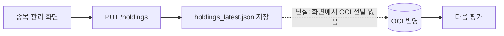
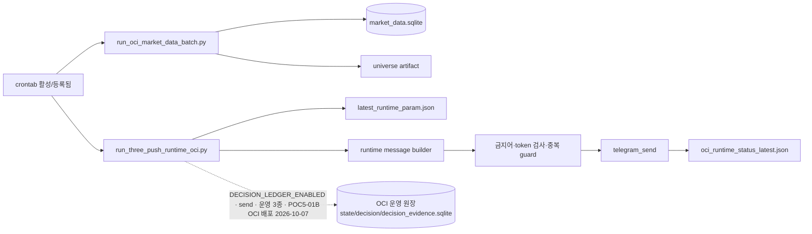

# PROGRAM_TRUTH.md

현행 프로그램 통합 설계서 (PROGRAM_TRUTH_RECONSTRUCTION_V1)

- **최종 반영**: 2026-10-07 — **`POC5-02` 가격 결과 성숙(저장소 코드 · 검증자 r1 VERIFIED · 설계자 RESULT PASS_TO_DEPLOY_AFTER_GATE · 미커밋 · OCI 미배포 — 배포 게이트 = POC5-01B 첫 거래일 확인)**: 08:10 · 09:20 배치 `main()` 이 기존 기록 · 출력을 끝낸 뒤 원장의 `PRIMARY_LIVE` · 예정 회차 · 평가 가능 item 에 +1/+5/+20 거래일 원시 가격 결과를 새 표 `price_outcome` 에 한 번씩 INSERT 한다(격리 · 배치 status · 상태 JSON · stdout · exit code 불변 · 외부 조회 · cron · FDR 0). 계열 = KRX 무조정 ETF 표 · KRX 코스피 개별주 표 · KOSPI 공식 종가. 날짜 = 운영 거래일 캘린더만. `MATURED` = +1 ~ horizon 종가 전부 저장 · 빠진 날은 채우기 창(ETF 21 · 개별주 31 거래일) 안이면 대기 · 지나면 `PRICE_MISSING`(§7.1 · C-4 · §12 · 부록 A). 대조 CLI `--legacy`(§4). 설계 `docs/ai_design/POC5/POC5-02_PRICE_OUTCOME_MATURITY_DESIGN_V1.md` · PLAN 같은 이름 `ai_plan`.
- (그 전) 2026-10-07 — **`POC5-01B` 운영 의사결정 이벤트 원장(검증자 r3 VERIFIED · 커밋 · push 2026-10-07 · 설계자 RESULT PASS_TO_DEPLOY · OCI pull 2026-10-07 15:56 · 플래그 켬 · 첫 거래일 10-08 확인 전 — OCI `.env` `DECISION_LEDGER_ENABLED=true` 전까지 원장 쓰기 0)**: 활성 = 플래그 ∧ `mode=send` ∧ 운영 3종일 때만 OCI `state/decision/decision_evidence.sqlite`(폴더 0700 · 파일 0600 · WAL)에 `evaluation_run` · `signal_item` · `delivery` · `ledger_meta` 4테이블(§7.1). 러너 `@_ledger.boundary` · `begin` · `_finish` 안 `finalize` · `attach_assembly` · `attach_send` · `wrap_insert_status`(§4 · §9 C · 부록 A). record · JSONL · runtime DB · 본문 · 판정 · 상태 파일 · 시세 조회 수 불변 — 단 run() 밖으로 나가는 예외의 traceback 에 원장 모듈 frame 이 더해진다(원장 비활성이면 경계 frame 1개 · 원장이 켜진 실행의 insert_status 예외만 2개(경계 + wrap_insert_status)). flow 수집 자리(C-1 · C-4 · 장중 급등락 · 부록 A) · 읽기 전용 대조 CLI `scripts/run_decision_ledger_reconcile.py`(§4 · §12). PC 는 같은 경로의 기존 AI 세션 DB 를 쓰고 원장은 비활성이다 — PC `.env` 에 플래그가 없어서이고, 코드에 PC · OCI 판별은 없다(§7.1). 같은 반영에서 `POC5-01A` 배포 전 표현 3곳(§4 runner 행 · C-1 근거 · 부록 A `_finish`)을 배포 완료로 고쳤다. 설계 `docs/ai_design/POC5/POC5-01B_OPERATIONAL_DECISION_EVENT_LEDGER_DESIGN_V1.md` · PLAN · 결과서 같은 이름 `ai_plan` · `ai_result`.
- (그 전) 2026-10-07 — **`POC3-02D-OPS-04` 남은 운영 정정 6건(검증자 r2 VERIFIED · 커밋 · push 2026-10-06 · 설계자 PASS_TO_DEPLOY · OCI pull 2026-10-06 21:40 · 첫 거래일 2026-10-07 확인 통과 · `IMPLEMENTED_VERIFIED_DEPLOYED_OPERATION_CONFIRMED`)**: ① 보유 코스피 개별주 파생값 = KRX 공식 종가(새 표 `krx_stock_daily_price_unadjusted` · `sto/stk_bydd_trd` · C-1 · C-4) ② 08:30 배치 실패 고지에서 FDR 단계 실패 제외(C-4) ③ 「OCI 운영·적용」 ① `장중 대표 ETF` 행 ④ 누락 거래일 가드 — 운영 코드 변경 없음(기존 가드 확인 · 개별주 경로 테스트) ⑤ 창 빈 날 09:20 일시 오류 보강 1회(C-4 · §7.2) ⑥ PARAM '전달' 과 '활성' 구분(① `운영 기준 활성` 행 · ② 카드 문구 · §9 프로세스 B). 설계 `docs/ai_design/POC3/POC3-02D-OPS-04_REMAINING_OPERATIONAL_CORRECTIONS_DESIGN_V1.md` · PLAN 같은 이름 `ai_plan`.
- (그 전) 2026-10-03 — **`POC5-01A` 세 PUSH 러너 기계 분리(검증자 `VERIFIED` 2026-10-04 · OCI pull 2026-10-04 · 10-06 첫 거래일 확인 통과 · `IMPLEMENTED_VERIFIED_DEPLOYED_OPERATION_CONFIRMED`)**: `scripts/run_three_push_runtime_oci.py` 646 → 517줄 — 실행 기록 시작 · 종료(`_finish` 본문) `app/three_push_runtime/runner_record.py` · PARAM · 비밀값 · slot · kind 활성 사전 검사 `runner_preflight.py` · kind 조립(§3-c · §3-d · §3-e) · flag 뒤 판정(§6-c) `runner_dispatch.py`. 동작 · 본문 · 판정 · 상태 저장 순서 · 예외 종류와 전파 여부 · CLI · cron · DB 변경 0(PARAM 실패 경로의 예외 문맥 연결 1건만 다름 — 결과서 §6-1 · 동등성 검증 `scripts/poc5_01a/runner_split_equivalence.py` · 검증 전용). 같은 날 **후속 배포 확인**: 한국 거래일 계약 정정 커밋 7d507951은 2026-10-02 17:56 KST OCI pull로 반영됐다. OCI HEAD는 7d507951이며 OCI runner blob은 저장소 기준 blob f256677020232600627d207c54baf5081c70c6e2와 일치한다. OPS-03은 재개방하지 않는다. (개발자 OCI 읽기 전용 확인 · 아래 '다음 pull' 표기 3곳을 반영 완료로 정정). (그 전) 2026-10-02 — **`POC3-02D-OPS-03` 운영 데이터 최신성 · 자료원 복구 `IMPLEMENTED_VERIFIED_DEPLOYED_OPERATION_CONFIRMED`**(검증자 `VERIFIED` r3 2026-10-01 · 커밋 `7feddf2c` · OCI pull + cron 3줄 2026-10-01 · 첫 거래일 2026-10-02 실측 통과 · 사용자 결정으로 10-06 재실측 생략) · 운영 상태 `OPERATING`(`OPERATING_DEGRADED` 해제 — 국내 T-2 · KOSPI 정지 해소). 종료 커밋: 한국 거래일 계약 정정(설계자 2026-10-02 · 「OCI 운영·적용」 `거래일 기준` · `미국 휴장일 달력` 행 · 연도 파일 없는 해 5월 1일 · 12월 31일 휴장 · 저장 자료 없는 평일 건너뛰기 · 달력 준비 경고는 미국만 — PC 화면 행은 바로 · OCI 는 2026-10-02 17:56 KST pull 로 반영 · C-4). 운영에서 바뀐 것: 시간 계약 명시 개정(설계자 2026-09-29 · 사용자 결정) — 배치 07:20 → **08:10** · KRX 목표일(T-1) 시도 08:10 · 08:15 · 08:20 · 08:24 · 마감 08:27 · 시장 브리핑 08:00 → **08:30** · 09:20 KRX 전용 보강 1회(프로세스 C-4). 국내 최신성 = 기준일 == 기대 직전 거래일(T-1) · 5일 · 20일 = 거래일 날짜(시장 브리핑 · 장중 「신규 진입 검토」 · C-4 · 장중 급등락 절). 배치 단계별 실패 격리 · FDR timeout · 배치 실패 고지 하루 1회(C-4). KOSPI 자료원 KRX `idx/kospi_dd_trd` 공식 종가 · 최신 = 기대 T-1 정확 일치(C7 `lag ≤ 1` 폐기) · 09-17 정정 증거 · 차트 · AI 복사 텍스트 · 스냅샷도 같은 판정(§8 · §13-4). S&P500 = 가장 최근 완료 NYSE 세션(C-4). 보유 브리핑 20거래일 기준일 = 거래일 캘린더(C-1). 「OCI 운영·적용」 ① `거래일 달력` 행(§5.2). 설계자 RESULT 필수 보완(2026-09-30 · 저장소 코드 기준): 보유 PUSH 가격 기준 `ETF_KRX_UNADJUSTED__STOCK_FDR` — ETF 20거래일 전 · 구간 종가 = KRX 무조정 표 · 개별주 20거래일 수익률 · 고점 대비는 혼합 확정으로 늘 닫음(확정 계약 10 `DONE` · C-1) · KRX 적재 성공 조건에서 대표 ETF 커버리지 제외 · 장중 「신규 진입 검토」만 대표 27종 T-1 100% 관문(C-4 · 장중 급등락 절) · 창 빈 날 채우기 같은 날짜 하루 1회 호출 기록(C-4) · KOSPI 08:15 · 08:20 · 08:24 재시도(§8) · KOSPI 화면 제목 `KOSPI (보조)` · 출처 `출처: 한국거래소(KRX)` · KOSPI 카드 기준일 = KOSPI 기준일 · 정비 큐 KOSPI 항목 · 판정 · 문구 생성기 `frontend/lib/kospiStatus.ts`(§5.2 · §13-4). (그 전) 2026-09-29 — **`POC3-02D-OPS-02` 장중 전달 상태 · KOSPI 화면 상태 (검증자 VERIFIED 2026-09-29 · OCI 반영 2026-09-29 밤 · 새 코드 첫 장중 실행 2026-09-30)** · **운영 상태 `OPERATING_DEGRADED`(설계자 2026-09-29)** — 08:00 「오늘 볼 기초지수」 · 장중 「신규 진입 검토」 5일 · 20일이 매 거래일 T-2(07:20 에 KRX 가 T-1 을 아직 주지 않음 · OCI 실측) · KOSPI 원자료 09-17 정지 → `POC3-02D-OPS-03` 에서 복구(`POC5-01A` 는 그 뒤): 장중 급등락 억제 비교를 관측 `state` 가 아니라 마지막 성공 전달 상태(`last_delivered_state`)와 한다 — 잘림 · 전송 실패 · 부분 전송 · 조립 뒤 예외로 전달되지 못한 상태 변화가 다음 틱에 다시 후보가 된다(장중 급등락 절). 「오늘의 투자 점검」 · 「요즘 잘 오르는 ETF」 KOSPI 표시가 상태별 배지 · 기준 줄 · 사유 줄로 바뀐다(`GET /market/topn/latest` 선택 필드 3개 · §13-4). 낡은 fingerprint 역검증 ⑦ 정리(3-3). (그 전) 2026-09-27 — **메뉴 합침(사용자 직접 지시 · UI 전용)**: 「승인·적용」과 「OCI 운영 상태」를 한 화면 **「OCI 운영·적용」**(`approval`)으로 합쳤다 — ① 지금 OCI 상태(읽기만) · ② OCI 에 적용(현재 운영 기준 · 장중 급등락 설정). MenuKey 13→12(`oci_status` 없음). 두 적용 카드는 배치만 정리(문구 · 상태 구분 · 버튼 동작 불변 · §5.2). (같은 날) **`POC3-02D-OPS-01` 운영 정정 C1~C7 (검증자 VERIFIED 2026-09-27 · OCI 반영 2026-09-27 · 첫 거래일 2026-09-28 운영 확인)**. 08:00 기초지수 구역의 공식 CSV 를 파일명 상수 대신 공용 resolver 가 고르고(최신 유효 `krx_etf_basic_YYYYMMDD.csv`), 적재가 짧은 신규 ETF 는 차단하지 않고 pending 으로 기록하며, 갱신이 필요하면 08:00 본문 끝에 안내 1줄을 붙인다(C-3) · 「OCI 운영 상태」 필수 판정 = 운영 3종(§9-D) · 「장중 급등락」 '기준' 줄 실행 시각 · 잘린 보유 급락 재판정 · 15:40 '발송 실패 N회'(장중 급등락 절) · KOSPI 적재 stale 을 `failed` 로 기록(§8). OCI 쪽 정정(07:20 · 08:00 · 장중 · 15:40 · OCI 배치 KOSPI)은 2026-09-27 OCI `git pull` 로 반영됐고 2026-09-28 첫 거래일에 07:20 · 08:00 정상 동작을 확인했다(08:00 기초지수 구역 복귀 · STATE_LATEST). PC 쪽(OCI 상태 판정 · PC 수동 갱신 KOSPI)은 PC 백엔드 재기동(2026-09-27)으로 반영됐다. (그 전) 2026-09-26 — KRX 연구 DB consumer 에 POC4-03 러너 추가(§7.1). 2026-09-25 — **POC3 운영 상태 정정**. 장중 급등락 정책 `enabled=true`(2026-09-21 23:48 사용자 승인) · 정기 PUSH(시장 브리핑 08:00 · 보유 브리핑 3슬롯)는 2026-09-18 `02C-OPS-01` 배포부터 **내용이 같아도 발송**(C-1·C-2) · 보유 브리핑 상태 저장 3경우(C-1 `상태 확정`) · 현재 cron 7틱은 `holdings_risk_alert`, 폐지된 `spike_or_falling_alert` 는 cron 0건(§3·§10·§12) · KRX 연구 DB 는 공용 reader 와 POC4-02·03 러너만 읽는다(§7.1). 2026-08-29 이후의 본문 갱신(OPS-01A · OPS-02A · OPS-02B-2 · 02C · POC4-01·02)은 이 머리글에 따로 적지 않았다 — 각 절 참조.
- (그 전) 2026-08-29 — **REJECT 참고점수 판단 화면 비활성 (POC3-ML-02 REJECT Closeout)**. `relative_upside_v0` 이 유효성 검증에서 **`REJECT` 확정**(상위 10% net 25bp `−1.214 %/월` · CI `[−2.495%, −0.213%]`)돼 **판단 화면에서 소비하지 않는다**. 표시·정렬을 5곳에서 제거했다 — `요즘 잘 오르는 ETF` 후보 **표**(점수 열·점수 근거 열·점수 정렬 토글·사용자 고지 배너) · 후보 **카드**(점수 배지·점수 근거) · `ETF 비교하기`(정렬 키 `score`·정렬 버튼 `참고점수`·행 표시·선택 상세) · `보유와 비교`(타입에서 `"score"` 리터럴 삭제·정렬 키·정렬 버튼) · `보유와 비교` **선택 상세**(점수·사유). **대체 표시를 두지 않는다** — 비활성 선택지·`0`·`사용 불가`·경고 배지 전부 없음. 후보 카드의 빈 큰 숫자 자리만 **1개월 수익률**로 채웠고(결측은 `0` 아닌 `—`), `ETF 비교하기` 행은 자리 자체를 없앴다(아래 facts 줄에 이미 1M 이 있어 중복을 만들지 않는다). **후보 순서는 API 응답 순서 그대로** — 점수의 존재·부재·크기가 순서에 개입하지 않는다(세 화면 모두 기본 정렬이 이미 API 순서였다: 표 `scoreSort="off"` · 워크벤치 `useSort("rank")` · 보유와비교 `"default"`). **정상 정렬은 보존** — 워크벤치 `순위·1M·3M·KODEX초과·고점대비` 5개, 보유와비교 `20일 초과·고점 대비·보유 노출` 3개. **API 응답 필드는 유지**(`relative_upside_score`·`relative_upside_reasons` 등) — 계약 보존·연구 재현용이며 화면이 소비하지 않을 뿐이다. **백엔드·DB·artifact·OCI·PUSH·cron 변경 0건.** `ML 실험` 화면의 수동 실행은 **연구용 baseline 으로 유지**하고 그 카드 안에 `relative_upside_v0` · `REJECT` · `연구용 baseline이며 투자 판단에 사용하지 않음` 을 명시한다(이 문구와 점수는 ML 화면 밖에 노출하지 않는다). 실행 성공 후 후보 화면으로 넘어가던 링크는 제거했다. 결과서 `docs/ai_result/POC3/POC3-ML-02-CLOSEOUT_REJECTED_SCORE_DEACTIVATION_RESULT.md`.
- (그 전) 2026-08-25 — **ML feature·evidence 체인 복구 (POC3-ML-01 · 검증자 `VERIFIED`)**. `요즘 잘 오르는 ETF`·`ETF 비교하기`·`보유와 비교` 의 **참고점수·판단 사유·고점 대비가 실제 값으로 표시**되고 **`고점대비` 정렬이 실동작**한다(이전에는 전 종목 `null` 이라 정렬이 무의미했다). `etf_ml_feature_daily` **1,376,524행**(`2014-05-12`~`2026-08-20` · ETF **1,171**) · `market_risk_feature_daily` **3,013행** · 점수 snapshot **1,157종목** 적재. **두 체인은 독립이다** — 참고점수·사유·`drawdown_20d` 는 feature 테이블을 거치지 않고 `etf_daily_price` 를 직접 읽는다(`ml_relative_upside_features.py`). **증분 갱신은 수동** — `ML 실험` → `ML 근거 갱신`(`POST /ml/jobs/evidence-refresh`). 자동 스케줄러·OCI 역할 변경 0건. 코드 변경은 `ml_job_runner._run_feature` 의 0건 가드 1건뿐이며 (가드를 snapshot 기록 앞으로 + `and`→`or`), **계산 불가 종목은 `0` 으로 위장하지 않고 `—`** 로 둔다. 결과서 `docs/ai_result/POC3/POC3-ML-01_ML_FEATURE_AND_EVIDENCE_CHAIN_RESTORATION_RESULT.md`. **⚠ 2026-08-29 정정**: 이 항목의 *"참고점수·판단 사유가 실제 값으로 표시된다"* 는 **더 이상 사실이 아니다** — `relative_upside_v0` REJECT 확정으로 판단 화면에서 제거했다(맨 위 항목). `고점 대비` 표시와 `고점대비` 정렬은 그대로 살아 있다.
- (그 전) 2026-08-19 — **구성종목 수집 깊이 30 + 등락률 열 제거 (설계 확정 구현)**. 외부 호출을 가두는 상한(**ETF 1회 10개 · delay 0.5s · 예산 30s · 캐시 우선**)은 그대로 두고, **ETF 안에서 담는 깊이만 10 → 30**. 같은 source·endpoint 를 **1회** 부르되 `pageSize` 를 요청 깊이에 맞춘다(실측: `pageSize=30` → 30건, `componentCount=200` · 069500 · 2026-08-19). **표시 깊이와 중복률 깊이를 분리** — `top_holdings` 는 30, **중복률·반복 등장 집계는 항상 상위 10 고정**이라 `Top 10 기준` 문구와 `common_count_top10` 필드명이 계속 사실이다. 응답에 `overlap_top_k` 추가. **구 정책으로 정확히 10건 저장된 캐시는 완료로 보지 않고 재수집**하되, 그 외 건수(= source 고갈)는 캐시를 그대로 쓴다. `upsert` 가 rank 단위 `ON CONFLICT` 라 **30건 스냅샷이 이후 10건 수집으로 축소되지 않는다**(회귀 테스트로 고정). 구성종목 탭 제목 `상위 구성종목` · 요약 `상위 N개 표시 · 표시 비중 합계 XX.XX%`(`전체 구성종목` 표현 금지). **등락률 열·`unavailable` 안내문 제거** — 대체값 없음, API·DB 에 빈 필드 추가 없음. 개별주 등락률 수집은 **BACKLOG**(§2 기존 항목 갱신). **DB 스키마·신규 endpoint·신규 의존성 0건.** 결과서 `docs/ai_result/POC3/POC3-CONSTITUENTS_DEPTH30_AND_CHANGE_RATE_REMOVAL_RESULT.md`.
- (그 전) 2026-08-19 — **중복률 탭 카드 전환 + 구성종목 탭 식별 줄 정리**. `etf_exposure` 의 `중복률` 탭이 표 2개(쌍 5열 + 반복 종목 4열) → **카드 2벌**(`.wb-hrow.compact` 재사용). 쌍 정렬 세그먼트 3종 신설(기본 **중복률 높은순** — 이전엔 정렬이 없어 93% 쌍이 목록에 묻혔다), **겹침 없는 쌍은 0% 로 쓰지 않고**(`겹치는 종목 없음` 배지) 정렬에서 항상 뒤로 보낸다. 반복 종목 카드에 **최고 비중** + 해당 ETF 이름. **ETF 이름은 응답이 아니라 draft 후보 스냅샷에서 온다** — 네이버 구성종목 API 가 ETF 자기 이름을 주지 않아 `etf_constituents.etf_name` 이 저장 시점부터 전부 `NULL`(DB 실측). `ETFExposureView` 가 맵을 만들어 `OverlapTab`·`ConstituentsTab` 에 넘긴다(백엔드·수집 경로 변경 0건 · draft 에 없으면 티커 그대로). 구성종목 탭 summary 줄은 **이름 먼저 · 티커 뒤 · source 는 상세 안쪽(+`asof`)** 으로 바꾸고 배지를 공용 `.wb-hb` 로 통일했다(이 화면만 테두리 알약이었음 · 정상 배지는 사용자 판단으로 유지). 결과서 `docs/ai_result/POC3/POC3-OVERLAP_TAB_CARD_CONVERSION_RESULT.md`. **설계 판단 요청 2건**(구성종목 상위 10건 제한 · 등락률 미연결) → `docs/handoff/POC3/POC3_CONSTITUENTS_TOPK_AND_CHANGE_RATE_QUESTION.md`.
- (그 전) 2026-08-19 — **보유와 비교 카드 전환 + 보유 기간 수익률 확장(백엔드) + 좌우 2열 배치 정정 + 선택 보유 상세 채움**. 이 탭의 목적은 *보유↔추천 비교* 인데, **보유 evidence 에 1개월·3개월밖에 없어 같은 기간 비교가 불가능**했다. `holdings_market_evidence` 가 후보 `returns` 의 `six_month`·`twelve_month` 를 옮기지 않고 버리던 것을 연결해 **양쪽 모두 1/3/6/12개월**을 같은 자리에 놓는다(신규 계산·외부 조회 0건). `ReturnsPayload` 에 optional 필드 2개 추가 — **`status` 판정은 기존대로 1M/3M 기준 유지**(따라서 `ok` 여도 6·12개월이 `null` 일 수 있음). 화면은 표 2개 → 카드(상호 배타 선택·판단 초안 미리보기 무변경). **⚠ 2026-08-19 정정**: 최초 기록의 *"2열 배치 무변경"* 은 사실이 아니었다 — 전환 이전은 `1fr 360px` 에 보유/후보가 **세로로 쌓인** 형태였고 목업만 좌우 2열이었다. 사용자 지시로 `.cmp-twocol`(`auto-fit, minmax(430px,1fr)`) **좌우 2열**로 맞추고 선택 상세를 2열 아래 전체 폭으로 내렸다. 같은 날 `선택 보유 상세` 에 **보유 내역·후보 관계·단기 흐름·KODEX 대비·NAV 괴리·구성종목 겹침·확인 근거** 7줄을 채웠다(`SelectedHoldingDetail.tsx` 신규 · 응답에 이미 있는 값만 · 신규 계산 0건). 후보 카드의 **참고점수 제거** — 이 환경에서 항상 `null`(ML 미실행)이라 응답의 `basis`+`rank` 로 `1개월 1위` 표기 대체. `선택 보유 상세` 의 중복 3줄 제거(→ 2026-08-19 에 카드에 없는 값 7줄로 채움). 결과서 `docs/ai_result/POC3/POC3-HOLDINGS_COMPARE_CARD_CONVERSION_RESULT.md`.
- (그 전) 2026-08-16 — **요즘 잘 오르는 ETF 후보 카드 전환**. `market_discovery` 의 후보 보기가 `카드`(기본) / `표` / `보유와 비교` 3탭이 됐다(기존 `기본` 탭 → `카드`). 카드는 다른 화면과 같은 규칙(좌 2단 + 우 지표 + 정상이면 배지 숨김)이고, 카드에 없는 항목(6개월·12개월·3년·KODEX200 대비 3M·고점 대비·점수 근거)은 **행을 펼치면** 나온다 — 열을 버리지 않는다. **`1년` 열 제거**(backend `twelve_month` 를 두 번 표시하던 중복 · 17열→16열). 표는 `width:100%` 에 16열이 눌려 답답하던 것을 **가로 스크롤 + `min-width:1500px`** 로 풀었다(글자 크기는 원래 14px, 변경 없음). 보유 여부 배지를 위해 이 화면이 `DASH_KEY_HOLDINGS` 공유 캐시를 조회하게 됐다(신규 endpoint·N+1 없음). 결과서 `docs/ai_result/POC3/POC3-MARKET_DISCOVERY_CARD_CONVERSION_RESULT.md`.
- (같은 날) **손익 색 국내 관례 전환 + 배지 규칙 통일**. 방향 색을 전용 토큰(`--pnl-up #d92d20` 상승·이익 / `--pnl-down #1570ef` 하락·손실)으로 신설하고 **6개 지점**(`.pnl-pos`/`.pnl-neg` · `directionColor` · `returnPctColor` · `returnColor` · DashboardView 인라인 2)을 전부 그 토큰으로 통일 — 앞으로 방향 색 변경은 토큰 두 줄로 끝난다. **상태 색**(괴리율 크기 경고 `pctColor` · 상태 배지 `badgeColor` · 노출 상태 `exposureColorByState`)은 방향이 아니므로 제외. 보유 탭 배지는 후보 탭 규칙에 맞춰 **정상이면 숨김**(상시 참이던 `보유` 배지 제거, `NAV`/`구성종목`/`근거 정상` 숨김) — 배지가 없으면 전부 정상이라는 뜻. 결과서 `docs/ai_result/POC3/POC3-PNL_COLOR_AND_BADGE_CONSISTENCY_RESULT.md`.
- (같은 날) **메뉴 재편(ML 실험 신설 · 데이터 상태/OCI 운영 상태 복원·분리 · diagnostics→개발·실험용) 반영**. MenuKey 10→13. 흩어져 있던 ML 카드 5개를 한 메뉴로 모으고, 진단 서랍에 섞여 있던 정상 업무 조회를 분리했다. 화면 내용·API 무변경(위치 이동). 상세는 §5.1 표 아래 주석. (같은 날) **확인 근거 그리드 카드 전환 반영 (사용자 실화면 직접 지시 · 실화면 확인 완료)**. `holdings_evidence` 의 8컬럼 표(`.hre-table`)가 ETF 비교하기와 같은 하이브리드 행으로 바뀜(좌측 2단 카드 + 우측 지표 **2칸**(5일·20일) + KODEX200 대비 20일 아랫줄). `확인됨` 상태 배지는 정상일 때 숨기고 `자료 확인 필요` 만 표시. 요약·빠른 보기·선택 상세·`need_check` 판정·값 없는 칸 표기(`자료 확인 필요`/`—`)는 전부 무변경. 원래 색이 없던 화면에 방향 색(`directionColor`)이 새로 적용됨 — 국내 관례 전환은 후속. 결과서 `docs/ai_result/POC3/POC3-EVIDENCE_GRID_AND_STOP_GUARD_RESULT.md`.
- (그 전) 2026-08-13 — **ETF 비교하기 그리드 카드 전환 반영 (사용자 실화면 직접 지시 · PARTIAL)**. `workbench` 의 후보/보유 두 탭이 가로 표(후보 9열 · 보유 14열) → 보유 현황과 같은 하이브리드 행(좌측 2단 카드 + 우측 지표 열)으로 바뀜. 상태 4종(후보포함·NAV·구성종목·Evidence)은 배지로 통합하되 **후보 탭의 데이터 상태 배지는 정상일 때 숨김**. 후보 탭의 헤더 클릭 정렬은 정렬 세그먼트 바로 이전(정렬 키·동작 동일). **탭 전환 시 선택 상세 해제**(이전에는 다른 탭까지 잔존). `KODEX초과` 는 `candExcess` 필드명 오류로 계속 `—` 였던 것을 정정 — 표시·정렬·선택 상세 3곳에서 1M 기준(`vs_kodex200_1m_pctp`) 값이 나온다. `확인 필요` 탭은 미전환. 집계·3-state·부분 평가(N/M)·stale·행 클릭→차트 등 판정 로직은 전부 무변경. 결과서 `docs/ai_result/POC3/POC3-WORKBENCH_GRID_CARD_CONVERSION_RESULT.md`.
- (그 전) 2026-08-11 — **POC3-08(종목 관리·보유 현황 그리드 UX 개선 A~F) 반영**. (A~D) 종목 관리 입력에 종목코드 형식검증(영숫자 6자·저장 차단)·`etf_master` 종목명 자동조회(신규 GET `/holdings/etf-name`)·하단 고정 액션바·계좌 select 제한, `PUT /holdings` strict_ticker=True. (E) 두 화면 정렬(계좌순 기본/종목명순/종목코드순). (F) 보유 현황 증권사 스타일 개편(평가 배너·계좌별 구성 막대·2단 종목 행). 재작업: 종목 관리 비동기 조회 uid 식별(index 경합 해소)·계좌 표시=저장 정합·평가 3상태(N/M 기준) 표기. (그 전) 2026-08-06 POC3-07 반영: 메뉴 10키(diagnostics 신설·data_status·dashboard 흡수)·approval 축소·신규 API(`/oci/startup-status`·`/holdings/apply`)·기동 시 1회 OCI 읽기·Holdings 단일 payload OCI 적용.

---

## 0. 문서 권위와 사용 방법

- **목적**: 단계별 설계서·완료보고에 흩어진 사실을, "지금 소스가 실제로 무엇을 연결하고 있는가" 기준으로 하나로 정리한다. 앞으로 구조·실행 경로·PC/OCI 책임이 혼동되면 **가장 먼저 확인하는 canonical 문서**다.
- **적용 범위**: 현재 저장소(`e:/AI Study/krx_alertor_modular`)의 소스·설정·`state/` artifact. **OCI 호스트는 사용자 제공 실측 증거(2026-08-05)로 일부 RUNTIME_VERIFIED** — 아래 "OCI 런타임 실측(사용자 제공)" 참조.
- **OCI 런타임 실측 (사용자 제공 증거, 2026-08-05)**:
  - `crontab -l` 실측: Market 08:00 · Holdings 09:15/12:30/15:40 · 배치 07:20 · Spike 7틱 — **crontab 활성·등록됨**(DRAFT 아님).
  - `ls state/`: `runtime` Aug 5 15:40 · `universe`·`market` Aug 5 07:20 — **오늘 자동 실행 흔적**.
  - `logs/low_freq_push_cron.log`: holdings 35종목 처리 기록.
  - `state/three_push/oci_runtime_status_latest.json`: `"status":"sent"` · `"telegram_sent":true`(스냅샷은 2026-07-09자 spike, param manual_seed).
  - 사용자 증언: "OCI 크론탭 동작 + PUSH 잘 받고 있다."
  → **OCI 자동 운영(크론·배치·평가·Telegram 발송)은 RUNTIME_VERIFIED.** 단 `oci_runtime_status_latest.json` 최신 스냅샷 갱신 여부는 별도 확인 필요(아래 §14).
- **기준 revision / 조사일** (§10.1 실측):
  - branch: `main`
  - HEAD: `608907bc35ed11bffdd2e69a0f083c49d28fc0ca` (`608907bc`)
  - working tree: untracked 4건 — `.claude/hooks/result_doc_gate.sh`, `.claude/hooks/stop_verify_gate.sh`, `design/DESIGN-apple.md`, `docs.zip`. tracked 변경 0.
  - origin/main 대비 미push: **10 commit** (POC3-06 계열)
  - PC 배포 revision: `UNKNOWN` · OCI 배포 revision: `UNKNOWN`
  - 조사일시: 2026-08-05 (KST)
- **사실 등급**: `APPROVED_DESIGN` / `SOURCE_CONFIRMED` / `RUNTIME_VERIFIED` / `RUNTIME_UNVERIFIED` / `CONTRADICTION` / `UNKNOWN`. **SOURCE_CONFIRMED ≠ RUNTIME_VERIFIED** — 소스가 있다는 사실은 "OCI에서 실행 중"을 의미하지 않는다.
- **상태 분류**: `OPERATING` / `IMPLEMENTED_UNVERIFIED` / `CONNECTED_BUT_BROKEN` / `MOCK` / `DIAGNOSTIC` / `LEGACY` / `ORPHANED` / `DUPLICATED` / `UNKNOWN`. 필요 시 `주/보조`(예: `IMPLEMENTED_UNVERIFIED / DIAGNOSTIC`).
- **문서 충돌 우선순위**: 진행 상태는 `docs/STATE_LATEST.md`, 보류 항목은 `docs/backlog/BACKLOG.md`가 우선한다. 본 문서는 그 둘을 **대체하지 않는다**. 구조·연결·실행 경로 해석이 충돌하면 본 문서가 우선한다.
- **갱신 조건**: 화면/route/DB/스케줄/OCI 책임 변경 시 본 파일을 갱신(새 버전 파일 생성 금지).
- **본 문서 작성 중 부작용 0**: 소스·설정·DB·UI·테스트 무변경. Telegram 발송·OCI 전송·refresh 미실행. commit/push 미수행.

---

## 1. 프로그램의 원래 목적

`docs/PROJECT_ORIGIN_INTENT.md` (SOURCE_CONFIRMED):
- 한 줄 정의: **"AI와 함께 투자 방향 찾기"**.
- 사용자는 Python 초보. **인간이 최종 판단**하고 시스템은 관찰값·자료 상태를 제공한다(매수/매도 확정 문구 금지 — 여러 화면 주석·`KILL_SWITCHES` 확인).
- 현실 목표: 강한 흐름 섹터/ETF 발굴 → AI와 대화·판단, factor·ML 점진 도입.

---

## 2. 전체 시스템 구성

```mermaid
flowchart LR
  subgraph PC[PC — Windows]
    FE[Next.js Frontend\napp/page.tsx → MainPanel]
    BE[FastAPI Backend\napp/api.py]
    PCS[PC scripts\nscripts/*.py]
    SQL[(state/market/market_data.sqlite\nstate/runtime/runtime_state.sqlite\nstate/decision/decision_evidence.sqlite · AI 세션)]
    ART[state/*.json artifacts\nholdings_latest.json · runs/ · three_push/]
    CACHE[(state/market_cache/market_latest.json)]
  end
  subgraph EXT[외부 source]
    NAVER[Naver 시세]
    FDR[FinanceDataReader]
    PYKRX[pykrx]
  end
  subgraph OCI[OCI — Ubuntu /home/ubuntu/krx_hyungsoo — RUNTIME_VERIFIED 2026-08-05]
    OCIBATCH[run_oci_market_data_batch.py]
    OCIRUN[run_three_push_runtime_oci.py\n(정식) · run_three_push_oci.py(fallback)]
    CRON[crontab — 활성/등록됨]
    OCILED[(state/decision/decision_evidence.sqlite\n운영 원장 · POC5-01B · OCI 배포 2026-10-07)]
  end
  TG[Telegram sendMessage]

  FE <-->|REST| BE
  BE --> SQL
  BE --> ART
  BE --> CACHE
  BE -->|/holdings/market/refresh| NAVER
  BE -->|/market/refresh BG job| FDR
  PCS -->|SSH/SCP| OCI
  OCIBATCH --> FDR
  OCIBATCH --> PYKRX
  OCIRUN --> TG
  OCIRUN -.->|DECISION_LEDGER_ENABLED · send · 운영 3종| OCILED
  CRON --> OCIBATCH
  CRON --> OCIRUN
```

경계 요약: **소스상 PC와 OCI 둘 다** 외부 시세 수집·메시지 생성 코드를 갖고 있다. **OCI 실행은 사용자 제공 실측(2026-08-05)으로 RUNTIME_VERIFIED** — crontab 활성, 오늘 배치·PUSH 실행 흔적 확인. PC→OCI 전달은 SSH/SCP 스크립트로만 존재(화면에서 트리거 안 함).

---

## 3. PC와 OCI 책임 계약 (승인 vs 현재 구현)

| 책임 | APPROVED_DESIGN (지시문 §3) | SOURCE_CONFIRMED (현재 소스) | 판정 |
|---|---|---|---|
| 시장 탐색·Market Discovery | PC | PC — `POST /market/refresh`(BG job, FDR) `app/api_market_topn.py :: @router.post("/market/refresh")` → `app/market_refresh_service.py` | 일치 |
| Holdings 입력·변경 | PC | PC — `PUT /holdings` `app/api.py`, `saveHoldings` | 일치 |
| Holdings 현재가 조회·평가 | **OCI** | **PC 도 수행** — `POST /holdings/market/refresh` `app/api.py :: post_market_refresh` 가 `market_naver.fetch_many` 직접 호출 | **CONTRADICTION** |
| 시세·시장 데이터 증분 최신화 | **OCI** | OCI 스크립트 존재(`run_oci_market_data_batch.py`) **+ PC 도 refresh 경로 보유**. OCI 배치 07:20 실측 실행(`state/universe`·`market` Aug 5 07:20) | **CONTRADICTION**(소스 이중) / **OCI RUNTIME_VERIFIED** |
| 메시지 artifact·초안 생성 | OCI | 양쪽 — PC `app/draft.py`, OCI `run_three_push_runtime_oci.py`. OCI 로그에 35종목 처리 기록 | 부분 CONTRADICTION / OCI RUNTIME_VERIFIED |
| Telegram PUSH 발송 | **OCI** | **PC 에도 직접 발송 함수 존재** — `app/three_push_runner_common.py :: telegram_send`. **정식 발송은 OCI crontab 이 수행**(사용자 "PUSH 잘 받고 있다" + `oci_runtime_status_latest.json` `telegram_sent:true`) | **CONTRADICTION**(PC 소스에도 존재·호출 가능) / **OCI 정식 발송 RUNTIME_VERIFIED** |
| freshness·중복·실패 기록 | OCI | OCI runner 소스에 존재(`oci_runtime_status_latest.json` `status:"sent"`) | SOURCE_CONFIRMED / RUNTIME_VERIFIED(스냅샷 2026-07-09자) |
| 운영 판단 기록(원장) | OCI(POC5-00 Q5 · 사용자 승인 2026-09-26) · PC 동기 · 화면 = POC5-03 | OCI 러너 → `app/three_push_runtime/ledger_context.py` → `state/decision/decision_evidence.sqlite`(`POC5-01B` · OCI 배포 2026-10-07 · 플래그 켬 · 첫 활성 실행 2026-10-08 08:30 · 운영 확인 전) · 대조 상대 = `runtime_state.sqlite :: runtime_execution_status` · PC 비활성(PC `.env` 에 플래그가 없어서 — 코드에 PC 판별 없음 · 넣고 send 하면 같은 경로의 AI 세션 DB 에 4테이블 · 권한 0700/0600) | 일치(소스) / RUNTIME_UNVERIFIED |
| 정기 스케줄 | OCI crontab | **crontab 활성·등록됨** — Market 08:00·Holdings 09:15/12:30/15:40·배치 07:20·`holdings_risk_alert` 7틱(09:30~15:20). 러너 11건 + 배치 1건(2026-09-21 실측 · 2026-09-30 읽기 전용 확인 12줄 · 서버 시간대 KST). 폐지된 `spike_or_falling_alert` 는 cron 0건. **`POC3-02D-OPS-03` 배포(2026-10-01 · 사용자 OCI pull + cron 3줄)로 바뀌었다 — 2026-10-02 부터**: 배치 08:10 · Market 08:30 · 09:20 KRX 전용 보강(`run_oci_market_data_batch.py --krx-only`) 1줄 추가 → 러너 11건 + 배치 2건(프로세스 C-4 · 위 07:20 · 08:00 은 그 전) | **RUNTIME_VERIFIED** |
| ML·백테스트·튜닝 | PC | PC — `scripts/run_ml_*.py`, `run_market_flow_*.py` | 일치 |

> 핵심: 지시문이 "OCI 전담"으로 승인한 **시세 갱신·평가·Telegram 발송이 PC 소스에도 구현되어 실행 가능**하다. 이는 이번 문서가 드러낸 최대 구조 불일치다(§13 참조).

---

## 4. 실행 환경과 진입점 (§10.2)

| 구분 | 진입점 | 근거 (파일 :: symbol) | 사실등급 |
|---|---|---|---|
| Frontend 시작 | Next.js app router | `frontend/app/page.tsx`, `frontend/app/layout.tsx`, `frontend/app/components/MainPanel.tsx :: MainPanel` | SOURCE_CONFIRMED |
| Backend 시작 | FastAPI app | `app/api.py :: app = FastAPI(...)` + 14× `include_router` | SOURCE_CONFIRMED |
| PC 시세 갱신(holdings) | REST 핸들러 | `app/api.py :: post_market_refresh` → `market_naver.fetch_many` | SOURCE_CONFIRMED |
| PC 시장 universe 갱신 | REST 핸들러(BG) | `app/api_market_topn.py :: @router.post("/market/refresh")` → `app/market_refresh_service.py` (FDR) | SOURCE_CONFIRMED |
| PC→OCI package 전달 | SSH/SCP 스크립트 | `scripts/sync_three_push_packages.py` | SOURCE_CONFIRMED / RUNTIME_UNVERIFIED |
| PC→OCI PARAM 전달 | SSH/SCP 스크립트 | `scripts/sync_three_push_runtime_param.py` | SOURCE_CONFIRMED / RUNTIME_UNVERIFIED |
| OCI 시장데이터 배치 | CLI(crontab 08:10 + 09:20 `--krx-only` 보강 · 2026-10-02 부터 · 그 전 07:20) | `scripts/run_oci_market_data_batch.py` — 실측 실행(`state/market`·`universe` Aug 5 07:20). OPS-03 코드: `run`(단계 격리 · KRX 목표일 T-1 · KOSPI 재시도) · `run_krx_only`(ETF 목표일 1회(T-1 미확보 날만) + 창 빈 날 채우기 · 같은 날짜 하루 1회 · `POC3-02D-OPS-04`(OCI pull 2026-10-06 · 2026-10-07 부터 운영)부터 09:20 회차 창(09:20:00 ~ 09:29:59 KST)에 시작한 실행만 일시 오류 날짜 1회 보강 + 보유 코스피 개별주 곁 작업 1칸) — 프로세스 C-4 | SOURCE_CONFIRMED / RUNTIME_VERIFIED(2026-10-02 08:10 · 09:20 실측 · OPS-04 개별주 곁 작업은 2026-10-07 08:10 첫 칸 저장 · 09:20 호출 0 실측 · OPS-04 재시도 칸 · 일시 오류 보강은 운영 미발동이라 SOURCE_CONFIRMED · OPS-04 결과서 §5-1) |
| OCI PUSH 정식 runner | CLI(crontab) | `scripts/run_three_push_runtime_oci.py` (PARAM runtime) — 실측 발송(`telegram_sent:true`). `POC5-01A`(OCI pull 2026-10-04 · 10-06 운영 확인): `run()` · CLI 그대로 · 실행 기록 시작 · 종료 `app/three_push_runtime/runner_record.py :: new_run_record, finish_run` · 사전 검사 `runner_preflight.py :: load_param_and_check_slot` · kind 조립 · flag 뒤 판정 `runner_dispatch.py :: assemble_push_kind, decide_after_flag_guard`(동작 불변). `POC5-01B`(OCI 배포 2026-10-07 · 플래그 켬 · 첫 활성 실행 2026-10-08 08:30 · 운영 확인 전): `run` 에 `@_ledger.boundary`(미포착 예외는 원장 failed 확정을 시도한 뒤 같은 예외를 다시 올린다 · traceback 에 원장 비활성이면 경계 frame 1개 · 원장이 켜진 실행의 insert_status 예외만 2개(경계 + wrap_insert_status)) · `new_run_record` 직후 `ledger_context.begin`(event_id · meta · STARTED INSERT — preflight · 발송보다 먼저) · 조립 직후 `attach_assembly` · 발송 직후 `attach_send` · `_finish` 안 `finish_run` 뒤 `finalize` · `insert_status` 를 `wrap_insert_status` 로 감싸 runtime `run_id` 만 잡는다. 활성 = 플래그 ∧ send ∧ 운영 3종(spike · dry-run 0행 · PC 는 `.env` 에 플래그가 없어 0행). record 키 · JSONL · runtime DB · 본문 · 판정 · 상태 파일 불변 · 원장 실패는 PUSH · 예외 전파를 바꾸지 않는다 | SOURCE_CONFIRMED / RUNTIME_VERIFIED(러너) · 원장 RUNTIME_UNVERIFIED(OCI 배포 2026-10-07 · 첫 거래일 확인 전) |
| OCI PUSH package fallback | CLI | `scripts/run_three_push_oci.py` (package 소비) | SOURCE_CONFIRMED / DUPLICATED / RUNTIME_UNVERIFIED |
| 운영 원장 대조(POC5-01B) | CLI(수동 · cron 없음) | `scripts/run_decision_ledger_reconcile.py :: main`(`--ledger` · `--runtime` · 기본 = 실행 위치(CWD) 기준 상대경로 `state/…` — 저장소 루트에서 실행 · 아니면 파일을 못 찾아 exit 3) → `ledger_store.reconcile` — 원장 `evaluation_run` 과 `runtime_state.sqlite :: runtime_execution_status`(mode='send' · 운영 3종 · started_at ≥ meta `first_active_at`)를 `(push_kind, started_at)` 로 대조 · 두 DB `mode=ro` · `.env` 안 읽음 · 출력 = `status=OK floor=<first_active_at>` · 네 분류 건수 1줄 · ok 를 뺀 세 분류의 ID(missing_in_ledger = runtime run_id · 나머지 = event_id)(자동 수정 0) · 예외면 `status=FAILED error_class=…` · exit 3 | SOURCE_CONFIRMED / RUNTIME_UNVERIFIED(OCI 배포 2026-10-07 · 첫 거래일 확인 전) |
| 가격 결과 성숙(POC5-02) | 배치 `main()` 끝(08:10 · 09:20 cron 그대로) | `scripts/run_oci_market_data_batch.py :: _price_outcome_maturity` → `app/three_push_runtime/ledger_outcome.py :: run_maturity`(`POC5-02` · 저장소 코드 · OCI 미배포) — 게이트 = 원장 플래그(환경변수 · 없으면 `.env` 의 `DECISION_LEDGER_ENABLED` 한 키만) ∧ 원장 파일이 이미 있음(만들지 않음) · dry-run 제외 · 예외는 배치 logger 에 종류만(`price outcome maturity 실패: err=…`) · 결과 건수 1줄 · 대조 CLI `--legacy`(선택 · 원장 cohort 별 run 수 · run_id 연결 수 · 원장 이전 runtime send 수 · 기본 출력 불변) | SOURCE_CONFIRMED / RUNTIME_UNVERIFIED |
| Telegram 실제 발송 | 함수 | `app/three_push_runner_common.py :: telegram_send` / `_telegram_send_one` | SOURCE_CONFIRMED |
| Telegram 메시지 생성 | 빌더 | `app/market_briefing/render.py`(시장 브리핑 · 2026-09-13~ · 머리 `08:30` · 2026-10-02 부터 · 그 전 `08:00`), `app/runtime_evidence/holdings_risk_render.py`, `app/draft_message.py`, `app/three_push_runtime_message_builder.py` | SOURCE_CONFIRMED |
| DB 경로 결정 | 상수 | `market_data_store.py :: DEFAULT_DB_PATH`, `runtime_state_db.py :: DEFAULT_DB_PATH`, `decision_evidence_store.py :: DEFAULT_DB_PATH`, `three_push_runtime/ledger_store.py :: DEFAULT_DB_PATH`(POC5-01B OCI 원장 · 같은 경로 문자열 · 호출 때 해석 · `decision_evidence_store` 를 import 하지 않음) (경로 환경변수 override 미발견 · 원장 켜기 플래그 `DECISION_LEDGER_ENABLED` 는 경로가 아니다) | SOURCE_CONFIRMED |
| scheduler/cron | OCI crontab(활성) | 저장소 문서 `docs/handoff/OCI_LOW_FREQUENCY_TELEGRAM_PUSH_OPERATION_V1_CRONTAB.md`(07-25 초안 · spike 7틱 · **SUPERSEDED** 2026-09-27 — 현재 구성은 §3 · §10) + **OCI 호스트 `crontab -l` 실측 활성**. `POC3-02D-OPS-03` 배포 회차에 바꿀 3줄(KST) = `docs/handoff/OCI_THREE_PUSH_CRONTAB_TEMPLATE.md` 맨 위 OPS-03 절 | RUNTIME_VERIFIED |

> crontab 은 **저장소에는 문서로만** 존재(`.service`/실제 crontab 파일은 저장소에 없음)하지만, **OCI 호스트에는 실제로 등록·활성**되어 있음이 사용자 `crontab -l` 실측(2026-08-05)으로 확인됨 → OCI 스케줄 = RUNTIME_VERIFIED. (저장소 tracked 아님 = 배포는 사람이 OCI 에 직접 등록.)

---

## 5. 화면 및 사용자 기능 (§10.3~10.4)

라우팅은 URL 폴더 분기가 아니라 `MainPanel` 의 클라이언트 상태(`MenuKey` switch)로 처리(`MainPanel.tsx :: switch(active)`). 좌측 5그룹(`LeftSidebar.tsx :: MENU_GROUPS`). 첫 진입 = `today_check`.

### 5.1 전체 화면 요약표

| MenuKey | 라벨 | 컴포넌트 | 그룹 | 성격 | 상태 |
|---|---|---|---|---|---|
| today_check | 오늘의 투자 점검 | `TodayInvestmentCheckView` | 오늘 확인 | 운영 대시보드 | IMPLEMENTED_UNVERIFIED (데이터 의존) |
| workbench | ETF 비교하기 | `JudgmentWorkbenchView` | 비교·판단 | 읽기 판단 · **후보/보유 탭 카드형 그리드 + 정렬 바**(2026-08-12) | IMPLEMENTED_UNVERIFIED |
| market_discovery | 요즘 잘 오르는 ETF | `MarketDiscoveryView` | 비교·판단 | 운영(시장 갱신 트리거) · **후보 카드/표 3탭**(2026-08-16) | IMPLEMENTED_UNVERIFIED |
| etf_exposure | ETF 구성종목 | `ETFExposureView` | 비교·판단 | 조회 | IMPLEMENTED_UNVERIFIED |
| ai_sessions | AI 투자 세션 | `AISessionsView` | 비교·판단 | 기록 | IMPLEMENTED_UNVERIFIED |
| holdings | 보유 현황 | `HoldingsView` | 보유·자료 관리 | 평가·시세 갱신·**정렬(계좌순 기본)**(POC3-08) | IMPLEMENTED_UNVERIFIED |
| holdings_manage | 종목 관리 | `HoldingsManageView` | 보유·자료 관리 | 입력·저장·**OCI 적용**(POC3-07)·**형식검증+종목명 자동조회+정렬**(POC3-08) | IMPLEMENTED_UNVERIFIED |
| holdings_evidence | 확인 근거 | `HoldingsEvidenceView` | 보유·자료 관리 | 읽기 근거 · **카드형 그리드**(2026-08-16) | IMPLEMENTED_UNVERIFIED |
| approval | OCI 운영·적용 | `ApprovalTelegramView` | 승인·운영 | 운영 — ① 지금 OCI 상태(기동 시 1회 읽은 값 · 조회만 · `POC3-02D-OPS-04` 부터 `장중 대표 ETF` · `운영 기준 활성` 행) · ② OCI 적용(PARAM 은 `POC3-02D-OPS-04` 부터 '전달' · 장중 급등락 설정) — 2026-09-27 「승인·적용」+「OCI 운영 상태」 합침 | IMPLEMENTED_UNVERIFIED |
| data_status | 데이터 상태 | `DataStatusView` | 진단·상태 | **조회(전체 ETF NAV·괴리율·수집 상태)** — 2026-08-16 정상 메뉴 복원 | IMPLEMENTED_UNVERIFIED |
| ml | ML 실험 | `MLView` | 진단·상태 | 학습 자료 상태·baseline·참고점수(**`relative_upside_v0` 은 `REJECT` — 연구용 baseline 전용**) — 2026-08-16 신설(카드 5개 집결) | DIAGNOSTIC |
| diagnostics | 개발·실험용 | `DiagnosticsView` | 진단·상태 | 미리보기·샘플·개발 호환·LEGACY — 2026-08-16 범위 축소·라벨 변경 | DIAGNOSTIC |

> **2026-09-27 메뉴 합침(사용자 직접 지시)**: MenuKey 13→**12**. `oci_status`(「OCI 운영 상태」)를 없애고 그 내용을 `approval` 화면 「OCI 운영·적용」의 ① 섹션으로 옮겼다(라벨 「승인·적용」→「OCI 운영·적용」 · 힌트 'OCI 상태 · 운영 기준 적용'). 진단·상태 그룹은 데이터 상태 → ML 실험 → 개발·실험용. 아래 08-16 기록은 그때의 구성이다.
>
> **2026-08-16 메뉴 재편(사용자 직접 지시)**: MenuKey 10→**13**. 진단 서랍에 **정상 업무가 섞여 있던 것을 분리**했다.
> - `ml` 신설 — ML 카드 5개를 한 메뉴로 집결(`DataStatusView` 3 + `ETFExposureView` 1 + `MarketDiscoveryView` 1). 판단 화면(비교·판단)에서 ML 실험 카드가 빠졌다.
> - `data_status` **복원** — POC3-07 은 이를 "placeholder" 로 보고 흡수했으나, 실제로는 **2026-06-08 NAV/Discount Display FIX 로 이미 전체 ETF 조회 화면**이었다(흡수 판단 근거가 낡음).
> - `oci_status` 분리 — 기동 시 OCI 상태는 정상 업무 조회다.
> - `diagnostics` 라벨 "진단·상태 상세"→**"개발·실험용"**, 범위를 미리보기·샘플·개발 호환·LEGACY 로 축소(이름과 내용 일치).
> - 진단·상태 그룹 순서: 데이터 상태 → OCI 운영 상태 → ML 실험 → 개발·실험용.
>
> (그 전) **POC3-07(2026-08-06) 메뉴 재편**: MenuKey 11→10. `data_status`·`dashboard` 제거 → `diagnostics` 신설·흡수. `approval` 라벨 "승인·알림"→"승인·적용", 정보 PUSH 카드·미리보기·샘플은 `diagnostics`로 이동. `DashboardView` 는 지금도 `DiagnosticsView` 내부 LEGACY 로만 참조된다.

### 5.2 화면별 요지 (근거 symbol)

- **today_check** (`TodayInvestmentCheckView`): 최초 진입 시 `fetchMarketTopnLatest` · `fetchEnrichedHoldings` · `fetchHoldingsMarketEvidence` · `fetchNavDiscountLatest` 자동 조회. KOSPI 위치·국면·오늘 먼저 볼 보유 ETF 최대 3건(= backend `judgment_summary` 표시)·정비 큐. **표시 데이터가 저장 DB/캐시에 의존** → 데이터 부실 시 빈 화면(§13). KOSPI 카드 '코스피 수익률·위치' 는 최신성 상태 배지 · 기준 줄 · 사유 줄을 보인다(`POC3-02D-OPS-02` 3-4 · 「요즘 잘 오르는 ETF」 시장 배경 카드와 같은 생성기 — 판정 · 문구 `frontend/lib/kospiStatus.ts` · 배지 · 상태 줄 컴포넌트 `KospiStatusNote` · §13-4). 같은 카드의 「코스피 가격 흐름」 차트(`today/KospiChart.tsx`)도 부모가 받은 같은 KOSPI 판정으로 배지 · 기준 줄을 달고(정상이면 줄 없음 · 휴장일은 `휴장일` 배지 · 사유 줄은 오른쪽 '코스피 수익률·위치' 에만) 정상 · 휴장일이 아니면 선을 경고색으로 그린다(`POC3-02D-OPS-03` 확정 계약 9 ⑥ · 저장소 코드 기준 · 사용자 실화면 확인 2026-09-30). `POC3-02D-OPS-03` 설계자 RESULT STEP 4(저장소 코드 기준 · 보완 화면 사용자 실화면 확인 PASSED 2026-10-01): KOSPI 카드 맨 아래 한 줄 = `마지막 자료 기준일 YYYY-MM-DD · 출처: 한국거래소(KRX)`(`today/KospiHeadline.tsx` · 날짜 = KOSPI `as_of_date` — 예전 값은 KODEX200 기준일 · KOSPI 기준일이 없으면 날짜 없이 `출처: 한국거래소(KRX)` 만 · 차트에는 따로 달지 않는다). 정비 큐(「자료 최신화 필요」 · `today/maintenanceQueue.ts :: collectMaintenance` · PLAN STEP 7-4)에 KOSPI 항목: 시장 응답이 성공이고 KOSPI 판정이 정상 · 휴장일이 아니면 VIX 지연 항목과 같은 모양(`heavy` · 버튼 `시장 자료 업데이트로` → 「요즘 잘 오르는 ETF」) · 문구 = 확정 사유 문장(끝 마침표 뺌) + 기준 줄이 있으면 ` (기준 줄)` · ⓘ = 상태 한 줄(AI 복사 텍스트와 같은 `kospiStatusText`) · 새 낱말 없음.
- **market_discovery** (`MarketDiscoveryView`): "최신 시장 데이터 갱신" 버튼 → `POST /market/refresh` (FDR BG job). **PC가 외부 수집을 트리거하는 운영 경로**. 시장 배경 카드(`MarketContextCard`) KOSPI 칸: 제목 `KOSPI (보조)`(`POC3-02D-OPS-03` 설계자 RESULT STEP 4-1 · 예전 `(KS11) KOSPI (보조)` — 자료원이 KRX 공식 지수라 FDR 기호 `KS11` 제거) · 상태 배지 · 기준 줄 · 사유 줄(§13-4) · 칸 맨 아래 `출처: 한국거래소(KRX)` 한 줄(STEP 4-2 · KRX 약관 제10조③ · KOSPI 상태와 무관하게 늘).
- **holdings_manage**: `PUT /holdings`(saveHoldings) → `state/holdings/holdings_latest.json` 로컬 저장 + **POC3-07: `POST /holdings/apply`(OCI 적용 버튼)**. 저장과 OCI 적용은 **별도 동작**. 적용은 단일 payload atomic replace(별도 manifest 파일 없음, active 재독출 hash 확인). 사용자 명시 클릭만. **POC3-08 (A·B·D)**: 종목코드 입력 시 `GET /holdings/etf-name` 로 `etf_master` 종목명 자동조회(있으면 이름칸 자동채움·✓, 없으면 개별주 경고 ⚠·저장 허용). 형식(영숫자 6자) 위반은 저장 차단(✗) — `PUT /holdings` 가 `strict_ticker=True` 로 최종 방어(`app/holdings.py :: TICKER_PATTERN`). 단 `load()`(읽기)는 lenient 유지(기존 비정형 값 하위호환). 계좌는 추천 목록 select 로 제한(자유입력 차단). 저장 흐름(경고·오류→저장→결과)은 하단 고정 액션바. **정렬 컨트롤**(`sortRowsWithMetas`) — 조회(로드/저장 직후) 시 계좌순 자동 정렬 + 계좌순/종목명순/종목코드순 수동 버튼(편집 중 자동 재정렬 X, rows·metas 짝 보존).
- **holdings**(보유 현황): `POST /holdings/market/refresh`(Naver) + `fetchEnrichedHoldings`. 시세 갱신은 PC 직접. **POC3-08: 정렬 컨트롤**(`EnrichedHoldingsSection.tsx :: sortHoldings`) — 계좌순(기본, 일반·ISA·연금·오픈뱅킹·기타 순 + 계좌 내 종목명 가나다)·종목명순·종목코드순. **증권사 스타일 표시 개편**(`HoldingsHero`·`CompositionBar`·`AccountSection`·`HoldingRow`) — 상단 큰 평가 배너(총 평가금액·평가손익 + 계좌별 구성 막대) + 계좌 소계 헤더 + 종목 행 2단×2열(종목명·판단배지 / 손익 / 티커·수량·비중숫자 / 매입가→현재가), 행 클릭 상세 펼침. 구성 막대 = 계좌별 평가금액 비율(계좌순·계좌색). 표시 방식만 교체(평가·계산·요약·정렬 계약 무변경, 신규 API·계산 없음, 손익색은 기존 pnlClass 초록/빨강 재사용).
- **approval**(OCI 운영·적용 · 2026-09-27 합침): `ApprovalTelegramView` — h1 「OCI 운영·적용」(`OciAlertHeader`) 아래 **① 지금 OCI 상태 (읽기만)**(`OciStatusView` 패널 · 버튼 없음)와 **② OCI 에 적용 (버튼으로 반영)**(`ThreePushParamCard` → `IntradayConfigCard`). 두 카드는 제목 옆 상태 배지 + 줄 맞춘 행으로 정리했다. 「현재 운영 기준」: 적용 기준 · 마지막 적용(`YYYY-MM-DD HH:MM` 그대로) · OCI 전달(`POC3-02D-OPS-04` 부터 — 그 전 'OCI 반영') · 배지 `전달 완료` · `전달 중` · `전달 실패` · `미전달` · `확인 필요` · `전달 완료` 일 때 안내 1줄 '실제로 쓰이는지는 위 ① 표 ‘운영 기준 활성’ 행에서 확인하세요.' · 버튼 `현재 기준 OCI 전달`. 「장중 급등락 설정」: 배지 = **지금** 알림 상태 · 지켜보는/적용 예정 사업군 · 자료 기준일 · (후보가 있으면) 지금 알림 상태 · 적용 후 상태 · OCI 반영 · 확인할 변경(재시도 · 미확정에는 없음) · 판정 기준은 늘 펼침 · 설정 버전 · 확인값 · 산출 규칙만 '자세히 보기'. 표시 계약('승인 대기' 금지 · 현재/후보 분리 · 동작 h3 하나 · 값 없음 '없음')은 그대로다. 정보 PUSH 카드 · 미리보기 · 샘플 · 개발호환 · 현재 run 표시는 POC3-07 때 `diagnostics` 로 이동했다. 빈 승인 카드 안 만듦(직전 POC3 확정).
- **diagnostics**(개발·실험용): `DiagnosticsView` — 미리보기·샘플(`ManualPreviewSection`·`DevCompatSection`, PREVIEW/TEST 표기) · `DashboardView`(LEGACY, details 접힘). 정상 업무 아님. POC3-07 때 흡수했던 기동 시 OCI 상태와 `DataStatusView` 는 2026-08-16 에 각각 `oci_status` · `data_status` 메뉴로 나갔다(§5.1 주석). `oci_status` 는 2026-09-27 「OCI 운영·적용」으로 합쳐졌다.
- **OCI 운영·적용 ① 지금 OCI 상태**(구 `oci_status` 화면 · 2026-09-27 합침): `OciStatusView`(패널) — 기동 시 OCI 상태 상세(`GET /oci/startup-status`). 화면은 **요약 한 줄 + 표**(항목 · 상태 · 내용)다 — 자동 발송 예약 · 보유 종목 파일 · 운영 설정 DB · PUSH 발송 결과를 한국어 이름 · 정상/일부 누락/확인 불가 · 한국 시간으로 보인다(2026-09-27 사용자 직접 지시 · 표시만 · 응답 · 판정 불변 · 모르는 값은 원문 그대로). 판정은 `app/oci_startup_status.py` 가 `crontab -l` 의 `--push-kind` 를 모아 한다. 하나도 없으면 UNKNOWN, 있는데 **필수 3종 `market_briefing` · `holdings_briefing` · `holdings_risk_alert`** 중 하나라도 빠지면 DEGRADED(빠진 이름 표시), 셋 다 있으면 OPERATING 이다. 필수 밖 kind(예: 폐지된 spike)는 OPERATING 을 막지 않는다(`_REQUIRED_PUSH_KINDS` · 2026-09-27 `POC3-02D-OPS-01` C2 — 그 전에는 폐지된 `spike_or_falling_alert` 가 필수여서 지금 cron 에서 DEGRADED 거짓 경보가 코드상 났다). 백엔드 재기동 때 반영된다. **`거래일 기준` 행**(한국 · 설계자 2026-10-02 화면 계약): 고정 문구 `평일 기본 운영 · 등록된 공휴일·명절·5월 1일·12월 31일 제외` · 늘 `정상`(`oci_startup_status.trading_day_basis_job` — 한국 다음 해 파일이 없어도 `준비 필요` · `오래됨` · 마감 경고를 내지 않는다 · 한국 거래일 계약 2026-09-11). **`미국 휴장일 달력` 행**(`POC3-02D-OPS-03` 확정 계약 11 · 미국만): 같은 SSH 읽기에 `ls -1 state/market_meta` 를 더해 미국(`nyse_holidays_YYYY.csv`) 올해 · 다음 해 파일이 있는지 보인다(`oci_startup_status.calendar_job` · 판정 규칙은 배치와 같은 `us_trading_calendar.calendar_readiness`). 올해 파일 없음 또는 12월인데 다음 해 파일 없음 = 상태 `준비 필요`(STALE) · 11월 = `… — 11월 30일까지 준비 필요` · 10월까지 = `… — 11월 30일까지 준비`(상태 `정상`) · 다 있으면 `미국 {올해}년·{다음 해}년 파일 있음`. 폴더 목록이 없는 옛 응답이면 미국 행을 만들지 않는다(한국 행은 고정 문구라 있다). 두 행은 종료 커밋 코드 — PC 백엔드 재기동 뒤 보인다. Telegram 은 보내지 않는다. **`장중 대표 ETF` 행**(`POC3-02D-OPS-04` 항목 3 · 설계자 Q3 a/a · Q4 a · 사용자 목업 확정 2026-10-06 · `app/oci_status_rows.py :: representatives_job`): 같은 SSH 읽기에 블록을 하나 더해(OCI `python3` 표준 라이브러리 · 상태 JSON 읽기만) 08:10 배치 상태 · 09:20 보강 기록의 `krx_representatives` 를 읽는다 — 같은 날이면 09:20 기록, 아니면 08:10 기록 · 지난 기록도 그대로 보이고 기준일을 함께 쓴다. `정상` `기준일 10/2 · 27/27 준비됨 (10/6 09:20 확인)` · `확인 필요` `… · 26/27 준비됨 · 1종 빠짐 (…)` · `확인 불가` `활성 설정을 읽지 못함`(`intraday_config_unavailable`) / `기록을 읽지 못함`(파일 없음 · 깨짐 · KRX 전 기록 · `not_evaluated` — 숫자를 만들지 않는다). **`운영 기준 활성` 행**(`POC3-02D-OPS-04` 항목 6 · Q7 b · Q8 a · `oci_status_rows.param_active_job`): 블록 하나 더 — OCI `runtime_state.sqlite` 를 `mode=ro` 로 열어 활성 포인터 → 버전 행 → 값 행(러너가 읽는 유효값 14개 · 버전 ID 는 꺼내지 않는다)을 읽어 둔다(응답에 싣지 않음). `GET /oci/startup-status` 가 **요청 때** 지금 PC 운영 기준 JSON 을 버전 생성과 같은 펼침 규칙으로 비교해 행을 붙인다(캐시 행 목록은 고치지 않는다 · OCI 는 다시 읽지 않는다 · `enabled_push_kinds` 는 순서 무관 · 버전 ID 가 달라도 값이 같으면 일치) — `일치` `전달한 운영 기준이 OCI 에서 쓰는 값과 같음 (14/14)` · `다름` `OCI 는 다른 값으로 동작 중 (14개 중 N개 다름)`(마지막 전달이 성공했으면 ` — 전달만 되고 활성화되지 않음` 을 붙인다) · `확인 불가` `OCI 에서 쓰는 값을 읽지 못함` / `전달한 운영 기준을 읽지 못함` / `전달한 운영 기준과 비교하지 못함`(어떤 예외도 이 행만 · 응답은 늘 200). ② 에서 전달이 끝나면 ① 이 이 GET 을 다시 부른다(`ApprovalTelegramView` `onDelivered` → `reloadKey`). 두 행 모두 PC 백엔드 재기동 뒤 보인다(원격 블록은 PC 코드가 만들어 보내므로 OCI 코드가 필요 없다). 2026-10-06 OCI 실측: 대표 `정상 27/27` · 운영 기준 `일치 14/14`(OCI 활성 `param-20260907…` · PC 기준 `param-20261004…` — 값이 같다).
- **첫 화면 OCI 한 줄**(POC3-07): `today_check` 상단 `OciStatusOneLine` 이 `GET /oci/startup-status` 로 기동 시 읽은 OCI 상태 한 줄 + 'OCI 운영·적용에서 상세 보기 →' 링크를 보인다. 링크는 「OCI 운영·적용」(`approval`)으로 간다(`POC3-02D-OPS-02` 3-1 · 2026-09-27 · 같은 날 사용자 지시로 「OCI 운영 상태」가 이 화면에 합쳐졌다 · 그 전에는 2026-08-16 메뉴 분리 뒤에도 OCI 상세가 없는 「개발·실험용」(`diagnostics`)으로 가며 '진단·상태에서 상세 보기 →' 라고 적혀 있었다). 이 GET 은 **백엔드 기동 시 1회 읽은 캐시** 반환(요청·새로고침으로 OCI 재조회 안 함).

> 전체 버튼→handler→API 매핑은 §6 API 표 + 부록 A 색인에서 교차 확인.

---

## 6. API 및 Backend 기능 (§10.5)

### 6.1 Frontend가 실제 호출하는 API (SOURCE_CONFIRMED)

`frontend/lib/api/*.ts` 의 export 함수 → route:

| FE 함수 | method path | 성격 |
|---|---|---|
| fetchHoldings / saveHoldings | GET·PUT `/holdings` | 운영 |
| fetchEnrichedHoldings | GET `/holdings/enriched` | 운영 |
| refreshMarket(holdings) | POST `/holdings/market/refresh` | 운영 (Naver 직접) |
| refreshMarket(universe) | POST `/market/refresh` | 운영 (FDR BG) |
| fetchMarketRefreshStatus | GET `/market/refresh/status` | 조회 |
| fetchMarketTopnLatest | GET `/market/topn/latest` | 운영 · `market_context.kospi` 선택 필드 `display_state` · `trading_day_lag` · `today_is_trading_day`(2026-09-28 `POC3-02D-OPS-02` 3-4 · 응답 조립 때 기존 DB · 캘린더만 읽음). `POC3-02D-OPS-03`(저장소 코드 기준): KOSPI 계산(`compute_topn` 의 `kospi_today_kst`)과 `display_state` 가 같은 '오늘'로 같은 함수 `kospi_freshness`(기준일 == 기대 T-1)를 쓴다 · `trading_day_lag` 는 표시용 지연 거래일 수 · 필드 · 경로 추가 0 · 「오늘의 투자 점검」 KOSPI 카드 `마지막 자료 기준일` 은 기존 필드 `market_context.kospi.as_of_date` 를 쓴다(설계자 RESULT STEP 4-3 · 백엔드 변경 없음) |
| fetchHoldingsMarketEvidence | GET `/holdings/market-evidence/latest` | 운영(judgment_summary 포함) |
| fetchNavDiscountLatest | GET `/market/nav-discount/latest` | 조회 |
| fetchPriceSeries / fetchBenchmarkSeries | GET `/market/price-series` | 조회 |
| fetchConstituentsAnalysis / refreshConstituents | GET·POST `/market/constituents/refresh` | 조회·갱신 |
| generateDraft / generateDraftFromHoldings | POST `/runs/generate` · `/runs/generate-from-holdings` | 운영(초안) |
| generateMarketBriefingDraft / generateSpikeAlertDraft | POST `/runs/generate` 계열 | 운영(초안) |
| fetchRun / approveRun / rejectRun | GET·POST `/runs/{id}`(+/approve,/reject) | 운영(승인 게이트) |
| createDecisionSession / fetchDecisionSession(s) | POST·GET `/decision/sessions` | 기록 |
| fetchMlReadinessLatest / fetchMlBaselineV0Latest / fetchMlFeatureSanityLatest / fetchMlJobsLatest / fetchMlBaselineEvidenceSnapshot | GET `/ml/*/latest` | 조회(ML evidence) |
| (evidence refresh) | POST `/ml/jobs/evidence-refresh` | 갱신 |
| fetchThreePushParamState / applyThreePushParamToOci | GET·POST `/three-push/param/state`·`/apply` | 조회·운영(OCI 전달 — `POC3-02D-OPS-04` 부터 '전달' · OCI JSON 만 · 활성화 아님 + content_sha256 표시) |
| fetchOciStartupStatus | GET `/oci/startup-status` | 조회(**POC3-07** 기동 시 1회 읽은 OCI 상태 캐시. 요청마다 재조회 안 함 · `POC3-02D-OPS-04` 부터 `운영 기준 활성` 행만 요청 때 PC 운영 기준과 비교) |
| applyHoldingsToOci | POST `/holdings/apply` | 운영(**POC3-07** Holdings 단일 payload atomic replace, 사용자 명시 클릭만) |
| fetchEtfName | GET `/holdings/etf-name?ticker=` | 조회(**POC3-08** `etf_master` 종목명 자동조회 · found=false=개별주/미등록 경고용 · 읽기전용) |
| refreshUniverseMomentum | (universe) | 갱신 |

### 6.2 소비자 관점 분류

- **FE 사용 API**: 위 표.
- **router prefix 주의 (정정)**: 일부 라우터는 `APIRouter(prefix=...)` 를 쓰므로 라우터 내부의 상대 path(`/apply`,`/state`,`/run`)가 실제 full path 가 아니다. 실측 결과 **모두 FE 가 full path 로 호출**한다:
  - `/three-push/param/apply` · `/three-push/param/state` — `app/api_three_push_param.py`(prefix `/three-push/param`), FE `frontend/lib/api/threePushParam.ts`
  - `/market/relative-upside/run` — `app/api_ml_relative_upside.py`(prefix `/market/relative-upside`), FE `frontend/lib/api/mlRelativeUpside.ts`
  - `/decision-draft/preview` — `app/api_decision_draft_preview.py`, FE `frontend/lib/api/decisionDraftPreview.ts`
  → **이들은 ORPHANED 가 아니라 운영 API 다.** (초기 조사에서 상대 path 만 보고 오분류했던 것을 소스 재확인으로 정정.)
- **실제 ORPHANED 후보**: 현재까지 FE·스크립트 소비자를 확정하지 못한 것만 개별 재확인 대상으로 남긴다(부록 B). 상대 path 로 인한 오분류는 위에서 제거함.
- **승인 게이트 부작용**: `POST /runs/{id}/approve` → `app/api.py :: post_approve` 가 `BackgroundTasks` 로 **SCP OCI inbox 전달 워커**(`_execute_delivery`) 위임. `app/delivery.py :: deliver` 는 `OCI_SSH_TARGET`/`OCI_REMOTE_INBOX` 필요.
- **`200 OK ≠ 작업 성공` 경로**: `deliver`/approve 계열은 SCP 성공 여부가 OCI 환경변수·SSH에 의존 → HTTP 200이어도 실제 OCI 전달은 별개(§13).

---

## 7. DB·table·artifact (§10.6)

### 7.1 SQLite (운영 3개 + PC 연구용 2종, 모두 `state/` 로컬)

| 논리 이름 | 경로 | 결정 symbol | 주요 producer/consumer | 성격 |
|---|---|---|---|---|
| 시장 데이터 DB | `state/market/market_data.sqlite` | `market_data_store.py :: DEFAULT_DB_PATH` | producer: refresh 서비스·배치 / consumer: topn·evidence·nav·constituents·ml_feature | authoritative (시장 SSOT, `market_topn.py` 명시) |
| runtime state DB | `state/runtime/runtime_state.sqlite` | `runtime_state_db.py :: DEFAULT_DB_PATH` | active PARAM SSOT(Cutover v1) · 러너 실행 기록 `runtime_execution_status`(`runtime_execution_status_store.insert_status_from_record` — POC5-01B(OCI 배포 2026-10-07 · 플래그 켬 · 첫 활성 실행 2026-10-08 08:30 · 운영 확인 전) 원장 run `run_id` 의 원천 · 대조 CLI 가 `mode=ro` 로 읽음 · 원장은 이 DB 에 쓰지 않음) | authoritative(PARAM) |
| decision evidence DB | `state/decision/decision_evidence.sqlite`(OCI 원장은 + `-wal` · `-shm`) | PC `decision_evidence_store.py :: DEFAULT_DB_PATH` · OCI `three_push_runtime/ledger_store.py :: DEFAULT_DB_PATH`(같은 문자열 · 서로 import 안 함) | PC = decision sessions(`ai_session_records`) · 원장 비활성(PC `.env` 에 플래그가 없어서 · 코드에 PC 판별 없음). OCI(`POC5-01B` · OCI 배포 2026-10-07 · 플래그 켬 · 첫 활성 실행 2026-10-08 08:30 · 운영 확인 전 · 플래그 ∧ send ∧ 운영 3종일 때만 생성) = `evaluation_run`(22컬럼 · STARTED → FINALIZED 1회 · off_schedule · cohort · tags_json) · `signal_item`(subject · held · state · prev_state · disposition 6값 · event_type · exposure · values_json · t0 · evaluable) · `delivery`(분할 전 본문 · SHA-256 · `planned_chunk_count` · 비밀값 든 본문은 본문만 보류) · `ledger_meta`(INSERT OR IGNORE) · `price_outcome`(`POC5-02` · 저장소 코드 · OCI 미배포 · PK (event_id, item_seq, series_id, horizon) · horizon 1 · 5 · 20 · t0 · 평가일 · 원시 수익률 · 경로 최대/최소 · `path_points` · 상태 `MATURED` · `T0_MISSING` · `PRICE_MISSING` · `UNTRACKED_AFTER_EXIT` · `UNSUPPORTED_PRICE_SOURCE` · 배치 성숙 단계가 만듦 · 01B 러너는 모름) — producer = 러너 · consumer = 러너 자기 읽기(직전 평가) · 대조 CLI(ro) · PC 동기는 POC5-03 | PC authoritative(세션) / OCI 운영 원장(폴더 0700 · 파일 0600 — 못 맞추면 그 실행 원장 쓰기 중단 · WAL · busy_timeout 5000 · gitignore 기존 4줄) |
| ML 기준선 불변 스냅샷 (PC 연구) | `state/ml/baselines/<baseline_id>/dataset.sqlite` (+ `e1_score_snapshot.json` · `dataset_manifest.json` · `runs/*/run_manifest.json`) | `ml_baseline_snapshot.py :: build_snapshot` · `scripts/ml_baseline_tool.py` | producer: 시장 DB 읽기 전용 복사 1회(가격 `etf_daily_price` 만 cutoff 이하 · `etf_master`·`market_refresh_log` 는 전체) / consumer: `scripts/run_ml_score_validity_eval_v1.py` (**스냅샷 필수** — 라이브 DB 직접 평가 불가 · 실행마다 **새** `--out-dir`(`state/ml/validity` 하위·기존 폴더 거부) · 결과에 `strategy_performance`(비용 분해·절대/상대 성과) 포함, POC4-01) | 봉인(0444) · sha256 불일치 시 평가 실패. 데이터·결과 파일 gitignore, manifest 만 git |
| KRX 과거 universe 연구 DB (PC 연구) | `state/ml/research/krx_etf_universe.sqlite` | `ml_research_krx_universe.py :: DEFAULT_RESEARCH_DB` · `scripts/run_krx_universe_download.py` | producer: KRX Open API `etf_bydd_trd` 원응답 append-only (POC4-01) / consumer: `krx_sealed_reader.py`(봉인 version 읽기 전용 · `mode=ro&immutable=1` · 실행 전후 hash·integrity 대조 · `KRX_BASEPRICE_CHAIN`) → `scripts/run_poc4_02a_pit_bias.py` · `scripts/run_poc4_02b_early_warning.py`(POC4-02 연구 러너 · 결과는 `state/ml/research/poc4_02a` · `poc4_02b` 새 폴더 · gitignore) · `scripts/run_poc4_03_rf_kill_gate.py`(POC4-03 RF 대 20일 모멘텀 kill gate 러너 · 02A 기준 산출물은 읽기와 hash 대조만 · 결과는 `state/ml/research/poc4_03` 새 폴더 · gitignore) | research-only · 운영 DB 와 분리(운영 경로로 열면 거부) · OCI 미전송 · gitignore |

> `etf_nav_store`·`etf_constituents_store`·`market_benchmark_store`·`ml_feature_store`·`market_briefing/krx_store`(KRX 무조정 ETF 표 `krx_etf_daily_price_unadjusted`)·`market_briefing/krx_stock_store`(KRX 공식 개별주 표 `krx_stock_daily_price_unadjusted` · `POC3-02D-OPS-04` 항목 1 · 사용자 승인 2026-10-04 · 표는 그 모듈 `init_db` 가 만든다 · `market_data_store.init_db` 표 목록 불변) 는 **같은 파일**(`market_data.sqlite`)에 별도 table 로 저장(각 파일 docstring). 환경변수 경로 override 미발견 → PC/OCI 모두 상대경로 `state/...` 사용.

### 7.2 주요 JSON artifact (`state/`)

| artifact | producer | 성격 |
|---|---|---|
| `state/holdings/holdings_latest.json` | `saveHoldings`(PUT /holdings) | authoritative 보유목록 |
| `state/market_cache/market_latest.json` | `/holdings/market/refresh`(Naver) | cache(현재가) |
| `state/runs/run_*.json` | 초안 생성(run) | run snapshot |
| `state/three_push/params/latest_runtime_param.json` | PARAM 생성 | OCI runtime 입력(SSOT) |
| `state/three_push/packages/latest_*.json` + `manifest.json` | PC package 생성 | OCI fallback 입력 (6/18자 — stale) |
| `state/ml/*_latest.json` / `.csv` | ML 스크립트 | ML evidence snapshot |
| `state/three_push/sector_signal_state_latest.json` | `holdings_risk_alert` 조립 (OPS-02) | 장중 사업군·급등 억제 상태. **장중 정책 `enabled=true` 이고 운영 Gate 통과 회차만** 생성·갱신. entry = 관측(`state` · `continuous`) + 전달(`last_delivered_state` · `last_sent_at`) · 파일 수준 `sent_today`(`POC3-02D-OPS-02` · OCI 반영 2026-09-29 · `schema_version` 불변) |
| `state/three_push/intraday_checkup_tally_latest.json` | 같음 | 장중 회차 집계(15:40 요약 입력). 생성 조건 동일. 전송 실패 회차는 `send_failed`(2026-09-27 C5) |
| `state/market_meta/krx_etf_basic_YYYYMMDD.csv` | 사용자가 KRX Data Marketplace(`증권상품 > ETF > 전종목 기본정보`)에서 받은 원본을 개발자가 byte 그대로 추가(git 추적 폴더 — OCI 는 `git pull` 로 받는다) | 시장 브리핑 기초지수 구역의 공식 기준정보. 공용 resolver 가 최신 유효 파일을 고른다(§9 C-3) |
| `state/market_meta/nyse_holidays_YYYY.csv` | 개발자가 NYSE 공식 휴장일 공지(`https://www.nyse.com/markets/hours-calendars`)에서 옮김 · 머리 주석에 출처 URL · 받은 시각 · 페이지 · 표 sha256(`POC3-02D-OPS-03` 확정 계약 11) | 미국 완료 세션 판정(휴장 · 조기 폐장 `close_et`) · 없는 해 · 손상 파일은 평일 fallback. 2026 · 2027 두 파일은 커밋 `7feddf2c` · OCI 2026-10-01 반영 |
| `state/three_push/market_briefing_meta_consistency_latest.json` | 배치 KRX 단계(OCI 옛 코드 = 07:20 `krx_sync` 역탐색 · `POC3-02D-OPS-03` 코드 = 08:10 `krx_target_sync` 목표일 T-1) | API 대 공식 CSV 정합성 판정 · 선택 CSV · pending · `refresh_due` · 판정 창(`evaluated_*` · OPS-03 코드는 거래일 날짜 d20). 시장 브리핑은 읽기만 한다. OPS-03 코드: 목표일을 못 받은 날도 T-1 판정이 든 파일은 덮지 않는다 |
| `state/three_push/market_briefing_state_latest.json` | 시장 브리핑 전체 발송 성공 뒤 | 시장 브리핑 상태(fingerprint 등) · 안내를 보낸 `refresh_notice_cycle_id` |
| `state/market/oci_market_data_batch_state.json` | OCI 배치(`market_data_batch.write_batch_state` · gitignore) | 배치 실행 상태 — Spike freshness 입력 · `POC3-02D-OPS-03` 코드부터 08:30 배치 실패 고지 입력(`refresh_date_kst` · 옛 파일은 `status` — `POC3-02D-OPS-04` 부터 `stage_status.fdr_price` 는 고지 입력이 아니다). OPS-03 코드는 KRX 단계 **전과 뒤 두 번** 쓰고 `stage_status` · `krx_target_date` · `krx_stage_mode` · `krx_attempts` · `calendar_readiness` 를 더한다(기존 키 불변). 설계자 RESULT 보완 뒤 선택 키 5개를 더 쓴다(옛 호출은 None): `krx_representatives`(적재 뒤 대표 ETF 커버리지 `{source, status, expected_previous_trading_day, count, missing, representatives_refresh_due}` · 적재 실패면 None) · `representatives_refresh_due` · `krx_backfill`(`backfill` · `backfill_retry` 각 `missing_before` · `called` · `retried` · `skipped_called_today` · `filled` · `failed`(날짜 · result · error_type · http · transient) · `stopped` · `calls_today` · 보강 대상 기록 실패면 `retryable_write_error` — `retried` · `http` · `transient` 는 `POC3-02D-OPS-04`) · `kospi_attempts`(시도별 kind · slot · at_kst · 날짜별 결과 · result · as_of · error · error_type · 키 · 가격 값 없음) · `kospi_retry`(mode · slots · retries · stopped). `POC3-02D-OPS-04` 부터 `krx_attempts` 의 조회 예외 항목에 일시 오류 여부 `transient` 를 더하고, 키 하나를 더 쓴다: `krx_holdings_stocks`(보유 코스피 개별주 곁 작업 — status · mode · slots · target · held_tickers · target_attempts(목표일 시도별 · ETF 시도와 같은 필드 + held_rows · 키 · 가격 값 없음) · missing_before · called · retried · filled · failed · skipped_called_today · stopped · calls_today(창을 돈 실행만) · KRX 단계 전 · 실패면 None · 곁 작업을 못 만들면 `{status: unexpected:<예외>}`). 읽는 화면은 없다(§5.2) |
| `state/market/oci_krx_reinforcement_state.json` | 09:20 `--krx-only`(`POC3-02D-OPS-03` · gitignore) | KRX 전용 보강 1회 기록 · 하루 1회 판정 입력. 08:10 배치 상태 파일과 따로 쓴다. KRX 단계 기록(`krx_representatives` · `representatives_refresh_due` · `krx_backfill` · `POC3-02D-OPS-04` `krx_holdings_stocks` 포함)을 그대로 싣는다. T-1 을 08:10 에 받은 날은 목표일 시도가 없어(`attempted=False`) 하루 1회 가드가 걸리지 않는다 — 그날 수동 `--krx-only` 를 또 돌리면 이 파일을 덮어 앞 기록(`retried` 등)이 지워진다(날짜별 호출 상한은 ledger 가 지킨다) |
| `state/market/krx_backfill_ledger.json` | 창 빈 날 채우기(`krx_backfill.fill_missing` · `POC3-02D-OPS-03` 설계자 RESULT STEP 6 · gitignore `krx_backfill_ledger.json*` — 저장 중 임시 파일 포함) | 오늘(KST) 날짜별 채우기 호출 횟수 `{"date_kst", "calls", "retryable"}`(`retryable` 은 `POC3-02D-OPS-04` · 비었으면 쓰지 않는다) — 같은 날짜는 하루 1회(08:10 첫 채우기 · 같은 실행의 `backfill_retry` · 09:20 · 수동 재실행 합산). 단 첫 호출이 **일시 오류**(HTTP 5xx · 429 · timeout · 연결 오류 · `httpx.RemoteProtocolError` — `krx_target_checks.is_transient_fetch_error`)였던 날짜는 `retryable` 에 남고 09:20 보강(**09:20 회차 창 09:20:00 ~ 09:29:59 KST 에 시작한 `run_krx_only` 만** · `krx_backfill.in_reinforcement_window` · 그 밖 시각의 수동 `--krx-only` 는 보강하지 않는다 — T-1 을 못 받은 날 그 수동 실행이 목표일을 조회하면 하루 1회 가드가 09:20 회차를 막아 그날 보강이 없다)이 **한 번 더** 부른다(날짜별 하루 최대 2회 · 보강 실행은 새 보강 대상을 만들지 않는다). 부르기 전에 먼저 기록 · 기록을 못 쓰면 부르지 않음(보강 직전이면 앞 기록으로 되돌린다) · 오늘 쓴 파일을 못 읽으면 채우기를 멈춤 · 날짜가 바뀌면(지난날 파일) 새로 시작. KRX 표와 같은 폴더. 잠금은 없다(겹친 수동 실행이면 상한이 깨질 수 있다) |
| `state/market/krx_stock_backfill_ledger.json` | 보유 코스피 개별주 창 채우기(`krx_stock_sync.HoldingsStockTask` · `POC3-02D-OPS-04` 항목 1 · gitignore `krx_stock_backfill_ledger.json*`) | 위 ETF ledger 와 같은 형식 · 같은 규칙(날짜별 하루 1회 + 일시 오류 09:20 보강 1회) · **따로 둔다** — ETF 채우기와 같은 날짜에서 서로 막지 않는다. 창 날짜만 적는다 — 목표일(T-1) 시도는 넣지 않는다(ETF 목표일 시도와 같다 · 시각표대로). 시장 DB 와 같은 폴더 |
| `state/market/kospi_source_corrections/kospi_correction_*.json` | KOSPI 적재가 기존 행을 바꿀 때 **덮어쓰기 전**(`POC3-02D-OPS-03` · gitignore) | 정정 증거 — 기존 값 · source · 행 sha256 · 새 값 · 적용 뒤 상태(§8) |
| `state/diagnostics/*_latest.json`, `state/market/*_diagnosis_latest.json` | 진단 스크립트 | DIAGNOSTIC |
| `*.bak-2026-07-05-150001` | 백업 | LEGACY/백업 |

> **DB 파일 존재 ≠ OCI 프로세스가 그 DB를 읽음**: 위 경로/타임스탬프는 PC 저장소 실측. OCI 호스트에서는 사용자 실측(2026-08-05)으로 `state/market`·`universe`(Aug 5 07:20)·`runtime`(Aug 5 15:40) artifact 가 crontab 실행으로 갱신됨이 확인됨(그 범위는 RUNTIME_VERIFIED). 단 OCI `state/runtime_state.sqlite` 가 0바이트(Jul 26)로 관측된 건과의 정합은 §14 미확인.

---

## 8. 외부 데이터 source (§10.7)

| source | 목적 | 진입점 (symbol) | 인증 | fallback | 현재 사용 | 등급 |
|---|---|---|---|---|---|---|
| Naver 시세 | holdings 현재가 | `app/market_cache.py`/`market_naver` ← `post_market_refresh` | 불요(비공식) | pykrx/yfinance = POC2-Step2A 이연(미구현) | PC 사용 | SOURCE_CONFIRMED |
| FinanceDataReader (FDR) | ETF universe·가격·KOSPI/VIX(KOSPI 는 2026-10-02 부터 KRX 공식 지수 — 그 전 FDR `KS11`) | `app/api_universe.py`, `market_benchmark_store.py`, `kospi_history_closeout.py` | 불요(비공식) | pykrx 일부 | PC·OCI | SOURCE_CONFIRMED · OPS-03: OCI 배치 FDR · 벤치마크 요청 timeout 20초(`market_data_batch.fdr_request_timeout`) · FDR 가격 단계 상한 180초(`FDR_STAGE_TIME_BUDGET_SECONDS` · 넘으면 남은 종목은 실패로 센다) |
| KRX Open API `idx/kospi_dd_trd` | (운영 · `POC3-02D-OPS-03` · 2026-10-02 부터) KOSPI 공식 종가(`IDX_NM='코스피'` · `CLSPRC_IDX`) | `market_briefing/krx_sync.py :: _default_kospi_fetcher` ← `market_benchmark_store.py :: refresh_kospi_benchmark`(OCI 08:10 배치 벤치마크 단계 + T-1 이 아니면 08:15 · 08:20 · 08:24 재시도 `market_benchmark_kospi_retry.KospiRetry` · PC 수동 갱신 `POST /market/refresh` 같은 함수 · 재시도 없음) | `.env` `KRX_API_KEY`(기존 키 · 사용자 승인 2026-09-29) | — | PC · OCI(2026-10-02 08:10 부터) | RUNTIME_VERIFIED(2026-10-02 08:10 실측) · 08:10 평소 1~2회(저장 최신일 재확인 + T-1) · 08:10 결과가 T-1 이 아니면 재시도 최대 3회차(각 회차는 빠진 날만 · 이번 실행이 확인한 저장 최신일은 빼고) · 전환 첫 OCI 실행은 09-17 ~ T-1 약 8~10회(예상) · 회차 상한 40 |
| KRX Open API `sto/stk_bydd_trd` | (운영 · `POC3-02D-OPS-04` 항목 1) 보유 코스피 개별주 공식 정규장 종가(무조정) — 응답은 그날 코스피 전 종목(2026-10-06 실측 `basDd=20261001` 942행 · `ISU_CD` 6자리 · `MKT_NM=KOSPI` · ETF 없음 · 공개 전 날짜 0행)이고 보유 종목 행만 저장한다 | `market_briefing/krx_sync.py :: _default_stock_fetcher` ← `market_briefing/krx_stock_sync.py :: HoldingsStockTask`(08:10 · 09:20 KRX 단계의 곁 작업 · ETF 와 독립) | `.env` `KRX_API_KEY`(기존 키 · 사용자 승인 2026-10-04 · PC · OCI 같은 키 — 2026-10-06 해시 대조) | — | OCI(2026-10-07 부터) | RUNTIME_VERIFIED(2026-10-07 08:10 첫 칸 942행 · 보유 3행 · 첫 실행 31회 · 09:20 호출 0) · 재시도 칸 · 09:20 목표일 재시도 · 일시 오류 보강은 SOURCE_CONFIRMED(운영 미발동) · 평소 날마다 T-1 1회(저장될 때까지 칸마다 — 08:10 배치 최대 4회 · 09:20 · 수동 실행 각 1회) + 창 안 저장 안 된 날 날짜당 하루 1회(일시 오류면 09:20 보강 1회 더) · 첫 실행(표 없음)은 창 30날 + 목표일 = 08:10 배치 최대 34회(목표일이 첫 칸에 저장되면 31회 · 마감 08:27 · 못 다 부르면 다음 실행) · 코스닥(`ksq_bydd_trd`) · 전 종목 적재 · 전체 과거 백필 없음 |
| pykrx | ETF universe·NAV·구성종목 | `etf_constituents_fetcher.py`, `etf_nav_service.py` | 불요 | — | 사용(일부 empty 응답 이력) | SOURCE_CONFIRMED |
| KRX Open API `etf_bydd_trd` | (운영) 07:20 KRX 전종목 무조정 가격(옛 역탐색 · 매 거래일 T-2) · `POC3-02D-OPS-03` 코드: 08:10 목표일 T-1 단일 날짜 조회(최대 4회 · 마감 08:27) + 창 빠진 날 채우기 + 09:20 보강 1회 · (PC 연구) 기준일별 과거 ETF universe(상장폐지 포함) | `market_briefing/krx_sync.py` · OPS-03 `market_briefing/krx_target_sync.py` · `ml_research_krx_universe.py :: http_fetch` | `.env` `KRX_API_KEY` (값 미출력) | — | OCI 운영 · PC 연구(POC4-01) | SOURCE_CONFIRMED · 공식 한도 키당 10,000회/일(이용약관 제8조④) · 공개 = 전일 자료를 익영업일 08:00(공식 FAQ) |

> fallback 존재해도 **동일 데이터 의미 보장은 별개**(설계서 §5.2·BACKLOG 기록). KRX Open API 는 시장 브리핑(07:20 수집 · `POC3-02D-OPS-03` 코드부터 08:10 · KOSPI 지수 포함)과 PC 연구 DB 가 함께 쓴다. 두 곳은 같은 인증키다(2026-10-06 PC · OCI `.env` 키 해시 대조 · 키 값 미출력). 연구 적재는 공식 한도의 절반인 한 KST 일 5,000회 이하로 스스로 막는다(`POC3-02D-OPS-04` 개별주 조회도 같은 키).
> **KOSPI 데이터 정상 확인**: `market_benchmark_daily_price` 의 KOSPI 저장값(6,690대)은 **실제 지수와 일치**함이 사용자 실측(2026-08-05 종가 6,598.26 +3.76%)으로 확인됨. 산식 정확·데이터 정상 — 이전 초안의 "스케일 이상/품질 의심"은 오판이었음(정정).
> **KOSPI 적재 정지 (2026-09-18 자료부터)**: FDR `KS11` 은 제3자 GitHub 캐시(`FinanceData/fdr_krx_data_cache` master `data/index/year_ks11/{연도}.csv`)를 읽는데, 그 `2026.csv` 가 2026-09-17 행에서 멈췄다(설계자 확인 2026-09-27 · 파일 최신 커밋 09-17 12:22 KST). 그래서 09-18 이후 KOSPI 행이 없다. 전에는 반환이 비어 있지만 않으면 `ok` 로 기록했다. 2026-09-27 `POC3-02D-OPS-01` C7 부터 `refresh_kospi_benchmark` 가 유효 종가(> 0)의 마지막 날짜를 KRX 거래일 축(`app/trading_day_lag.py`)에 대 `MAX_STALE_TRADING_DAYS=1` 을 넘으면 `failed` + `source_stale:as_of=…,ref=…,lag=N` 으로 기록한다(행은 유지). OCI 07:20 배치는 가격 적재 등 다른 단계가 성공한 날이면 `success_with_benchmark_failure` · exit 1(로그 `kospi=failed(as_of=…)` · `source_stale:` 은 실행 결과 `benchmark_refresh.kospi.error`), PC 수동 갱신은 `market_refresh_log` KS11 행 success 0 이 된다(OCI 는 pull 뒤부터 · PC 는 백엔드 재기동 뒤부터). `SOURCE_SWITCH = PROHIBITED` 는 `POC3-02D-OPS-03` 범위에서 해제됐다(설계자 2026-09-29 · 1순위 현재 KRX 키의 공식 지수 — 2026-09-29 읽기 전용 조회로 `idx/kospi_dd_trd` 가 되는 것을 확인). 같은 날짜 대조: 09-15 · 09-16 은 KRX 공식 종가와 같고, **09-17 행(6,724.34)은 공식 종가(6,715.41)와 다르다** — 캐시가 그날 장중에 멈춘 값으로 보인다(교체 때 바로잡을 대상). 화면 표시(stale 구분)는 `POC3-02D-OPS-02` 3-4(§13-4). lag 계산은 3-4 에서 `trading_day_lag.benchmark_lag_trading_days` 로 옮겨 적재 감지와 화면이 같은 함수를 쓴다(본문 불변).
> **KOSPI 공식 자료원 (`POC3-02D-OPS-03` 확정 계약 9 · OCI 2026-10-02 08:10 배치부터 · 그 전 07:20 배치는 위 C7 동작)**: `refresh_kospi_benchmark` 의 자료원이 FDR `KS11` 에서 KRX `idx/kospi_dd_trd` 공식 종가로 바뀌었다(source `KRX_OPEN_API/idx_kospi_dd_trd` · 기존 키 · 사용자 승인 2026-09-29). 조회 = **저장 최신일(포함)부터 기대 T-1 까지** 거래일 날짜당 1회(같은 실행의 재시도는 아래 예외) · 오래된 날부터 · 회차 상한 40(넘으면 다음 회차가 잇는다). 새 날짜가 비면 거기서 멈춘다(빈 날을 만들지 않는다 · 저장 최신일 재확인만 비어도 넘어간다) · 호출 예외는 곧바로 멈춘다. 기존 행과 값 또는 source 가 다르면 **덮어쓰기 전에** 증거 JSON(`state/market/kospi_source_corrections/` · 기존 값 · source · created_at · 행 sha256 · 새 값)을 쓰고, 못 쓰면 아무것도 저장하지 않는다. 저장 뒤 날짜별 read-back · 결과에 전후 건수 · 기준일 · 정정 값. 최신 = 기준일 == 기대 T-1(`market_benchmark_freshness.kospi_freshness` — 배치 적재 판정 · 계산 `market_regime.compute_kospi_metrics`(화면 API 경로) · `api_market_topn_service.with_kospi_display` 공용). **C7 `lag ≤ 1` 은 KOSPI 에 쓰지 않는다 — T-2 는 정상이 아니다.** 아니면 `failed` + `source_stale:as_of=…,expected=…,lag=…`(예전 `ref=` 자리) · 키 없음 · 호출 예외는 `api_key_missing` · `fetch_failed:…` · 증거 · 저장 · read-back 실패는 기준일이 T-1 이어도 `failed`. **OCI 는 KOSPI 를 08:10 배치에서만 받는다 — 벤치마크 단계 1회 + 재시도(설계자 RESULT STEP 3 · `app/market_benchmark_kospi_retry.py`)**: 벤치마크 단계 결과가 기대 T-1 이 아니면 KRX 단계와 같은 시각표로 08:15 · 08:20 · 08:24 에 다시 조회한다(마감 08:27 · 벤치마크 단계 시작 뒤 60초 이상 남은 시각만 · 밀린 시각은 1회로 합침 · T-1 을 저장하면 곧바로 끝). 08:00 전 · 08:27 뒤 시작이면 재시도 없음. KRX 단계의 곁 작업(`krx_target_sync.sync_krx_target(side_task=…)`)이라 ETF 시도 사이와 ETF 판정 · 정합성 JSON 을 쓴 뒤에만 돌고(같은 시각이면 ETF 먼저 · ETF 가 성공 · 실패 · 예외로 끝나도 남은 KOSPI 시각은 돈다 · KOSPI 예외는 ETF 결과를 바꾸지 않는다) ETF 시도 · 브리핑을 막지 않는다. 재시도는 첫 시도 전 저장 최신일을 이번 실행이 `ok` 로 확인했고 무결성 오류(증거 · 저장 · read-back)가 없을 때만 그 날짜를 빼고(`recheck_latest=False`) 그 뒤 빠진 날만 부른다 — 아니면 다시 포함한다(`latest_confirmed` · 09-17 같은 정정이 빠지지 않게). 키 없음(`api_key_missing`) · 기대 T-1 미정(`expected_date_unknown`)이면 재시도하지 않는다. 재시도가 있으면 `benchmark_refresh.kospi` 를 이번 실행 전체로 합친다(상태 · 기준일 · 오류 = 마지막 시도 · 호출 수 · 날짜별 시도 · 정정 · 행 수 = 합계 · `before` = 첫 시도) · benchmark 상태와 종료 status 를 다시 센다(KOSPI 만 실패였고 재시도로 T-1 을 받으면 `success_with_benchmark_failure` → `success` · 벤치마크 단계가 예외로 끝난 날은 `failed` 유지). 08:27 까지 T-1 이 없으면 OCI 저장 기준일이 그대로 남아 `source_stale` 이고 Telegram 경고는 없다(`batch_failure_reasons` 는 KOSPI 를 보지 않는다). 시도 기록 = 배치 상태 JSON `kospi_attempts` · `kospi_retry`. 09:20 보강에는 KOSPI 가 없다 · KOSPI 는 PUSH 본문에 없다. PC 화면은 PC DB 를 읽고, PC DB 는 수동 갱신(`POST /market/refresh`) 때 같은 함수로 따로 받아 같은 정정을 한다(재시도 없음 · OCI 재시도는 PC 화면 기준일을 바꾸지 않는다). **OCI 영향 날짜 대조(확정 계약 9 ② · 2026-09-30 읽기 전용)**: OCI KOSPI 3,052행(2014-04-10 ~ 2026-09-17 · `NAVER_FDR` 2,870 · `FinanceDataReader/KS11` 182)을 공식 기준값(PC 연구 DB KRX `etf_bydd_trd` 원문의 코스피 ETF `OBJ_STKPRC_IDX` · 2,718일)과 공통 2,716일 대조 → **불일치 1일 = 2026-09-17**(6,724.34 vs 6,715.41) · 정지 원천 182행은 전부 대조됨 · 기준값이 없는 336행은 2014-04-10 ~ 2015-08-21 `NAVER_FDR`. 정정 대상은 09-17 한 건이고 첫 OCI 실행이 증거 JSON 을 남기고 바로잡는다(예상 · 배포 뒤 확인).

---

## 9. 종단 프로세스 (§11)

### 프로세스 A — Holdings 변경

- **APPROVED**: PC 입력 → PC 저장 → OCI 전달 → OCI 반영 → 다음 평가 사용.
- **SOURCE 현재**: `HoldingsManageView` → `PUT /holdings`(`saveHoldings`) → `state/holdings/holdings_latest.json` 저장 + **POC3-07: `POST /holdings/apply`(OCI 적용 버튼)** → 단일 payload atomic replace → active 재독출 hash 확인.
- **단절 지점 (POC3-07 이후 정정)**: 이제 화면에서 OCI 적용 가능(별도 sync 스크립트 불필요). 단 **저장·적용은 별도 2동작**(설계자 Q3 명시적 분리)이고, **실전 write 는 사용자 명시 클릭 필요**(개발자 dry-run만 — Q11). 실패 시 기존 active 보존.
- 등급: SOURCE_CONFIRMED(PC 저장·OCI 적용 코드) / RUNTIME_VERIFIED 미완(사용자 실클릭 전).


```mermaid
flowchart LR
  A[종목 관리 화면] --> B[PUT /holdings]
  B --> C[holdings_latest.json 저장]
  C -. 단절: 화면에서 OCI 전달 없음 .-> D[(OCI 반영)]
  D --> E[다음 평가]
```

### 프로세스 B — 승인 기준(seed·PARAM) 전달

- **SOURCE**: PARAM = `state/three_push/params/latest_runtime_param.json`(runtime_state.sqlite SSOT). PC→OCI 전달 = `scripts/sync_three_push_runtime_param.py`(SSH/SCP, `OCI_SSH_TARGET` 필요). 이 전달(화면 `POST /three-push/param/apply` 포함)은 OCI 의 `latest_runtime_param.json` 만 바꾼다 — OCI 러너는 DB `runtime_param_active` 만 읽는다(`app/runtime_param_store.py :: read_active_param_dict` · JSON fallback 없음 · 2026-10-04 관찰). `POC3-02D-OPS-04` 항목 6(설계자 Q7 b · 자동 활성화 · 새 원격 쓰기 없음)부터 화면이 둘을 나눠 보인다 — ② 카드는 '전달'(배지 `전달 완료` · 행 `OCI 전달` · 버튼 `현재 기준 OCI 전달`), ① `운영 기준 활성` 행이 OCI 러너의 실제 값과 비교한다. OCI 활성화는 여전히 OCI 에서 `scripts/create_three_push_runtime_param.py` 를 돌려야 한다(PC 자동 활성화는 BACKLOG)
- **최초 단절 지점**: 전달은 화면 버튼(`POST /three-push/param/apply`)으로 되지만 **OCI 활성화는 OCI 에서 수동 스크립트**(`create_three_push_runtime_param.py`)다. `POC3-02D-OPS-04` 부터 ① `운영 기준 활성` 행이 활성값과 PC 운영 기준의 일치 여부를 보인다(2026-10-06 OCI 실측 일치 14/14).
- 등급: SOURCE_CONFIRMED(스크립트 존재) / RUNTIME_UNVERIFIED(OCI 활성화).

### 프로세스 C — OCI 자동 운영과 Telegram


```mermaid
flowchart LR
  CR[crontab 활성/등록됨] --> B1[run_oci_market_data_batch.py]
  B1 --> DB[(market_data.sqlite)]
  B1 --> ART[universe artifact]
  CR --> R1[run_three_push_runtime_oci.py]
  R1 --> P[latest_runtime_param.json]
  R1 --> M[runtime message builder]
  M --> G[금지어·token 검사·중복 guard]
  G --> TG[telegram_send]
  TG --> LOG[oci_runtime_status_latest.json]
  R1 -.->|DECISION_LEDGER_ENABLED · send · 운영 3종 · POC5-01B OCI 배포 2026-10-07| LED[(OCI 운영 원장\nstate/decision/decision_evidence.sqlite)]
```

- **RUNTIME_VERIFIED (사용자 실측 2026-08-05)**: crontab 활성(Market 08:00·Holdings 09:15/12:30/15:40·배치 07:20·Spike 7틱), `state/` Aug 5 갱신, 로그 35종목 처리, `oci_runtime_status_latest.json` `telegram_sent:true`, 사용자 "PUSH 잘 받고 있다". → **자동 운영 정상 작동**.
- **status 파일 성격 확정(실측)**: `oci_runtime_status_latest.json` 은 **spike push 1건(2026-07-09)의 status 만 유지**하며 kind 별 덮어쓰기 — 최근 Market·Holdings 발송은 이 파일을 갱신하지 않음. 이 파일 단독으로 job별 최신 상태를 판정하면 stale 오염(§14). 구분 불가 job 은 UNKNOWN.
- **DUPLICATED**: 정식 `run_three_push_runtime_oci.py`(PARAM runtime, 메시지 새로 생성) vs fallback `run_three_push_oci.py`(PC package 소비) 두 경로 공존.
- **운영 원장**(`POC5-01B` · OCI 배포 2026-10-07 · 플래그 켬 · 첫 활성 실행 2026-10-08 08:30 · 운영 확인 전): 순서 = `new_run_record` → `begin`(event_id `ev_<UTC 시각>_<hex8>` · meta 1회 · STARTED INSERT) → preflight · 조립 → `attach_assembly` → `telegram_send` → `attach_send` → `_finish` = `finish_run`(장중 관측 · insert_status · JSONL · 로그 — 그대로) → `finalize`. meta 1회 = schema_version · first_active_at · contract_version.<kind>.<계약 버전>(예: `contract_version.market_briefing.market_briefing.v1` · 값 = 계약 버전) · deploy_commit(`git rev-parse` · 실패면 비워 다음 실행에 재시도) · primary_start_date(첫 활성 · 예정 시각 · 거래일 실행). finalize = 한 트랜잭션(BEGIN IMMEDIATE → 원장 자기 행으로 직전 평가 · 같은 날 PRIMARY 조회 → item · delivery INSERT → run FINALIZED UPDATE · rowcount 1 → COMMIT · 실패면 ROLLBACK 해 STARTED 가 gap 으로 남음). 조립 전에 끝난 실행은 item 0. run() 밖 예외는 경계가 failed(`uncaught_exception`)를 확정한 뒤 같은 예외를 다시 올린다. 대조 키 = record `started_at`. 원장 쓰기 실패 = 그 실행 원장만 멈춘다(logger 에 event_id · 단계 · kind · 예외 종류만 · PUSH · 예외 전파 그대로). 활성 때 begin 은 발송 전에 쓰기 트랜잭션 4 ~ 6개(meta INSERT OR IGNORE 3 ~ 5 · STARTED 1)를 따로 열고 각각 잠금을 최대 5초(busy_timeout) 기다린다 · deploy_commit 이 비어 있으면 `git rev-parse` 자식 프로세스(timeout 5초)가 더해진다. 등급 SOURCE_CONFIRMED / RUNTIME_UNVERIFIED.
- 등급: SOURCE_CONFIRMED(스크립트) / **RUNTIME_VERIFIED(스케줄·발송)**.

#### C-1. 보유 브리핑 본문 계약 (POC3-OPS-01A · 2026-09-05)

> ✅ **OCI 배포 완료 (`703eb56f`, 2026-09-07).** 아래 계약이 **현재 실제로
> 발송되는 본문**이다. 2026-09-07 09:15 첫 실행 `sent` 519자 · 7종목 수신 확인.
> **2026-09-18 `02C-OPS-01` 배포로 슬롯·반복 억제·변화 없음·선정 0건 행이 바뀌었다**(설계자 판정 2026-09-16
> `POC3-02B-OPS-03`) — 변화가 없어도 슬롯마다 보낸다. 아래 표는 바뀐 계약이다.

`holdings_briefing` 은 보유 전 종목을 나열하지 않고 **선정된 종목만** 보낸다.

| 항목 | 계약 |
|---|---|
| 선정 이유 | `RECENT_DECLINE`(20거래일 하락) · `DATA_UNAVAILABLE_OR_STALE` 둘뿐 |
| 표시 지표 3종 | **모두 같은 runtime 현재가를 분자로** 쓰고 분모만 다르다 (아래 식) |
| 20일 수익률 | 분모 = **거래일 축에서 실행일보다 앞선 20번째 거래일의 그 날짜 종가** |
| 매입 대비 손익률 | 분모 = **수량 가중평균 매입가**(금액합÷수량합). 다계좌는 계좌별 매입가가 다르다 |
| 고점 대비 | 분모 = 보조값 구간의 고점. 구간 불완전 시 **이 값만** 생략 |
| 분모 없음 | `DATA_UNAVAILABLE_OR_STALE`. **더 오래된 종가로 대체하지 않는다.** 달력일 임계 없음 |
| 구간 | `20거래일 하락 5~8% / 8~10% / 10% 이상` (사실형 명칭) |
| 슬롯 | OPEN(09:15) 전체 현재 상태 · MIDDAY(12:30)·CLOSE(15:40) 는 변화가 있으면 **변화분만**, 변화가 없거나 직전 상태와 비교할 수 없으면 **현재 상태 전체** |
| 반복 억제 | identity = `ticker \| sorted(reason:state)`. 같은 종목·이유·구간이면 변화분에 넣지 않는다 — **발송을 막지는 않는다** |
| 변화 없음 | **발송한다** — 현재 상태 전체 · `content_unchanged=true` 기록. `skipped/no_change` 미발송은 2026-09-18 전 계약이다 |
| 선정 0건 | 미발송(`skipped/no_selection`) — 현재 상태 전체를 보낼 차례(OPEN·비교 불가·변화 없음)에 0건일 때. MIDDAY·CLOSE 에서 직전 슬롯에 선정됐던 종목이 모두 빠지면 `정상 해소` 변화분으로 발송 |
| 비거래일 | 완전 수집(**고유 ticker 집합 일치**) + 전 종목 `price_asof < 오늘` → `skipped/non_trading_day`, 미발송·state 불변 |
| 부분 실패 | 오늘 quote 가 하나라도 있으면 **실패 종목만** `데이터 확인 필요` 로 표시하고 진행. 오늘 quote 0건이면 Fail-Closed 미발송 |
| 상태 확정 | `state/three_push/holdings_selection_state_latest.json`. 선정 종목이 있으면 Telegram **전체 발송 성공 후에만** 저장 · 선정 0건이면 미발송(`no_selection`)하고 **빈 selection state 를 저장** · 전송 실패·부분 전송이면 발송 대상 상태를 확정 저장하지 않는다 |
| 면책 문구 | **넣지 않는다**(설계자 확정) |
| 행 배치 | **두 줄** — 종목명 줄 + `매입대비 · 20거래일 · 고점 대비` 상세 줄. `parse_mode="HTML"` 이라 Telegram 이 비례 글꼴로 렌더해 공백 정렬이 성립하지 않는다 |

```
매입 대비 손익률 = 현재가 / 수량가중평균 매입가 - 1
20거래일 수익률  = 현재가 / 20거래일 전 종가     - 1
고점 대비 수익률 = 현재가 / 기간 고점            - 1
```

세 슬롯(09:15·12:30·15:40) 모두 **실행 시점 시세** 기준이며 OPEN 만 종가로 바꾸지
않는다. 매입 대비는 **보조 정보**라 identity(비교 키)에 넣지 않는다 — 넣으면 값이
미세하게 흔들릴 때마다 변화로 잡혀 MIDDAY·CLOSE 변화분 본문이 잡음으로 찬다.

신규 휴장일 캘린더·신규 외부 조회·cron 변경 **0건**. 거래일 축은 walk-forward 가
쓰는 KODEX200 시퀀스를 재사용한다.

> **`POC3-02D-OPS-03` 정정(확정 계약 10 · OCI 2026-10-02 부터 — 그 전 OCI 는 위 KODEX200 축)**:
> 거래일 축은 KODEX200(`069500`) `etf_daily_price` 저장 날짜가 아니라 **거래일 캘린더**다
> (`holdings_selection_source.trading_day_axis` · `trading_day_lag` — 시장 브리핑 · 장중과 같은 함수).
> 예전에는 배치가 실패해 T-1 행이 없으면 축 끝이 T-2 가 되어 21거래일 전 종가를 '20거래일' 로 보고했다.
> 이제 기준일은 늘 캘린더 T-20 이다. 그날 KRX 표에 T-1 행이 없으면 ETF 는 `고점 대비` 보조값만 빠진다(구간 불완전 ·
> 위 표). 기준일 종가가 없으면 기존대로 `DATA_UNAVAILABLE_OR_STALE`. 캘린더가 그해를 덮지 않는 해에는 평일 기본(5월 1일 ·
> 12월 31일 제외)으로 세고 저장 자료가 없는 T-1 이전 평일은 휴장으로 건너뛴다(한국 거래일 계약 · 종료 커밋 `7d507951` · OCI 반영 2026-10-02 17:56 KST). 장중 위험
> 경로(`holdings_risk_flow`)의 `직전 종가` 날짜 · 고점 대비 구간도 같은 축이다.
>
> **보유 PUSH 가격 기준 — `ETF_KRX_UNADJUSTED__STOCK_KRX_UNADJUSTED`(`POC3-02D-OPS-04` 항목 1 · OCI 2026-10-07 부터 ·
> 그 전 = `ETF_KRX_UNADJUSTED__STOCK_FDR` — 설계자 RESULT STEP 1 · 2026-09-30 · 선택지 (a) + 가드 · 확정 계약 10 `DONE` ·
> OCI 2026-10-02 부터 · 그 전 분모 = FDR `etf_daily_price` 종가)**:
> 현재가와 과거 종가를 같은 성격으로 맞춘다. 가격수익률이다(분배금 포함 총수익률과 섞지 않는다). 보유 브리핑 ·
> 장중 보유 위험 두 흐름이 `app/runtime_evidence/holdings_price_basis.py :: load_basis_history` 로 과거 종가를 읽는다.
>
> - 자산 유형 = 종목 마스터: 공식 KRX ETF 마스터 CSV(`krx_etf_basic_*.csv` 최신 유효 파일 · 시장 브리핑과 같은
>   resolver)에 있거나 KRX 무조정 표에 적재 기록이 있으면 ETF(`class_source` = `etf_master_csv` · `krx_table`) · 두 원천을
>   모두 읽었고 어디에도 없으면 개별주 · 그 밖(한쪽을 못 읽었고 읽은 쪽에도 없음)은 미상 → 파생값을 닫는다(추측하지 않는다).
> - ETF: 현재가 = 네이버 무조정 · 20거래일 전 종가 · 구간 종가 = KRX 무조정 표 `krx_etf_daily_price_unadjusted`
>   (`krx_store.read_holdings_etf_prices` · 읽기 전용 `mode=ro` · 표를 만들지 않음 · 못 읽으면 그 회차 ETF 파생값만 닫음
>   `krx_unreadable`). FDR 조정 계열(`etf_daily_price`) fallback · 두 계열 혼합 없음. `krx_store` 모듈 계약(UI · ML ·
>   그 밖 경로로 확장 금지)은 보유 PUSH 의 ETF 가격 증거에 한해서만 개정했다. ETF 의 기준 종가 · 고점 대비는 08:10 ·
>   09:20 KRX 적재에 달린다.
> - 개별주(`POC3-02D-OPS-04` 항목 1 · 설계자 Q1 a · 사용자 승인 2026-10-04): 현재가 = 네이버 무조정(정규장) · 20거래일 전
>   종가 · 구간 종가 = KRX 공식 정규장 종가 표 `krx_stock_daily_price_unadjusted`(`sto/stk_bydd_trd` · `krx_stock_store.read_holdings_stock_prices` · 읽기 전용 `mode=ro` · 표를 만들지 않음). 표를 못 읽으면(표가 없는 PC · 파일 손상 등 — OCI 는 2026-10-07 08:10 첫 적재)
>   그 종목 파생값만 닫는다(`reason = krx_stock_unreadable` · `derived = blocked` · 0 · 정상으로 보이지 않음). 행이 빠진
>   날은 ETF 와 같은 규칙(기준일 종가 없으면 20거래일 값만 · 구간이 빠지면 고점 대비만 생략 · 오래된 날짜로 대체 없음).
>   **FDR(`fetch_history`)은 더 읽지 않는다**(호출자 서명은 POC5-01A 경계 때문에 그대로 · 인자는 쓰지 않음). T-1 가드
>   (KRX 캘린더 T-1 종가 vs 네이버 전일 종가 · 0.5%)는 그날 차이 기록만 남긴다. 캘린더 없는 해의 평일 확인 근거 = ETF ·
>   개별주 KRX 저장 날짜. 적재는 08:10 · 09:20 KRX 단계 안(C-4 '보유 개별주 공식 종가'). 범위 = PUSH(보유 브리핑 · 장중
>   보유 위험)뿐 — PC 보유 미리보기(`scripts/build_holdings_selection_preview.py`) · PC 보유 evidence 단기 흐름은 여전히
>   FDR `etf_daily_price` 다. 08:10 FDR 단계도 보유 개별주를 계속 갱신한다(배치 상태 · 스파이크 판정 결합은 그대로).
>   개정 전(2026-09-30 ~ 2026-10-06 · OPS-04 배포 전): FDR(Naver fchart) 개별주 일봉 종가가 KRX 정규장 종가가 아니라서(2026-09-29 KRX
>   `sto/stk_bydd_trd` 공식 000660 1,765,000 · 005930 272,500 · 006400 511,000 = 네이버 전일 종가 ≠ FDR 1,790,000 · 275,000 ·
>   517,000 · +0.9 ~ +1.4%) 설계자 STEP 1-7 로 개별주 파생값을 늘 닫았다(`reason = price_basis_mismatch`).
> - 닫힌 종목의 표시: 보유 브리핑(09:15 · 12:30 · 15:40) `■ 데이터 확인 필요` 그룹 · 값 칸 `20거래일 데이터 확인 불가`
>   (`holdings_selection_render._value_cell` · 설계자 문구 `데이터 확인 불가` 앞에 대상을 붙인 조합 문구 · 사용자 확인
>   요청 중). `현재가 조회 실패` 는 현재가 자체가 실패했을 때만(둘 다면 현재가 실패). 상태 identity
>   `DATA_UNAVAILABLE_OR_STALE` 그대로. 구간 종가만 빠지면 `고점 대비` 보조값만 표시 없이 생략. 장중 보유 위험 알림은
>   급락 판정(네이버 등락률) 그대로 · `고점 대비` 보조값만 빠진다. 개정 전에는 개별주 3종(000660 · 005930 · 006400)이 늘 이
>   그룹이었다. `POC3-02D-OPS-04` 배포 뒤(OCI 2026-10-07 · 창 31거래일이 08:10 에 다 참) 이 그룹에서 나와 20거래일 하락
>   판정 · 고점 대비를 받는다. 그래서 하락 구간 · 데이터 문제 종목이 0 인 날은 보유 브리핑이 `skipped/no_selection` 이다
>   (2026-10-07 09:15 실측 · 10-02 · 10-06 은 세 슬롯 모두 선정 3 = 개별주 3종 `데이터 확인 필요` 로 발송).
> - 실행 기록 evidence: 보유 브리핑 `holdings_price_basis` · 장중 위험 `risk_price_basis` = `contract` · `etf_master` ·
>   `krx_table` · `krx_stock_table`(OPS-04) · `tickers{asset_type, class_source, price_source(KRX_OPEN_API/etf_bydd_trd ·
>   KRX_OPEN_API/stk_bydd_trd), price_basis(unadjusted), guard(개별주만 · t1 · krx_close · naver_prev_close · diff_pct · ok),
>   reason(asset_type_unknown · krx_unreadable · krx_stock_unreadable), derived{base_close, window}}`. 개정 전 값은
>   `FinanceDataReader` · `fdr_naver` · `fdr_close` · `price_basis_mismatch`.
> - 개정 전 근거(OCI 2026-09-30 읽기 전용): `etf_daily_price` 와 KRX 무조정 표의 같은 (종목 · 날짜) 1,102행 중 6행이
>   0.2 ~ 0.6% 달랐다(모두 FDR < KRX · 2026-08-27 · 09-11 · FDR 증분 수집이 마지막 저장일부터(포함) 다시 받아 분배락 뒤
>   그날 행을 조정값으로 다시 씀). ETF 는 이제 이 FDR 종가를 쓰지 않는다.

- 근거: `app/runtime_evidence/holdings_selection*.py` · `app/three_push_runtime/non_trading_day.py` ·
  `scripts/run_three_push_runtime_oci.py` §3-c·§6-c(`POC5-01A` · OCI 2026-10-04 부터 `app/three_push_runtime/runner_dispatch.py` · 동작 불변) · 가격 기준 `app/runtime_evidence/holdings_price_basis.py`(`POC3-02D-OPS-03` · 개별주 KRX 는 `POC3-02D-OPS-04` · `app/market_briefing/krx_stock_store.py`).
- 원장 수집(`POC5-01B` · OCI 배포 2026-10-07 · 플래그 켬 · 첫 활성 실행 2026-10-08 08:30 · 운영 확인 전 · 본문 · 판정 · 상태 파일 · 실행 기록 · diagnostics 불변 · 원장이 꺼져도 flow 는 메모리 목록을 채운다): `holdings_selection.py :: select_holdings(..., observations=None)` 가 평가한 전 종목(비선정 · `DATA_UNAVAILABLE_OR_STALE` 포함)의 이미 계산된 값(현재가 · 시세 시각 · 기준 종가 · 20거래일 수익률 · 매입대비 % · 자료없음 원인)을 담아 `HoldingsSelectionOutcome.observations` 로 원장에 간다. disposition = sent(본문에 실린 평가 가능 항목 — 전체 발송이면 자료없음이 아닌 선정 전부 · 아니면 new + moved) · suppressed(변화분에서 빠진 선정) · not_selected(구간 밖) · data_unavailable(본문 「데이터 확인 필요」 에 실려도 이 값 · 현재가 원인이면 t0 없음). 개인값(수량 · 매입가 · 금액 · 계좌)은 넣지 않는다.
- 등급: **RUNTIME_VERIFIED** (2026-09-07 실제 발송 수신 · 실행 기록 대조). `POC3-02D-OPS-03` 정정 · 가격 기준은 RUNTIME_VERIFIED(2026-10-02 09:15 실행 기록 `holdings_price_basis`). `POC3-02D-OPS-04` 개별주 KRX 는 RUNTIME_VERIFIED(2026-10-07 09:15 `holdings_price_basis` · 09:30 `risk_price_basis` — 개별주 3종 `KRX_OPEN_API/stk_bydd_trd` · derived ok).

#### C-2. PUSH 종류별 자동발송 상태 (2026-09-08 실측)

**3종이 모두 자동발송 중이다**(2026-09-23 실측).

| 종류 | cron | `PUSH_AUTOSEND_*_ENABLED` | 상태 |
|---|---|---|---|
| `holdings_briefing` (09:15·12:30·15:40) | 유지 | **`true`** | **발송 중** — 2026-09-18 `02C-OPS-01` 배포부터 **변화가 없어도 슬롯마다 발송**(변화가 없으면 현재 상태 전체 · 선정 0건이면 `skipped/no_selection` 미발송 — C-1 표) |
| `holdings_risk_alert` (7틱 09:30·10:30·11:30·12:30·13:30·14:30·15:20) | **신규** | **`true`** | **발송 중** — 2026-09-08 활성화. **2026-09-21 23:48 장중 급등락 정책 활성화**(사용자 승인) 후 「장중 급등락」 통합 본문이 나간다. 첫 운영일 2026-09-22: 7/7틱 · 알림 4건 · 일일 상한 4건 도달 · 커버리지 27/27 · 오류 0. 정기 PUSH 와 달리 **동일 위험 억제를 유지**한다 |
| `market_briefing` (08:00 · `POC3-02D-OPS-03` 배포 · cron 변경 뒤 08:30) | 유지 | **`true`** | **발송 중** — `OPS-02B-2` 재구현(검증자 `VERIFIED` 2026-09-13) 후 **2026-09-15 첫 발송**. 2026-09-18 `02C-OPS-01` 배포부터 **내용이 같아도 거래일마다 발송**(fingerprint 는 기록·비교용). 09-16 `no_change` 미발송은 변경 전 기록이다. OPS-03 코드: 낼 내용이 없는 날도 배치 실패면 머리 + 고지 1줄을 보낸다(C-4 · 설계자 승인 RESULT STEP 6 · 사용자 문구 확인 `APPROVED` 2026-09-30) |
| ~~`spike_or_falling_alert`~~ | **제거** | — | **폐지** — cron 7건을 `holdings_risk_alert` 로 교체 |

전역 `PUSH_AUTOSEND_ENABLED=true` 는 유지한다(끄면 보유 PUSH 까지 멈춘다).

운영 원장 플래그 `DECISION_LEDGER_ENABLED`(`POC5-01B` · OCI 배포 2026-10-07 · 플래그 켬 · 첫 활성 실행 2026-10-08 08:30 · 운영 확인 전)는 발송 허가가 아니라 원장 켜기다. 지금 OCI `.env` 에 없어 비활성이다. 켜기 = 배포 때 사용자가 한 줄 추가(거래일 15:45 이후나 비거래일) · 끄기 = 그 줄 삭제(즉시 · 코드 경로 no-op). `PUSH_AUTOSEND_*` 와 독립이라, 켠 뒤에는 autosend 를 꺼 skip 된 회차도 원장에 남는다(delivery `skipped`).

#### C-3. 08:00 시장 브리핑 — 기초지수 구역과 공식 CSV (`POC3-02D-OPS-01` C1 · 2026-09-27)

> **2026-09-27 OCI 반영 · 2026-09-28 운영 확인** — 첫 거래일 07:20 판정 `ok`(API 전용 0 · 선택 CSV
> `krx_etf_basic_20260927.csv`) · 08:00 기초지수 구역 `ok` · 후보 2. 그 전 옛 규칙(파일명 상수
> `krx_etf_basic_20260909.csv` · API 전용 1건이라도 있으면 차단) 때문에 2026-09-17 ~ 09-23 에는
> 매 거래일 기초지수 구역이 `CSV_REFRESH_REQUIRED` 로 빠졌다(발송 5건 모두 후보 0 · 09-15 · 09-22
> 상장 ETF 8종이 CSV 에 없었다).
>
> **`POC3-02D-OPS-03`(OCI 2026-10-02 부터)**: 아래 '07:20' 은 08:10 배치 KRX 단계, '08:00' 은 08:30
> 시장 브리핑으로 읽는다. 판정 창은 기대 T-1 과 그 **거래일 날짜** d20 이고, 국내 기준일이 T-1 이 아니면 이 절의
> 관문보다 먼저 구역을 닫는다 — C-4.

07:20 배치가 KRX API 응답과 공식 CSV 를 대조해 판정을 남기고, 08:00 은 그 판정을
읽기만 한다. 판정 파일은 `state/three_push/market_briefing_meta_consistency_latest.json`.

공식 CSV 는 가격 파일이 아니다. 일별 가격은 07:20 KRX API 가 자동 수집하고, CSV 는
ETF 이름 · 기초지수 · 분류 같은 **공식 메타정보를 독립적으로 검증하는 스냅샷**이다.
파일명 날짜는 다운로드 · 스냅샷 날짜이고 거래 기준일이 아니다(휴장일에 받아도 된다 ·
코드는 이 날짜를 거래일 · 최신성 판단에 쓰지 않는다). 갱신은 `refresh_due` 때만 요청한다.

| 항목 | 계약 |
|---|---|
| CSV 선택 | 07:20 · 08:00 이 같은 함수 `official_csv.resolve_official_csv` 를 부른다. 후보 `state/market_meta/krx_etf_basic_*.csv` 중 **파일명 날짜가 가장 늦고 검사를 통과한 파일**. 검사: 이름 엄격 패턴 `krx_etf_basic_YYYYMMDD.csv` · CP949 · 17컬럼(`20260909` 헤더와 같음) · 행 있음 · 단축코드 빈 값 · 중복 없음 · 기초지수명 빈 값 없음 |
| 검사 실패 | 떨어진 파일은 이름 · SHA-256 · 사유를 판정 JSON 과 로그에 남기고 **그 전 최신 유효 파일**로 내려간다. 같은 날짜 파일이 둘 이상이면 그 날짜 묶음 전체를 무효로 본다. 유효 파일이 0개일 때만 `CSV_REFRESH_REQUIRED` + `official_csv_resolver:no_valid_file` |
| 기록 | 선택 파일명 · SHA-256 · `csv_asof`(파일명 날짜) · 거부 목록 |
| 신규 ETF(pending) | API 에만 있고 **d20 종가가 없는**(적재 21거래일 미만) ETF 는 차단하지 않는다. 어차피 후보 계산(latest · d5 · d20 모두 필요)에 들어가지 않는다. `api_only_pending` 에 `ticker` · `first_loaded` · `stored_trading_day_count` · `remaining_trading_days`(= max(0, 21 − 적재일 수))로 **전부** 남긴다(첫 적재일 순) |
| 차단 | d20 종가가 있는 API 전용 ETF 나 기초지수명 불일치가 1건이라도 있으면 `CSV_REFRESH_REQUIRED`. coverage 0.95 규칙은 그대로 |
| `refresh_due` | 가장 먼저 적재된 pending 의 `remaining_trading_days` ≤ 5 이거나 status 가 `CSV_REFRESH_REQUIRED` 이면 참. 참이 된 판정의 API 기준일이 주기 id 이고, 참이 이어지는 동안 같은 id 를 잇는다. 07:20 이 판정하지 못한 날은 직전 값을 잇는다(reason `not_evaluated`). 배치 로그 `공식 CSV 갱신 판정: refresh_due=… reason=… cycle=… csv=…` |
| 판정 창 검사 | 07:20 이 판정에 쓴 창(`evaluated_api_basis_date` · `evaluated_window_d20_date` · `evaluated_at_kst`)을 남긴다. 08:00 은 오늘 저장 계열의 최신일 · d20 과 비교해 누락 · 불일치면 **기초지수 구역만** `META_GATE_STALE` 로 닫는다(`CSV_REFRESH_REQUIRED` 로 표시하지 않음). 본문 안내는 기존 문구 '기초지수 정보는 최신 기준을 확인하지 못해 제외했습니다.' 를 재사용한다(설계자 승인 2026-09-27 — 판정 창을 확인하지 못한 경우에만 · 정상 0개는 안내 없이 생략). 미국 전망 등 나머지는 정상 진행 |
| 갱신 안내 1줄 | `refresh_due` 주기마다 한 번, **어차피 나가는** 08:00 본문 끝에 `※ 운영 안내: KRX ETF 전종목 기본정보 CSV를 갱신해 주세요.` 를 붙인다. 발송이 없는 날은 다음 실제 발송까지 보류. 전체 발송 성공 뒤에만 `market_briefing_state_latest.json` 의 `refresh_notice_cycle_id` 에 저장. fingerprint · 발송 판정은 바꾸지 않는다. `META_GATE_STALE` 이면 붙이지 않는다 |
| 고정 경로 | 장중 설정 생성기(`app/intraday_config/generator.py`) · 02B-1 재현(`scripts/ops02b1_gate/reproduce.py`) · 장중 역검증(`scripts/ops02c/reverse_verify_guards.py`)은 `20260909` 파일을 그대로 쓴다(resolver 와 무관) |

**CSV 갱신 절차 = 데이터 파일 추가만**(코드 변경 없음):

1. 사용자가 KRX Data Marketplace `증권상품 > ETF > 전종목 기본정보` 에서 CSV 를 받는다. Excel 로 열어 다시 저장하지 않는다(인코딩 · byte 가 바뀐다).
2. 개발자가 byte 그대로 `state/market_meta/krx_etf_basic_YYYYMMDD.csv`(다운로드 · 스냅샷 날짜)로 추가하고 `python scripts/check_krx_etf_basic_csv.py --meta-dir state/market_meta` 로 확인한다(PC 전용 · 외부 호출 0). 새 파일이 선택되지 않거나, 비슷한 이름이 resolver 후보에서 빠지면 exit 1 이다. `--compare` 로 옛 파일 대비 추가 · 삭제 ticker 와 기초지수명 변경을 본다.
3. commit · push · OCI pull 은 각각 승인받는다. OCI pull 은 07:15~08:05 에 하지 않는다(`POC3-02D-OPS-03` 배포 · cron 변경 뒤에는 08:05~08:35 · PLAN STEP 9-3).

저장소 현황(2026-09-27 작업 트리): `krx_etf_basic_20260909.csv`(1,168행 · 커밋됨) · `krx_etf_basic_20260927.csv`(1,175행 · KRX Data Marketplace `증권상품 > ETF > 전종목 기본정보` · 사용자가 2026-09-27 추석 연휴 중 KRX 에서 직접 다운로드한 스냅샷 · 설계자 원본 대조 · `POC3-02D-OPS-01` 커밋 대기 · 작업 트리 resolver 선택 · 추가 8 · 삭제 1 `465780` · 기초지수명 변경 0). OCI 는 이 파일이 커밋 · pull 되기 전까지 `20260909` 를 쓴다.

#### C-4. 시장 브리핑 08:30 · KRX 목표일 수집 · 국내 · 미국 최신성 (`POC3-02D-OPS-03` · 2026-09-30)

> **OCI 반영 2026-10-01(커밋 `7feddf2c` · pull · 같은 회차 cron 변경 08:10 · 08:30 · 09:20 추가 ·
> `docs/handoff/OCI_THREE_PUSH_CRONTAB_TEMPLATE.md` OPS-03 절) · 2026-10-02 첫 거래일 실측 통과.** 그 전 OCI 는 옛 코드였다 — 07:20
> 배치의 KRX 역탐색은 매 거래일 T-2(KRX 는 전일 자료를 익영업일 08:00 에 공개 · 공식 FAQ · OCI 10회 실측) ·
> 08:00 브리핑은 lag ≤ 1 이면 T-2 도 썼다. 설계자 PLAN 판정 `PASS_WITH_MANDATORY_AMENDMENTS`(2026-09-29) ·
> 확정 계약 15항 · PLAN `docs/ai_plan/POC3/POC3-02D-OPS-03_OPERATIONAL_DATA_FRESHNESS_AND_SOURCE_RECOVERY_PLAN_V1.md`.

**시간 계약(명시 개정 · 설계자 2026-09-29 · 사용자 결정)** — 고정 PUSH 수 불변.

```text
08:10  시장 데이터 배치(07:20 폐지) — FDR · 미국 · KOSPI · VIX → artifact → KRX 목표일(T-1)
       KRX 시도 08:10 · 08:15 · 08:20 · 08:24 · 수집 마감 08:27
       KOSPI 가 T-1 이 아니면 같은 시각표로 08:15 · 08:20 · 08:24 재시도(ETF 와 독립 · §8)
       보유 코스피 개별주 공식 종가도 같은 시각표의 곁 작업(ETF 와 독립 · POC3-02D-OPS-04 · OCI 2026-10-07 부터)
08:30  시장 흐름 브리핑(08:00 → 08:30 · 본문 머리 `[시장 흐름 브리핑] 08:30`)
09:20  KRX 전용 보강 1회(`run_oci_market_data_batch.py --krx-only`) — T-1 을 못 받은 날은 목표일 1회 시도 · 이미 받은 날은 창 빈 날 중 오늘 아직 안 부른 날만 채움(없으면 조회 0)
       + 첫 호출(보강 아닌 실행)이 일시 오류였던 창 날짜 1회 보강 · 보유 코스피 개별주 곁 작업 1칸(POC3-02D-OPS-04 · OCI 2026-10-07 부터)
09:30  장중 첫 틱(그대로)
```

**배치 단계와 실패 격리**(`scripts/run_oci_market_data_batch.py :: run`): 대상 수집 → FDR 가격(요청 timeout
20초 · 단계 상한 180초 · 넘으면 남은 종목은 실패로 센다) → 벤치마크(US500 · IXIC · ^SOX · KOSPI · VIX · `requests`
호출에 같은 timeout · KOSPI · KRX 요청은 자체 40초) → artifact(가격이 성공한 날만) → 배치 상태 1차 기록(`stage_status.krx = pending`) → KRX 단계 → 최종
기록. 수집 · FDR 실패가 뒤 단계를 막지 않는다(예전은 FDR 한 종목 실패로 `return`). 종료 status 는 예전 그대로다
(가격 실패 `failed` · 벤치마크 실패 `success_with_benchmark_failure` · KRX 결과는 status 를 바꾸지 않는다 · KOSPI 재시도
결과로 벤치마크 상태와 종료 status 를 KRX 단계 뒤 다시 센다 — §8). 미국 · FDR 은 회차당 1회다. KRX 재시도와 KOSPI
재시도(설계자 RESULT STEP 3)는 KRX 단계 시각표 안에서만 돈다 — KOSPI 는 곁 작업이라 ETF 시도 · 판정 · 정합성 JSON 을
막지 않는다. KOSPI 가 끝까지 실패한 날은 마지막 상태 기록이 08:24 KOSPI 시도 뒤로 밀리고 그동안 `stage_status.krx` 는
`pending` 이다(08:30 배치 실패 고지 입력은 `refresh_date_kst` 라 영향 없음 · `POC3-02D-OPS-04` 부터 `stage_status.fdr_price` 는 고지 입력이 아니다).

**KRX 목표일 수집**(`app/market_briefing/krx_target_sync.py :: sync_krx_target` · 예외를 올리지 않는다):

| KRX 단계 시작 | 시도 |
|---|---|
| 08:00 전 | 건너뛰고 기록(`skipped_before_open`) — 표 · 정합성 JSON 을 건드리지 않는다(배포와 cron 변경 사이 옛 07:20 줄이 새 코드를 돌려도 헛재시도 없음) |
| 08:00 ~ 08:27 | 08:10(그 뒤 시작이면 시작 즉시) · 08:15 · 08:20 · 08:24 중 남은 시각 · 최대 4회 · 08:27 뒤 새 시도 없음 |
| 08:27 뒤 | 1회(수동 재실행 · 09:20 보강) |

- 목표일 = 거래일 캘린더의 직전 거래일(`trading_day_lag.expected_previous_trading_day`) · **단일 날짜 조회**. 0행 ·
  가격 빈 응답은 휴장이 아니라 '공개 전'(다음 시도) · 다른 기준일 응답(T-2 등)은 `basis_date_mismatch` 로 표에
  쓰지 않는다. 옛 역탐색(`krx_sync.resolve_basis_date`)은 쓰지 않는다.
- 적재 성공 조건(확정 계약 3 · 설계자 RESULT STEP 2 개정 · `app/market_briefing/krx_target_checks.py :: check_response`):
  ① 반환 기준일 == 요청일(목표일 = 기대 T-1) ③ 행 수 ≥ 직전 정상 적재 × 0.95(`MIN_ROW_RATIO` · 연구 DB 3,138쌍 최소
  0.954) ④ 관계식(저가 ≤ 시가 · 종가 ≤ 고가 · 시 · 고 · 저 전부 0 인 거래 없음 행은 통과) · 중복 · 0행 · 결측 ⑤ 저장 뒤
  read-back — 저장 뒤 다시 읽은 행(종목 · 종가 · 건수)이 이번 snapshot 과 같아야 성공 · 같은 날짜에 같은 내용이 있으면 다시 쓰지 않고, 다르면(판정 전 중단으로 남은 부분 저장 · 다른 값) 한 트랜잭션에서 바꿔 쓴 뒤 다시 읽는다 · 어긋나면 그 날짜를 비운다(fail-closed · 검증자 r1 A-1) — `krx_target_checks._save_and_read_back` · `krx_store.rows_on` · `replace_date`. **대표 ETF 커버리지(옛 ②)는 적재 성공 조건이 아니다.**
- 대표 ETF 커버리지 기록(설계자 RESULT STEP 2 · `krx_target_checks.evaluate_representatives` · 판정 규칙은 장중 관문과 같은
  `app/intraday_config/representatives.py :: evaluate_coverage`): 적재가 성공한 뒤(첫 적재 · 이미 받은 날 모두 · 적재
  실패일은 판정하지 않음) 활성 장중 설정의 사업군 대표(27종)가 T-1 행을 갖는지 따로 판정해 기록만 한다 — `ok` ·
  `intraday_config_unavailable`(활성 설정 없음 · 못 읽음 · 사업군이 비었거나 대표 없는 사업군이 있음 · 정책 `enabled` 와 무관) ·
  `representative_missing`(대표 일부 T-1 행 없음 · 상장폐지 등) · T-1 행을 못 읽으면 `not_evaluated`. `ok` 가 아니면
  `representatives_refresh_due = true`(장중 설정 재승인 필요 표시 · 정합성 JSON 의 공식 CSV 갱신 `refresh_due` 와 다른
  필드 · 08:30 CSV 안내를 움직이지 않는다). 기록 = 배치 상태 JSON `krx_representatives` · `representatives_refresh_due` ·
  09:20 보강 기록 · 로그(화면 표시 없음 · §5.2). 장중 설정을 못 읽거나 대표가 상장폐지돼도 KRX 전체 적재와 08:30
  기초지수는 막히지 않는다 — 장중 「신규 진입 검토」만 자기 관문으로 생략한다(장중 급등락 절).
- **성공한 T-1 은 덮지 않는다**: T-1 행이 있고 정합성 JSON 이 T-1 판정이면 다시 조회 · 저장 · 판정하지 않는다
  (`already_loaded`). 판정 전 중단으로 남은 같은 날짜 저장분은 이번 snapshot 과 다를 때만 한 트랜잭션에서 바꿔 쓴다(⑤). 목표일을 못 받은 날도 T-1 판정이 든 정합성 JSON 은
  '판정 못 함' 으로 덮지 않는다.
- 빠진 거래일 채우기(`app/market_briefing/krx_backfill.py :: fill_missing` · PLAN STEP 3-3 · 설계자 RESULT STEP 6): 목표일
  (T-1)로 끝나는 창(21거래일) 안 빈 날만(목표일 자신 제외 · 적재 조건 ①③④⑤) · **같은 날짜는 KST 하루 1회** — 08:10 첫
  채우기 · 같은 실행의 `backfill_retry` · 09:20 · 수동 재실행을 모두 합친 하루 호출 기록 `state/market/krx_backfill_ledger.json`
  (`POC3-02D-OPS-04` 항목 5 · 설계자 Q6 b: 첫 호출이 **일시 오류** — HTTP 5xx · 429 · timeout · 연결 오류 · `httpx.RemoteProtocolError` · `krx_target_checks.is_transient_fetch_error` — 였던 날짜만 09:20 보강이 **한 번 더** 부른다 · 날짜별 하루 최대 2회 ·
  보강 실행은 새 보강 대상을 만들지 않는다 · 보강 = **09:20 회차 창(09:20:00 ~ 09:29:59 KST)에 시작한 `run_krx_only` 만**
  (`krx_backfill.in_reinforcement_window` · cron 09:20 줄과 수동 `--krx-only` 는 같은 명령이라 시작 시각으로 가른다 · 실행 기록
  `backfill_reinforcement`) — 08:10 같은 실행의 `backfill_retry` · 수동 `run` 재실행 · 창 밖 수동 `--krx-only`(예 08:40 · 10:05)는
  보강하지 않는다(T-1 을 08:10 에 받은 날은 보강 기회도 남는다 · **못 받은 날 창 밖 수동 실행이 목표일을 조회하면 하루 1회
  가드(확정 계약 7)가 09:20 정기 회차를 통째로 건너뛰어 그날 보강이 돌지 않는다** — 알려진 한계) · `httpx.RemoteProtocolError` 는
  연결 끊김 · 잘못된 응답 모두 일시 오류로 센다(설계자 2026-10-06 · 오류 문자열로 나누지 않는다) · TLS · DNS 오류는 httpx 에서 연결
  오류(`ConnectError`)라 일시 오류로 센다)
  (부르기 전에 먼저 기록 · 기록을 못 쓰면 부르지 않음 · 오늘 쓴 기록을 못 읽으면 채우기를 멈춤 · 지난날 파일이면 새로
  시작 · §7.2). 부르는 때: 목표일 조회가 원천에 닿은(`fetch_error` 아님) 첫 시도 뒤 한 번(원천 불통 중에는 부르지 않고
  다음 시도로 미룬다) · 그 채우기가 원천 오류 · 마감 등으로 멈췄고 뒤 시도에서 T-1 을 받으면 한 번 더(`backfill_retry` ·
  오늘 아직 안 부른 날만) · 이미 받은 날(`already_loaded` · 09:20 · 재실행)도 채운다(T-1 재조회 · 재판정 없음 · 빈 날이
  없으면 조회 0). 정기 실행은 08:27 마감 · 조회 오류(HTTP 오류 포함)에서 멈춘다. 기록 `called` · `retried`(OPS-04) ·
  `skipped_called_today` · `calls_today` (+ `missing_before` · `filled` · `failed`(OPS-04 부터 http · transient) · `stopped`) →
  배치 상태 JSON · 09:20 보강 기록 `krx_backfill`. 결과: 채우기 조회가 **영구 실패**(그 밖 4xx · 검증 실패 등)한 창 안 날짜는
  그날 다시 부르지 않는다(다음 날 실행이 채운다) — 그 날짜가 d5 · d20 이면 그날 08:30 기초지수 · 장중 진입 검토가 닫히고,
  구간 날짜면 ETF 보유 `고점 대비` 가 빠진다. **일시 오류**였던 날짜는 09:20 보강이 채우면 그 뒤 실행에 반영된다 — 09:30
  부터 장중 사업군 추세(틱마다 저장 날짜로 다시 계산) · 12:30 · 15:40 보유 `고점 대비`. 08:30 브리핑과 09:15 보유 브리핑은
  이미 나간 뒤다. 이미 받은 날(`already_loaded`) 경로는 정합성 JSON · 판정 창을 다시 판정하지 않는다. 09:20 에 T-1 도 없고
  목표일 조회가 원천 오류면 채우기를 부르지 않아 그날 보강 기회는 잃는다.
- 시도 기록(시각 · 목표일 · HTTP · 행 수 · 가격 채움 · 결과 · 예외 종류 · 조회 예외면 일시 오류 여부 `transient`(OPS-04 · 배치 JSON 만) ·
  키 · 가격 값 없음)은 배치 JSON `krx_attempts` 와 로그에 남는다 — 매 거래일 실제 공개 시각이 쌓인다. 채우기 결과는 로그에
  따로 남기지 않는다(배치 상태 JSON · 09:20 보강 기록 · ledger 만).
- **보유 개별주 공식 종가**(`POC3-02D-OPS-04` 항목 1 · PLAN §2-1 2 · 3 · `app/market_briefing/krx_stock_sync.py :: HoldingsStockTask` ·
  예외를 올리지 않는다): KRX 단계 시작 때 만드는 **곁 작업**이다(`krx_target_sync.sync_krx_target` · 08:10 KOSPI 재시도와 같은
  자리 · `_Sides` 로 묶어 넘김 · 같은 칸이면 KOSPI 다음 · 곁 작업끼리 예외 격리 — 예외를 낸 쪽만 그 실행에서 빠진다). **ETF 와
  독립** — ETF T-1 을 못 받은 날도 돈다. 시각 = ETF 시각표 그대로(`attempt_plan` · 08:10 배치 08:10 · 08:15 · 08:20 · 08:24 ·
  마감 08:27 공유 · 09:20 · 수동 실행 = 1칸 · 08:00 전 시작이면 건너뜀). 곁 작업은 ETF 시도 사이와 ETF 단계 뒤(판정 · 정합성
  JSON · 대표 기록 뒤)에만 돌고, 같은 시각이면 ETF 가 먼저다. 칸마다 시각을 다시 읽어 마감 · 시도 시각을 정한다(앞 곁 작업이
  오래 걸려도 08:27 뒤 새 시도 없음). 조회 `sto/stk_bydd_trd`(§8) · 저장은 보유 종목 행만(`krx_stock_store` · 표
  `krx_stock_daily_price_unadjusted` · ETF 표 · `etf_daily_price` 불변). 한 칸에서 하는 일: ① 목표일(T-1)이 저장돼 있지
  않으면 1회 조회 — **ledger 밖**(ETF 목표일 시도와 같다 · 저장될 때까지 칸마다 · 저장되면 더 부르지 않는다) ② 창 = 목표일로
  끝나는 31거래일(PLAN '21 + 10' · 소비측이 읽는 30거래일 = 20거래일 축 + 읽기 여유 10 을 덮는다) 안에서 그 표에 행이 하나도
  없는 날(날짜 단위 — 나중에 새로 보유한 개별주는 그 뒤 날짜부터 쌓인다) · 오래된 날부터 · **목표일 저장 여부와 무관하게
  채운다** · **자기 다음 칸 시각이 오면 멈추고 그 칸에서 잇는다**(칸이 ETF 와 같아 ETF 시도는 많아야 개별주 호출 1회만큼 늦다 ·
  KOSPI 재시도 칸은 벤치마크 단계 시각으로 정해져 다를 수 있다 — KRX 단계가 KOSPI 칸 직전 60초 안에 시작하면 그 KOSPI
  재시도는 개별주 다음 칸까지 밀려 합쳐질 수 있다 · 마지막 칸 뒤는 08:27 까지). 목표일 조회가 원천 오류(`fetch_error`)인 칸은 창을 부르지 않고 다음 칸으로 미룬다(불통 중 ledger 소모 방지). 창
  조회가 원천 오류면 그 칸을 끝내고 다음 칸이 남은 날을 잇는다(이번 실행에서 부른 날은 다시 다루지 않는다 · 다른 실행에서는
  ledger 가 건너뛴다). **응답에 보유 행이 하나도 없으면**(목표일 · 창 어느 날이든) 그 실행을 끝낸다(헛조회 방지 · 남은 칸 · 창
  호출 0): 목표일이 저장되지 않은 채 끝나면 `no_held_kospi_stocks`(코스피 개별주 보유 0 — 실행마다 목표일 1회 · 목표일이 공개 전이면
  창 날짜 1개 더(실행마다 다른 날 · ledger)) · 목표일이 저장된 날이면 `incomplete`(창 앞쪽이 보유 종목의 상장 전 등 · 설계 범위 밖 · 실행마다 창 날짜 1개씩
  쓴다). 보유 파일 없음 · 손상 · 빈 목록 · 키 없음 · 목표일 모름 = 조회 0 + 기록.
  0행 · 가격 빈 응답(공개 전 · 휴장) = `not_published` · 다른 기준일 = `basis_date_mismatch` · 보유 행 없음 = `no_held_rows` ·
  저장 뒤 read-back 이 어긋나면 그 날짜를 지운다. 창 날짜의 하루 한도는 위 채우기와 같은 규칙(날짜별 하루 1회 + 일시 오류
  09:20 보강 1회 · `krx_backfill.call_allowed`)이고 ledger 는 따로(`state/market/krx_stock_backfill_ledger.json` · §7.2).
  기록 = 배치 상태 JSON · 09:20 보강 기록 `krx_holdings_stocks`(`stopped` = 그 실행을 끝낸 사유 · 할 일을 다 했으면 None ·
  칸이 남지 않았는데 목표일이나 창 날짜가 남았으면 마지막 칸의 원천 오류 또는 `slots_exhausted`). 호출 수: 평소 날마다 목표일
  1회(08:10 첫 칸에 저장되는 경우 · 공개 전이면 저장될 때까지 칸마다 — 08:10 배치 최대 4회 · 09:20 · 수동 실행 각 1회) +
  창 안 저장 안 된 날(날짜당 하루 1회 · 첫 호출이 일시 오류면 09:20 보강 1회 더 · 연도 파일 없는 해는 평일 휴장일도 날마다 1회 부르고 그날 상태는 `incomplete` — ETF
  채우기와 같은 구조). 첫 실행(표 없음)은 창 30날 + 목표일 = 08:10 배치 최대 34회(목표일이 첫 칸에 저장되면 31회 · 호출당
  timeout 40초 · 마감에 걸리면 다음 실행이 이어서). 곁 작업을 만들다 예외가 나면 `holdings_stocks = {status:
  unexpected:<예외>}` · 칸을 돌다 예외가 나면 `stopped = unexpected:<예외>` 로만 남기고 ETF 적재 · 판정 결과는 바꾸지 않는다.
  ETF 단계가 예외로 끝나면(배치가 `krx_sync = {status: unexpected:…}` 로 감싼다) 개별주 곁 작업은 남은 칸을 마저 돌고(호출 ·
  저장 · ledger 는 일어난다) 기록은 배치 상태에 실리지 않는다 — 대신 로그 한 줄(`개별주 곁 작업(ETF 단계 예외)`)에 남는다.
- **09:20 보강**(`run_krx_only` · 확정 계약 7 · 설계자 승인 RESULT STEP 6): ETF 목표일 시도 1회(ETF T-1 을 이미 받았으면 ETF 목표일 조회 0 · 창 빈 날 중 오늘 아직 안 부른 날만 채움 · 위 하루 호출 기록 · `POC3-02D-OPS-04` 부터 첫 호출(보강 아닌 실행)이 일시 오류였던 날짜 1회 보강 + 보유 개별주 곁 작업 1칸 — 개별주 T-1 이 아직 없으면 1회 조회 · ETF 와 따로) ·
- **가격 결과 성숙**(`POC5-02` · 저장소 코드 · OCI 미배포): 08:10 · 09:20 `main()` 이 결과 JSON 을 출력한 뒤 `ledger_outcome.run_maturity` 1회(dry-run 제외 · 09:20 이 `skipped_already_ran_today` 여도 돎 · idempotent). 대상 = 원장 `FINALIZED` · `PRIMARY_LIVE` · `off_schedule=0` run 의 `evaluable=1` item — 보유 · 장중 `ticker`(기존 `classify_assets` 로 ETF → ETF 표 · 개별주 → 개별주 표 · 미상 = 다음 실행 재시도 · 개별주 표가 지원하지 않는 종목(코스닥 등 · 그 종목 행이 없는데 개별주 표가 사건 뒤로 전진했거나 31거래일 채우기 창이 지남) = `UNSUPPORTED_PRICE_SOURCE`) · `sector`(values 의 실제 판정 ticker → ETF 표) · `market/SP500`(KOSPI 결과의 연결 주체 · t0 = 사건일 이전 마지막 KOSPI 종가) · `index_group`(ticker 마다 · t0 = 메시지가 쓴 `price_asof` 종가). +n = 운영 거래일 캘린더(15:30 이전 사건 = 사건일 종가가 +1 · 15:40 CLOSE = 다음 거래일부터 · 가격표 행으로 휴장 추론 0). `MATURED` = +1 ~ horizon 종가가 모두 저장 · 빠진 날이 채우기 창(ETF 21 · 개별주 31 거래일 · T-1 로 끝남) 안이면 행 없음(대기) · 지나면 `PRICE_MISSING`(KOSPI 는 채우기가 없어 그 뒤 날짜가 저장되면 확정) · 매도 뒤 끊긴 개별주 = `UNTRACKED_AFTER_EXIT`(사건 때 보유 · 지금 보유 목록에 없음 — 보유 파일 없음 · 손상이면 모름으로 보고 판정하지 않음 · 그 종목 행이 첫 빠진 날 전에 끊김 · ETF 표가 평가일까지 지남) · t0 없음 = `T0_MISSING`(대체 0). 시장 DB 는 `mode=ro` · 원장 쓰기는 `BEGIN IMMEDIATE` 1회 `INSERT OR IGNORE` 묶음 · 원시 소수만(성공 · 방향 적중 판정 0). 캘린더는 실행당 한 번 읽고, 세 horizon 이 다 끝난 item 은 날짜 계산 전에 건너뛴다(실행 시간이 누적 item 수로 늘지 않게).
  하루 1회 = ETF 목표일을 시도한 실행만 기록으로 막는다(개별주 조회는 세지 않는다)(채우기만 한 실행은 막지 않음 · cron 은 하루 1줄 ·
  `state/market/oci_krx_reinforcement_state.json`) · FDR · 미국 · KOSPI · VIX · 네이버 호출 없음 · 08:10 배치 상태
  파일을 덮지 않는다 · 08:30 브리핑을 다시 보내지 않는다. 성공하면 09:30 부터 장중 「신규 진입 검토」 정상(대표 27종
  T-1 행도 모두 있어야 · 장중 급등락 절), 실패하면 그 구역만 계속 생략.

**08:30 시장 브리핑**(`app/market_briefing/flow.py :: assemble_market_briefing` · 러너
`app/three_push_runtime/runner_market_briefing.py`):

| 항목 | 계약(OPS-03 코드) |
|---|---|
| 국내 최신성 | 저장 최신일 == 기대 T-1 일 때만 기초지수 구역을 계산한다(**맨 앞 관문** · lag 숫자 아님). 아니면 구역만 빼고 `국내 기초지수는 직전 거래일 자료를 확인하지 못해 제외했습니다.`(설계자 확정 · `STATUS_PREV_DAY_MISSING`) · T-2 값 · 날짜는 본문에 쓰지 않는다 · 그날은 CSV 갱신 안내를 붙이지 않는다 · 미국 전망은 정상 조건이면 그대로 |
| 5일 · 20일 | 거래일 **날짜**(`krx_store.resolve_calendar_window`). 최신일 · d5 · d20 중 저장 안 된 날이 있거나 캘린더 없는 해의 빈 평일이 창에 있으면 구역을 닫는다(`기초지수 정보는 최신성 조건을 충족하지 않아 제외했습니다.`) — 6 · 21일 전 값으로 밀지 않는다 |
| 대표 ETF · 장중 설정 | 읽지 않는다(설계자 RESULT STEP 2 · 시장 브리핑과 장중 설정 장애를 묶지 않는다). 기초지수 커버리지는 기존 관문으로 판정한다 — 판정 창 · 전 종목 조인 95%(`meta_gate.MIN_JOIN_COVERAGE`) · 그룹마다 세 날짜(최신 · d5 · d20) 종가가 있는 종목 2개 미만이면 그 그룹만 뺀다(`evidence.MIN_TICKERS_PER_INDEX`). 기초지수에 필요한 종목만 따로 센 새 관문은 두지 않았다 |
| 판정 창 | 저장된 판정은 기대 T-1 과 그 거래일 날짜 d20 의 것일 때만 쓴다(아니면 `META_GATE_STALE` · C-3) |
| S&P500 | 저장 최신 세션 == **가장 최근 완료 NYSE 세션**(`app/us_trading_calendar.py` · 뉴욕 16:00 · 조기 폐장일은 CSV `close_et` 뒤) 이고 직전 행 == 그 바로 앞 세션일 때만 전망. 아니면 기존 문장 `미국시장 방향 근거가 최신성 조건을 충족하지 않아 최근 강한 기초지수만 확인합니다.` · 그해 NYSE 파일이 없거나 손상이면 평일 fallback. 실행 기록 `sp500_asof` · `sp500_expected_session` · `sp500_fresh` · `sp500_session_check` |
| 배치 실패 고지 | 입력 = 배치 상태 JSON 없음 · `refresh_date_kst` ≠ 오늘(배치가 안 돈 날 · 또는 08:30 까지 1차 기록을 못 남긴 날) · 옛 파일(`stage_status` 없음)은 `status == failed`. **`POC3-02D-OPS-04` 항목 2(설계자 Q2 a) 부터 FDR 가격 단계 실패 · 건너뜀은 고지 사유가 아니다**(`stage_status` 가 있으면 FDR 결과와 무관 · 배치 상태 · 로그에는 그대로 남는다 · 그 전에는 `stage_status.fdr_price` ≠ `ok` 도 입력). KOSPI · VIX · IXIC · SOX · US500 · KRX 결과는 넣지 않는다(PC 전용 · 또는 본문 자기 줄). 본문 끝(CSV 안내보다 앞) 1줄 `※ 운영 안내: 오늘 아침 보유 종목 시세 갱신이 끝나지 않아 고점 대비 값이 빠질 수 있습니다.`(사용자 문구 확인 `APPROVED` · 설계자 RESULT 2026-09-30). 낼 내용이 없는 날(전망 불가 + 기초지수 없음)은 머리 + 이 1줄만 보낸다(예전 미발송 · 설계자 승인 RESULT STEP 6 · CSV 안내는 붙이지 않는다). fingerprint 는 고지와 무관 · 하루 1회는 기존 일 단위 registry. 근거: 보유 파생값은 KRX 무조정 계열(ETF 표 · 개별주 표 · C-1)에서 오고 FDR 을 쓰지 않는다. 배치가 아예 돌지 않은 날은 KRX 단계도 돌지 않아 `고점 대비` 가 빠진다 — 그날만 고지한다. 그래서 FDR 단계만 실패하고 낼 내용이 없는 날은 예전에는 고지만 담은 본문을 보냈지만 이제 보내지 않는다(발송 1건 → 0건 · `test_fdr_failure_alone_no_longer_sends_notice_only_body`) |
| 재발송 | 08:30 브리핑은 나중에 다시 보내지 않는다(09:20 보강은 장중용) |
| 운영 원장(`POC5-01B` · OCI 배포 2026-10-07 · 플래그 켬 · 첫 활성 실행 2026-10-08 08:30 · 운영 확인 전) | 수집 = `flow.py :: BriefingOutcome.outlook` · `.index`(이미 계산한 객체) · `evidence.py :: IndexCandidate.tickers`(수익률에 쓴 ticker) — 본문 · fingerprint · JSONL(`index_candidates` = identifier) · diagnostics 불변. item = S&P500 방향 1행(`market/SP500` · `NONE` 이면 data_unavailable · 평가 불가) + 본문에 실린 후보 그룹(`index_group` · 최대 2) 또는 구역 상태 1행(`index_block/KR_INDEX` — `no_candidate_normal` = not_selected · 그 밖 장애 = data_unavailable) · 상위 2 밖 그룹은 코드가 보존하지 않아 기록하지 않음 · 전이 없음. run `input_basis_date` = `sp500_asof`. `tags_json` = outlook_state · flat_or_none · input_delay(`sp500_session_check.reason ≠ ok` · 점검 결과가 없으면 null) · index_status · batch_failure_reasons · same_us_session(원장의 직전 확정 · 예정 시장 run 의 sp500_asof 와 같음 · 직전 기준일을 모르면 null) · after_kr_market_closure(기대 T-1 과 오늘 사이 한국 평일 휴장 · 로컬 캘린더). 조립 전에 끝난 run 은 item · 태그 없음 |

**거래일 달력 준비 상태**(확정 계약 11 · **미국만** · 설계자 2026-10-02 정정): 배치 JSON `calendar_readiness` · PC 「OCI 운영·적용」 ①
`미국 휴장일 달력` 행(§5.2). 미국 `nyse_holidays_YYYY.csv` 올해 · 다음 해 — 올해 없음 · 12월에 다음 해 없음 = 경고 · 11월 = 점검
안내. **한국은 경고하지 않는다** — 한국 거래일 계약(2026-09-11 사용자 확정): 연도 파일은 보조자료 · 없으면 평일 기본(주말 · 5월 1일 ·
12월 31일 제외 · `calendar.is_fallback_trading_day`) · 저장 자료 없는 T-1 이전 평일은 창 계산에서 건너뜀(`trading_day_lag` `stored`) ·
연 2~3회 오판은 결함이 아니다 · 「OCI 운영·적용」 `거래일 기준` 행은 고정 문구로 늘 정상. 이 정정은 종료 커밋 `7d507951` 코드다(OCI 반영
2026-10-02 17:56 KST pull · 연도 파일 없는 해에만 차이).

목업(생성기 출력 · ⑧ 국내 T-1 없음 · ⑨ 배치 실패 고지 · ⑩ 고지만 담은 본문):
`docs/ai_result/POC3/POC3-OPS-02B-2_MARKET_BRIEFING_MOCKUPS.md` 「POC3-02D-OPS-03 재생성본」 절. rollback: 코드 revert +
OCI pull → crontab 원복(PLAN STEP 9-4).

#### 장중 급등락 — **운영 중** (2026-09-21 23:48 활성화)

정책 `enabled=true` 이므로 7틱마다 사업군 대표 ETF 27개를 평가하고, 조건이
맞으면 「장중 급등락」 통합 본문이 기존 「보유 급락 알림」 본문을 **대체**한다.

```text
회차당 최대 1건 · 조건형 일일 최대 4건 · 한 메시지 최대 9종목(구역 3 × 3)
고정 4건 + 조건형 최대 4건 = 하루 최대 8건
15:40 보유 브리핑 말미에 그날 회차 집계 한 줄
```

첫 운영일(2026-09-22) 실측은 `docs/handoff/POC3-02C_CLOSEOUT_2026-09-23.md` §2.

OPS-02 배포로 **정책과 무관하게** 바뀐 것도 둘 있었다.

1. **보유 급락·급등 판정의 분모가 바뀌었다.** 조정계열 종가 역산이 아니라
   Naver 응답의 **무조정 D-1 등락률**(`fluctuationsRatio`)을 그대로 쓴다.
   등락률을 못 구하면 그 종목은 선정에서 빠지고 `데이터 확인 대상` 으로 간다
   (현재가로 역산하지 않는다). 배포 전 24거래일 재생에서 **급락 판정 변경 0건**.

2. **15:40 보유 브리핑 말미에 장중 점검 요약 한 줄이 붙는다.**
   `OPS-03` 에서 정책 상태를 보도록 고쳤다(설계자 확정).

   ```text
   비활성 · NOT_CONFIGURED    줄 없음
   활성 + 정상 집계            장중 점검 7회 · 알림 4건 · 중복 억제 3건 · 신호 없음 0건
   활성 + 누락·손상            장중 점검 확인 불가
   ```

   2026-09-22 실측은 위 가운데 줄 그대로다. **`중복 억제 N건` 은 발송이 없었던
   회차 수**이고, 억제된 **신호 건수**와 다르다(closeout §2-2).

**2026-09-27 `POC3-02D-OPS-01` 정정** (OCI 반영 2026-09-27 · 2026-09-28 첫 거래일부터 운영):

- **'기준' 다음 줄**(C3): `현재가 YYYY-MM-DD HH:MM · 직전 종가 YYYY-MM-DD`. 현재가
  시각은 러너 실행 시각이고 헤더 `[장중 급등락] HH:MM` · 구 「보유 급락 알림」 '시세'
  와 같은 값이다(`format_quote_asof(runtime_kst)`). 전에는 채우는 곳이 없는 진단 키를
  읽어 늘 `현재가 —` 가 나갔다(사용자 실수신 원문 2026-09-27 확인).
- **잘린 보유 급락**(C4): 「보유종목」 구역 상한(3)을 넘어 본문에 실리지 못한 보유
  급락은 발송으로 기록하지 않는다. 저장 대상은 **본문에 실린 것 + 이번 회차에 보낼
  대상이 아니던 억제분**으로 다시 계산한다. 잘린 종목은 다음 틱에 신규 · 악화로 다시
  잡혀 일일 상한이 남아 있으면 나간다(잘린 악화 종목은 이전 worst 를 유지). 구 본문 ·
  일일 상한 · 실패 · 부분 전송 분기는 그대로다.
- **사업군 · 급등 전달 상태**(`POC3-02D-OPS-02` 3-2 · OCI 반영 2026-09-29 밤 · 새 코드 첫 장중 실행
  2026-09-30 — `POC3-02D-OPS-01` 결과서 §8 의 두 결함 정정):
  억제 비교는 관측 `state` 가 아니라 **마지막 성공 전달 상태**(`last_delivered_state`)와
  한다. 이 필드는 전체 전송 성공 경로에서 본문에 실린 신호만 쓴다. 그래서 구역 상한 ·
  전송 실패 · 부분 전송으로 전달되지 못한 상태 변화는 다음 틱에 다시 후보가 된다. 장중
  조립 뒤 예외로 구 본문만 나간 회차는 장중 관측 · 집계 · 발송 진척을 쓰지 않는다
  (`out.intraday` 는 통합 본문이 구 본문을 대체한 분기에서만 넘긴다 · 보유 급락 D\* 는
  구 본문 기준으로 전송 성공 뒤에만 저장). 전달 X → 미전달 Y → X(연속)는 억제, 회복 뒤
  재진입은 전달 상태 기준 cooldown 규칙이다. 구파일(필드 없음)은 `last_sent_at` 이 있으면
  `state` 를 전달 상태로 추정하고 다음 저장 때 그 값을 필드로 옮긴다(`schema_version`
  불변). 전달 못 한 변화가 다시 나가므로 일일 상한(4)에 더 일찍 닿을 수 있다(상한 ·
  cooldown · 임계값 불변).
- **15:40 요약 줄**(C5): Telegram 전송 실패(부분 전송 포함) · 조립 뒤 발송 전 실패
  (`forbidden_wording` · `raw_identifier_exposed` · `registry_corrupted`) 회차는 집계
  `send_failed` 로 세고, 그런 회차가 있던 날만 줄 끝에 `· 발송 실패 N회` 가 붙는다.
  조회 실패와 같은 틱이면 발송 실패를 우선한다. 실패가 없는 날의 줄은 전과 byte 가 같다.
  성공 회차도 최종 status(sent · 부분 전송 아님)로 확정한다.
- **실행 기록 `message_text_length`**(C6): `holdings_risk_alert` 도 조립된 최종 본문
  (통합 또는 구 본문)의 분할 전 길이를 남긴다. 발송 여부는 status · `telegram_sent`
  로 본다(길이 > 0 ≠ 발송). 배포 전 행의 0 은 미기록이다(고치지 않는다).

**`POC3-02D-OPS-03` 정정** (확정 계약 5 · 8 · 13 · OCI 2026-10-02 09:30 장중부터. 그 전
OCI 는 KRX 표 최신 행을 날짜 검사 없이 읽어 5일 · 20일이 매 거래일 T-2 기준이었다):

- **추세 기준 = 기대 T-1**(`sector_signal.resolve_trend_basis` · `TrendBasis`): 무조정 표 최신 저장일
  (`latest_unadjusted_date`)이 T-1 이 아니거나, d5 · d20 날짜가 대표 · 대체 이력에 하나도 없거나, 캘린더 없는 해의
  빈 평일이 창에 있으면 **「신규 진입 검토」 구역 전체를 생략**한다. 대표에 T-1 종가가 없으면 구역 전체 생략(아래
  대표 커버리지 관문) · 대체 종목에 T-1 종가가 없으면 그 사업군만(`ticker_not_t1`) · d5 · d20 날짜 종가가 없으면 그
  사업군만(`short_history`) 뺀다. 「진입 회피」(장중 급락 · 추격 주의 · 당일 등락률)와 보유 급등락(네이버 실시간)은
  그대로다.
- **대표 커버리지 관문**(설계자 RESULT STEP 2 · `sector_signal.select_sector_signals` · 배치 기록과 같은 규칙
  `app/intraday_config/representatives.py :: evaluate_coverage`): 활성 대표 27종 **전부**가 KRX 표 이력에 기대 T-1 종가를
  가질 때만 「신규 진입 검토」를 낸다. 아니면 구역 전체를 생략한다(회피 · 보유 급등락 그대로). 생략 사유 순서 =
  `trend_not_t1`(추세 기준일 미확인) → `intraday_config_unavailable`(사업군 목록을 모름) · `representative_missing`
  (상장폐지 등 · 폐지 전 창 행이 남아도 T-1 행이 없으면 생략). 실행 기록 `intraday_entry_omitted_reason` ·
  `intraday_representatives`(없는 대표 목록 포함). 생략 회차는 아래 15:40 생략 집계에 들어가고, 그 회차의 직전 진입
  검토 관측은 회복으로 적지 않는다(D2 보존 목록 `intraday_alert_flow.ENTRY_UNEVALUABLE_REASONS`).
- **설정 읽기 실패**(설계자 RESULT STEP 2 · `intraday_alert_flow.config_read_error`): 활성 설정을 읽다 예외가 나거나
  payload 가 깨지면 `skip_reason` · `intraday_entry_omitted_reason` = `intraday_config_unavailable` · `intraday_config_error`
  (예외 종류)를 남긴다(발송 동작 불변 · 활성 버전 없음 · `enabled=false` 는 예전대로 `policy_disabled`). 이 틱은 집계
  틱을 쓰지 않는다(관측 없이 상태를 쓰면 직전 관측이 회복으로 기록될 위험 · D2). 15:40 에도 설정을 못 읽으면 요약 줄이
  빠지고 실행 기록 `intraday_checkup_summary_omitted = intraday_config_unavailable` 을 남긴다. 정책은 읽혔는데 사업군
  목록이 없으면 진입 검토를 생략으로 세고 사업군 평가는 불가로 둔다.
- 5일 · 20일 = 거래일 **날짜**(캘린더) 종가(`trend_returns`) — 저장 행 위치로 세지 않는다(6 · 21일 전 값으로 밀지 않는다).
- 구역을 낼 때 구역 머리 바로 다음 줄 `추세 기준 YYYY-MM-DD 종가`(설계자 확정 문구 · `TREND_BASIS_LINE`) —
  본문 끝 '기준' · `현재가 … · 직전 종가 …` 줄과 따로다.
- 생략한 회차는 집계 틱에 `entry_omitted: true`(참일 때만 · 스키마 버전 불변) → 15:40 요약 끝
  ` · 신규 진입 검토 생략 N회`(`ENTRY_OMITTED_SUMMARY` · 설계자 승인 RESULT STEP 6 · 사용자 문구 확인 `APPROVED` 2026-09-30 · 0 이면 줄이 예전과 byte 동일).
  매 회차 실행 기록에 `intraday_trend_basis` · `intraday_entry_omitted`. 틱마다 경고하지 않는다.
- 추세 기준일을 확인하지 못해 평가 못 한 진입 검토 항목은 회복으로 기록하지 않는다(직전 관측이 진입 검토였던
  항목만 보존 · 회피 항목은 당일 등락률로 정상 평가).
- 보유 급락 '기준' 줄 `직전 종가` 날짜 · 구 본문 고점 대비 구간도 거래일 캘린더(C-1 과 같은 축).
- 09:20 KRX 보강(C-4)이 성공하면 09:30 부터 진입 검토가 정상으로 돌아온다(대표 27종 T-1 행이 모두 있을 때).
- **운영 원장 수집**(`POC5-01B` · OCI 배포 2026-10-07 · 플래그 켬 · 첫 활성 실행 2026-10-08 08:30 · 운영 확인 전 · 본문 · 억제 · 상한 · 상태 파일 · 집계 · 시세 조회 수 불변): `holdings_risk.py :: select_risk_holdings(..., evaluated=None)` 가 평가한 전 보유(구간 밖 · 등락률 없음 포함)를 `HoldingsRiskOutcome.evaluated` 에 담는다. `RiskAssembly.intraday_eval` = 장중 조립 결과와 같은 객체(일일 상한 · 신호 없음 회차 포함 · 장중 조립 예외 격리 경로는 None) — 기존 `intraday`(본문 대체 회차 · 발송 진척 저장용)와 다르다. `sector_signal.py :: SectorOutcome.evaluated` · `.quotes`(병합된 시세 참조 · 대체 ETF t0 · 재조회 0) · `IntradayAssembly.config_version_id`(`_load_active_sectors(meta=)` · `build_sector_outcome(config_meta=)` 가 이미 읽은 활성 행) · `IntradayAssembly.surge_error`(보유 급등 선정 예외를 격리할 때 예외 종류 · record · diagnostics 미포함). 급등을 평가하지 못한 회차(급등 선정 예외 · 정책 꺼짐 · 장중 조립 격리)의 '상태 없음' 보유 행은 직전 상태와 상관없이 평가 불가(evaluable 0 · 회복으로 세지 않음). disposition = sent · suppressed · cut_by_section_cap(`plan.dropped`) · cut_by_daily_cap(`daily_cap_reached` 회차의 보낼 항목) · not_selected(구간 밖 보유 · 조건을 못 채운 사업군 · 보유로 제외된 사업군 — 마지막만 평가 불가 표시) · data_unavailable. 격리 회차(record `intraday_error`)는 보유 급락 item 만. 원장 event_type · exposure 는 원장 자기 행(확정 · 예정 회차 · 평가 가능)으로 정하며, 억제 파일(`last_delivered_state` · 그날 worst)과 기준이 다르고 억제 판정에 쓰이지 않는다.

**활성 PARAM** `param-20260907T152806-255383` 의 `enabled_push_kinds` 는 4종이다
(`market_briefing` · `holdings_briefing` · `spike_or_falling_alert` ·
`holdings_risk_alert`). `spike_or_falling_alert` 는 PARAM 에 남아 있으나 cron 이
호출하지 않으므로 실행되지 않는다.

**폐지된 것은 `spike_or_falling_alert` 하나뿐이다.** 아래는 지난 차단 이력이다
— `market_briefing` 은 재구현 후 2026-09-15 에 다시 켜졌다.

차단 이력 (설계자 판정 2026-09-07):

- **market_briefing `REJECT`** (2026-09-07 판정) — "확인된 항목"과 "별도 확인
  필요"가 실제 수치와 맞지 않고, 변화 여부와 무관하게 발송하며, 쓸 만한 정보가
  없어도 보냈다. **이 판정은 구 메시지에 대한 것이다.**

  **2026-09-13 재구현 완료** — `OPS-02B-1` Gate `ADOPT` 후 `OPS-02B-2` 로 메시지·
  억제·운영을 새로 만들었다(`app/market_briefing/` 8모듈). 구 조립 경로는
  `SKIP_EVIDENCE_KINDS` 로 우회한다. 쓸 내용이 없으면 미발송한다. 당시 계약은
  같은 상태가 이어지면 `no_change` 로 억제했지만, 2026-09-18 `02C-OPS-01` 배포로
  없어졌다 — 지금은 내용이 같아도 거래일마다 발송한다(정기 브리핑이라 같아도 보낸다 ·
  설계자 판정 2026-09-16 `POC3-02B-OPS-03`).

  **2026-09-15 활성화 — 차단 해소.** 09-16 `no_change` 미발송은 변경 전 기록이다.
  위 `REJECT` 는 **구 메시지에 대한 과거 판정**이다.
- **spike_or_falling `REJECT`** — 장중 급변이 아니라 **1개월 하락 스크리닝**이고
  보유와 무관하다(OPS-01C 판정).

당시 차단 실측(2026-09-07 11:13): 수동 실행 두 건 모두 `status=skipped ·
reason=push_kind_disabled · telegram_attempted=false`. **현재는 해당 없다** —
`market_briefing` 은 발송 중이고, `spike_or_falling_alert` 는 cron 자체가 없다.

### 프로세스 D — PC 운영 점검

- **SOURCE**: `today_check`/`diagnostics`/`approval` 화면이 최신 topn·evidence·nav·run 상태를 조회(run 상태는 `diagnostics` 의 미리보기 · 개발 호환 구역). **OCI 상태는 「승인·운영 > OCI 운영·적용」 ① 섹션(`approval` · 2026-09-27 합침 · 2026-08-16~09-27 에는 「진단·상태 > OCI 운영 상태」) + today_check 한 줄이 `GET /oci/startup-status`(기동 시 1회 읽은 캐시)로 표시**한다. 필수 판정은 운영 3종(`market_briefing` · `holdings_briefing` · `holdings_risk_alert` · §5.2). 단 개별 PUSH job 최신 성공/실패는 UNKNOWN(단일 status 파일 한계).
- **최초 단절 지점**: **"OCI 최신 성공 시각·PUSH 결과 조회"** — PC 화면이 OCI 실행 결과를 가져오는 API/동기화 경로 미확인.
- 등급: SOURCE_CONFIRMED(PC 조회 화면) / UNKNOWN(OCI 결과 PC 노출).

### 기타 흐름
- Market Discovery(운영, PC FDR 갱신)·Workbench(읽기)·AI Sessions(기록)·ML(스크립트) 존재 — 상세는 §5·§6.

---

## 10. 자동 운영 구조 (§10.8)

- scheduler: **OCI crontab 활성** → Market 08:00·Holdings 09:15/12:30/15:40·배치 07:20·`holdings_risk_alert` 7틱(09:30~15:20). 폐지된 `spike_or_falling_alert` 는 cron 0건(2026-09-21 실측). RUNTIME_VERIFIED. `POC3-02D-OPS-03` 배포(2026-10-01)로 배치 08:10 · Market 08:30 · 09:20 KRX 전용 보강 1줄 추가로 바뀌었다(2026-10-02 부터 · 위 07:20 · 08:00 은 그 전 · §9 C-4).
- 최신화: `run_oci_market_data_batch.py`(OCI, crontab 07:20 실측 실행 · OPS-03 코드는 08:10 전체 + 09:20 `--krx-only`) + PC `/market/refresh`·`/holdings/market/refresh`.
- 평가: `holdings_market_evidence.build_holdings_market_evidence`(PC API), OCI 평가는 로그상 35종목 처리 RUNTIME_VERIFIED.
- artifact/Telegram/freshness/중복: OCI runner 소스에 존재, **crontab 으로 실행·발송됨**(`telegram_sent:true`) RUNTIME_VERIFIED.
- 운영 원장(`POC5-01B` · OCI 배포 2026-10-07 · 플래그 켬 · 첫 활성 실행 2026-10-08 08:30 · 운영 확인 전): 위 cron 의 send 3종 실행이 OCI `state/decision/decision_evidence.sqlite` 에 run · item · delivery 를 남긴다 · cron · 스케줄 변경 0 · 상주 프로세스 · daemon · 재시도 큐 0(단 deploy_commit 이 비어 있는 실행은 발송 전에 `git rev-parse HEAD` 자식 프로세스 1회 · timeout 5초) · 대조는 수동 CLI(§4 · §12).
- 로그: `logs/low_freq_push_cron.log`(OCI) — 사용자 tail 로 Aug 5 활동·holdings 35종목 확인.

---

## 11. 운영·진단·MOCK·LEGACY 분류

| 항목 | 분류 |
|---|---|
| today_check / holdings / holdings_manage / holdings_evidence / market_discovery / workbench / approval | IMPLEMENTED_UNVERIFIED (운영 의도, 런타임 데이터 의존) |
| diagnostics(개발·실험용) | DIAGNOSTIC (미리보기/샘플·개발 호환·LEGACY 대시보드). 기동 OCI 상태와 DataStatus 는 2026-08-16 에 `oci_status` · `data_status` 정상 메뉴로 분리(§5.1 주석) |
| approval ① 지금 OCI 상태(OCI 운영·적용) | 운영 조회 — 기동 시 1회 읽은 OCI 상태 · 필수 판정 운영 3종(§5.2) · `거래일 기준`(한국 · 고정 문구) · `미국 휴장일 달력` 준비 행 · 같은 화면 ② 는 OCI 적용(운영) |
| `DashboardView`(→diagnostics 내 LEGACY) | LEGACY. 정상 메뉴 진입점 제거됨(POC3-07) |
| `oci_startup_status.py`·`holdings_oci_apply.py`(POC3-07 신규) | 운영 — 기동 시 1회 OCI 읽기(읽기전용) · Holdings 단일 payload OCI 적용 |
| `frontend .../_orphaned/HoldingsClient.tsx`, `_orphaned/HoldingsMarketEvidenceCard.tsx` | ORPHANED (참조 끊김, POC3-05) |
| `frontend .../approval/InfoPushGuideCards.tsx` | ORPHANED 후보 (approval 축소로 미참조, POC3-07 — 삭제 미결) |
| `run_three_push_runtime_oci.py` ↔ `run_three_push_oci.py` | DUPLICATED (정식/fallback) |
| `scripts/diagnose_*`, `check_ml_feature_sanity.py`, `run_push_content_gap_diagnosis.py`, `verify_*_oci.py` | DIAGNOSTIC |
| `app/three_push_runtime/ledger_context.py` · `ledger_store.py` · `ledger_items.py` · `ledger_market.py`(POC5-01B) | 운영(OCI 러너 부속 · 플래그 켬일 때만 · OCI 배포 2026-10-07) |
| `scripts/run_decision_ledger_reconcile.py`(POC5-01B) | DIAGNOSTIC(읽기 전용 대조 · 수동 · 자동 수정 0) |
| `/three-push/param/apply`·`/state`, `/market/relative-upside/run`, `/decision-draft/preview` | **운영 API** (prefix 붙은 full path 로 FE 호출됨 — ORPHANED 아님, 정정) |
| `telegram_send` PC 직접 발송 | 운영구조상 LEGACY/비승인 경로(§3 CONTRADICTION) |
| `state/market/*.bak-*` | LEGACY 백업 |

---

## 12. 현재 운영 방법 (소스로 가능한 실제 절차)

- **평상시 자동 운영**: **정상 작동** — OCI crontab 이 시장데이터 배치(07:20)·Holdings PUSH(09:15/12:30/15:40)·Market(08:00)·보유 급락 알림 `holdings_risk_alert`(7틱)를 자동 실행하고 Telegram 발송(`telegram_sent:true`, 사용자 수신 확인). RUNTIME_VERIFIED(2026-08-05 · 7틱 구성은 2026-09-21 실측). 폐지된 `spike_or_falling_alert` 는 cron 0건. `POC3-02D-OPS-03` 배포(2026-10-01)로 2026-10-02 부터 배치 08:10 · Market 08:30 · 09:20 KRX 전용 보강(§9 C-4 · 위 07:20 · 08:00 은 그 전).
- **Holdings 변경**: 종목 관리 화면 저장(PC 로컬) + **POC3-07: OCI 적용 버튼(`POST /holdings/apply`)** 으로 화면에서 OCI 반영. 저장·적용 별도 동작(Q3). 실전 write 는 사용자 명시 클릭(Q11).
- **PARAM·seed 변경**: PC 생성 후 `sync_three_push_runtime_param.py` 수동 실행 필요. 이 스크립트와 화면 '전달'은 OCI JSON 만 바꾸고 OCI 러너 활성 PARAM(DB)은 그대로다 — 「OCI 운영·적용」 ① `운영 기준 활성` 행이 일치 여부를 보인다(`POC3-02D-OPS-04` · §9 프로세스 B).
- **수동 운영 점검**: today_check/approval 화면에서 PC 조회 가능. OCI 실행 결과를 PC 화면이 직접 가져오는 경로는 미확인(§9 프로세스 D).
- **최신화 실패 확인**: PC `/market/refresh/status` 로 PC 갱신 상태 확인 가능. OCI 배치 실패는 OCI `logs/low_freq_push_cron.log` 로 확인(사용자 tail 로 실측 가능). 시장 데이터 배치 자체의 로그는 `logs/oci_market_data_batch.log`(배치 cron 출력 · `setup_logging(log_filename="oci_market_data_batch.log")`) · 상태 파일 `state/market/oci_market_data_batch_state.json`. `POC3-02D-OPS-03` 코드부터 뒤 PUSH 에 영향을 주는 배치 실패(배치가 안 돈 날 · `POC3-02D-OPS-04` 부터 FDR 가격 단계 실패는 제외)는 08:30 시장 브리핑 끝 1줄로 하루 1회 알린다(C-4). 대표 ETF 커버리지 · 창 빈 날 채우기 · KOSPI 재시도 기록은 같은 상태 파일(`krx_representatives` · `representatives_refresh_due` · `krx_backfill` · `kospi_attempts` · `kospi_retry`)과 09:20 보강 기록 `state/market/oci_krx_reinforcement_state.json` 에만 남는다(화면 · Telegram 표시 없음 · §7.2).
- **운영 원장 확인**(`POC5-01B` · OCI 배포 · 플래그 추가 뒤부터): OCI 저장소 루트(`cd /home/ubuntu/krx_hyungsoo`)에서 `venv/bin/python scripts/run_decision_ledger_reconcile.py`(읽기 전용) — ok = 원장 FINALIZED + 같은 (push_kind, started_at) runtime send 행 · missing_in_ledger = runtime 에만 있음(STARTED · 권한 실패, 또는 플래그를 끈 동안의 send — 대조 하한은 첫 활성 시각 하나) · started_gap = STARTED 로 남음(종료 확정 실패 · 프로세스 중단 · 대조 시점에 진행 중) · ledger_only = 원장 FINALIZED 인데 runtime 행 없음(run() 밖 예외 — `_finish` 전 예외, 또는 `_finish` 안 runtime DB 기록 예외). 원장 쓰기 실패는 러너 로그(`logs/three_push_runtime_cron.log` · cron 출력 `logs/low_freq_push_cron.log`)에 `decision ledger start|finalize 실패: event_id=… kind=… err=<예외 종류>` 만 남고 PUSH 는 그대로 나간다. 켜기 = OCI `.env` 한 줄(거래일 15:45 이후나 비거래일) · 끄기 = 그 줄 삭제(즉시). PC 화면은 원장을 읽지 않는다(POC5-03).
- **가격 결과 성숙 확인**(`POC5-02` · 저장소 코드 · OCI 미배포 · 배포 뒤부터): `logs/oci_market_data_batch.log` 의 `price outcome maturity: {...}` 줄(대상 · INSERT · 대기 · 상태별 건수) · 실패면 `price outcome maturity 실패: err=<예외 종류>`. 원장 `price_outcome` 행 수 · 상태별 건수(읽기 전용). 배치 status · exit code 는 성숙과 무관하다.
- **Telegram 미수신 확인**: **정식 경로 = OCI crontab 이 정상 발송 중**. PC 개발자 세션에서 PUSH 가 안 가는 것은 정상 — PC 는 `telegram_send` 직접 호출(비정식·수동)만 가능하고, 자동 발송은 OCI 담당이기 때문.

> 미적용/미검증으로 잘못 단정하지 않는다. OCI 자동 운영은 사용자 실측으로 RUNTIME_VERIFIED.

---

## 13. 프로세스 단절과 불일치

1. **PC가 Telegram·시세갱신·평가를 직접 수행 (승인구조는 OCI 전담)**
   - 기대: OCI 전담. 실제: `telegram_send`·`post_market_refresh`(Naver)·`build_holdings_market_evidence` PC 소스에 존재·호출 가능.
   - 최초 단절: 승인구조와 소스 구현의 경계 자체가 어긋남.
   - 사용자 영향: PC에서 비정식 발송·갱신이 가능해 "무엇이 진짜 운영 경로인가" 혼동.
   - 증거: `app/three_push_runner_common.py :: telegram_send`, `app/api.py :: post_market_refresh`.
   - 상태: CONTRADICTION. 설계 판단 필요.

2. **저장소는 crontab 을 문서로만 보유 (실 crontab 은 OCI 호스트에만 등록)**
   - 실제: OCI 호스트 `crontab -l` 은 **활성**(사용자 실측 2026-08-05)이나, 저장소에는 `.service`/실 crontab 파일이 없고 handoff 문서(DRAFT 표기)만 있음.
   - 최초 단절: 스케줄의 SSOT 가 저장소 밖(OCI 호스트 수동 등록)에 있어 저장소만 보면 미적용으로 오독하기 쉬움.
   - 사용자 영향: 자동 PUSH 는 **정상 작동 중**. "PC에서 PUSH가 안 간다" 는 것은 PC 가 정식 경로가 아니기 때문(§12).
   - 증거: 사용자 `crontab -l` 실측 · `state/` Aug 5 갱신 · `oci_runtime_status_latest.json` `telegram_sent:true`.
   - 상태: OCI 스케줄 RUNTIME_VERIFIED / 저장소-호스트 SSOT 이원화는 기록상 위험(문서만으로 상태 오독 가능).

3. **Holdings/PARAM 의 OCI 적용 — POC3-07 로 화면 연결됨(정정)**
   - 이전: 저장은 화면, OCI 전달은 사람이 `sync_*` 수동 실행 → 반영 보장 없음.
   - **POC3-07 이후**: `종목 관리 > OCI 적용`(`POST /holdings/apply`) · 「OCI 운영·적용」(구 「승인·적용」 · `POST /three-push/param/apply`)으로 화면에서 OCI 적용. 적용 결과 상태 표시(OCI_APPLIED/OUT_OF_SYNC/APPLY_FAILED/UNKNOWN).
   - PARAM 쪽(`POST /three-push/param/apply`)은 OCI JSON 만 바꾸고 OCI 러너 활성 PARAM(DB)은 바꾸지 않는다(2026-10-04 관찰). `POC3-02D-OPS-04` 항목 6 부터 화면이 '전달'(② 카드)과 '활성'(① `운영 기준 활성` 행 · 유효값 비교)을 나눠 보인다(§9 프로세스 B).
   - 남은 것: 실전 write 는 **사용자 명시 클릭 필요**(개발자 dry-run만, Q11). 저장·적용은 별도 2동작(Q3). 구 `sync_*` 스크립트도 존재(중복 경로).
   - 상태: CONNECTED(화면↔OCI 적용 경로 있음) / 실사용 확인은 사용자 몫.

4. **KOSPI 데이터 정상 (이전 의심 철회)**
   - 산식 정확, 저장값(6,690대)도 **실제 지수와 일치**(사용자 실측 2026-08-05 종가 6,598.26). today_check·PUSH 값의 큰 변동은 실제 시장 움직임을 정직하게 반영한 것.
   - 상태: 코드·데이터 모두 정상(2026-08-05 기준). 초안의 "품질 의심"은 컷오프 기준 오판이었음(정정). 단 아래 09-18 정지 · 09-17 행 불일치는 별개(`POC3-02D-OPS-03`).
   - **단, 2026-09-18 자료부터 적재가 멈췄다**(upstream 캐시 `2026.csv` 정지 · §8). 값이 틀린 것이 아니라 새 날짜가 들어오지 않는다(단 09-17 행은 공식 종가와 다르다 — §8 · `POC3-02D-OPS-03` 에서 정정). C7(2026-09-27 검증)이 OCI 에 pull 된 뒤 07:20 배치부터 배치 기록에 드러난다 — 로그 `kospi=failed(as_of=…)` · 실행 결과 `benchmark_refresh.kospi.error` 의 `source_stale:…`. 가격 적재 등 배치의 다른 단계가 성공한 날이면 배치 status 가 `success_with_benchmark_failure`(exit 1)다. 화면(`POC3-02D-OPS-02` 3-4 · 검증자 VERIFIED 2026-09-29 — PC 는 2026-09-28 부터 이 코드로 떠 있고 같은 날 사용자 화면 확인): 「오늘의 투자 점검」 KOSPI 카드 '코스피 수익률·위치' 와 「요즘 잘 오르는 ETF」 시장 배경 카드 KOSPI 칸(제목은 `POC3-02D-OPS-03` 부터 `KOSPI (보조)`)이 같은 생성기로 상태를 보인다(`POC3-02D-OPS-03` 부터 판정 · 문구는 `frontend/lib/kospiStatus.ts` · 배지 · 상태 줄 컴포넌트는 `KospiStatusNote`). 상태는 백엔드가 정한다(`api_market_topn_service.kospi_display_state` — 저장 KOSPI · KS11 적재 기록 · C7 거래일 지연 · 운영 판정 · 오늘 거래일 여부). 문구(설계자 확정 2026-09-28): 정상 = 배지 · 사유 없이 `KOSPI 기준일 YYYY-MM-DD` · `기준일 지연` = `KOSPI 기준일 … · N거래일 지연` + 'KOSPI 원자료가 최근 거래일까지 갱신되지 않았습니다.' · `자료원 확인 실패`(마지막 적재가 호출 실패 · 화면 요청 실패) · `수집 결과 없음`(기준일이 없으면 '저장된 KOSPI 자료가 없습니다.' · 기준일은 있으나 수익률이 없으면 'KOSPI 수익률을 계산할 자료가 충분하지 않습니다.' — 설계자 RESULT M1) · `아직 평가되지 않음`(KS11 적재 기록도 저장 자료도 없음) · 화면 요청 중은 로딩 `확인 중` · 휴장일은 중립 `휴장일` 배지(직전 거래일 자료는 지연으로 경고하지 않는다). N 은 C7 공용 거래일 계산값이고 화면은 계산하지 않는다(KODEX200 적재일 축 lag 와 섞지 않는다). 운영 판정(`compute_kospi_metrics` · `MAX_STALE_TRADING_DAYS=1`)은 그대로다. 영문 KOSPI 경고 줄은 화면에서만 숨긴다(응답 `warnings` 불변 · KODEX200 경고는 보인다).
   - **`POC3-02D-OPS-03` 정정**(확정 계약 9 · PC 화면은 PC 백엔드 · 프론트 · OCI 적재는 2026-10-02 08:10 부터): 자료원 KRX `idx/kospi_dd_trd` 공식 종가(§8). **최신 = 기준일 == 기대 T-1** — C7 `lag ≤ 1` 은 KOSPI 에서 폐기(T-2 는 `기준일 지연`). 배치 적재 판정 · 화면 API 경로의 계산(`compute_kospi_metrics` 에 `today_kst` 를 넘길 때) · `kospi_display_state`(최신 = 운영 판정이 stale 아님 + `kospi_freshness`)가 같은 함수를 쓴다. 적재 기록 source 는 `KRX_OPEN_API/idx_kospi_dd_trd`(옛 KS11 기록은 읽지 않는다). 다른 `compute_topn` 호출부(보유 evidence · draft · ML 과거 재현)는 옛 판정 그대로다(설계자 승인 RESULT STEP 6 — T-1 판정은 운영 화면 API 에만 · 과거 재현은 평가 기준일을 따로 쓴다). 같은 판정 · 문구를 더 쓰는 곳: 「코스피 가격 흐름」 차트(배지 · 기준 줄 · 선 경고색 · §5.2) · AI 복사 텍스트 `[시스템 시장 판정]` KOSPI 줄(예전 `데이터 없음 (N/A)` 대신 `{배지} · {기준 줄} · {사유}` · 정상 · 휴장일은 수익률 줄 `- KOSPI 보조 기준: 20거래일 …, 60거래일 … · 출처: 한국거래소(KRX)` — 출처는 값을 싣는 줄에만) · AI 세션 · ETF 노출 draft 스냅샷 `market_context_snapshot.kospi` 에 `as_of_date` · `display_state` · `state_text`(기존 키 불변) · LEGACY 대시보드(「개발·실험용」) 영문 KOSPI 경고 숨김(`isKospiWarning` · KODEX200 경고는 그대로) · 정비 큐 KOSPI 항목(§5.2). **설계자 RESULT STEP 4 반영**(2026-09-30 · 저장소 코드 기준 · 보완 화면 사용자 실화면 확인 PASSED 2026-10-01): 시장 배경 카드 제목 `KOSPI (보조)`(`KS11` 제거) · 출처 `출처: 한국거래소(KRX)`(상수 `KOSPI_SOURCE_LINE` · 시장 배경 카드 KOSPI 칸 맨 아래 · 「오늘의 투자 점검」 KOSPI 카드 하단 줄 · AI 복사 텍스트 값 줄 끝 · KRX 약관 제10조③) · KOSPI 카드 하단 `마지막 자료 기준일` = KOSPI `as_of_date`(예전 KODEX200 기준일 · §5.2). **STEP 5 의존 방향**: 판정 · 문구 생성기(`kospiStatusView` · `kospiStatusText` · `kospiValuesUsable` · 배지 · 사유 문구표 · `KOSPI_SOURCE_LINE`)는 `frontend/lib/kospiStatus.ts`(React 없음)에 있다 — React 컴포넌트(`KospiStatusNote` · `today/KospiChart.tsx` · `today/KospiHeadline.tsx` · `MarketContextCard` · `today/maintenanceQueue.ts` · `TransferToAISessionsCard`)와 AI 복사 텍스트(`lib/marketDiscoveryCopyText.ts` · `lib/etfExposureDraft.ts`)가 lib 를 가져온다. `frontend/lib` 는 `app/components` 를 가져오지 않는다 — `frontend/eslint.config.mjs` 의 `lib/**` `no-restricted-imports`(정적 import · re-export) + `frontend/lib/dependencyDirection.test.ts`(lib 아래 모든 `.ts/.tsx` · 동적 import · require 포함). 문구는 옮기기 전과 같다. PC DB 는 OCI 와 따로라, 그날 08:00(KRX 공개) 뒤에 PC 수동 갱신을 하지 않으면 PC 화면의 KOSPI 는 `기준일 지연` 으로 보인다(PLAN STEP 5-7).

5. **DUPLICATED OCI PUSH runner** (정식 runtime vs package fallback) — 정리 대상.

6. **ORPHANED 후보 API** — 초기 조사에서 `/apply`·`/state`·`/run`·`/decision-draft/preview` 를 후보로 적었으나, **prefix 붙은 full path 로 FE 가 호출하는 운영 API 로 정정**(§6.2). 남은 개별 재확인 대상은 `GET /runs`(목록 — FE 는 `/runs/{id}` 단건만 호출) 뿐.

7. ~~**장중 급등락(OPS-02) 을 켤 경로가 없다**~~ — **해소** (`OPS-03`, 2026-09-22).
   `generator` 가 `CONFIRMED_POLICY` 를 번들에 담고, 정책이 바뀌면 주기와
   무관하게 재산출한다. 사용자 승인으로 활성화까지 완료. 아래는 당시 기록이다.

   (당시) **장중 급등락을 켤 경로가 없다** (2026-09-21 배포 후 실측)
   - 판정·발송·상태 저장은 전부 구현·검증(`VERIFIED`)됐고 배포도 됐다. 그러나
     **정책 `enabled=true` 를 만드는 경로가 소스에 없다.**
   - 실측: 번들 생성부 `app/intraday_config/generator.py` 가 `schema.build_payload()`
     를 호출할 때 `policy=` 를 넘기지 않아 항상 기본값
     `{"enabled": False, "policy_status": "NOT_CONFIGURED"}` 가 들어간다.
     `policy=` 를 넘기는 호출처는 저장소 전체에 **0건**.
   - API 는 `GET /state`(읽기) · `POST /approve-and-apply` · `POST /reject` 3개이고,
     쓰기 2개는 **사업군 목록**을 승인·거부한다. 정책 값을 바꾸는 엔드포인트는 없다.
   - 화면 「승인·적용 > 장중 급등락 설정」 카드의 `알림 상태` 는 **표시 전용**이다.
     승인 버튼을 눌러도 `enabled` 는 `false` 로 남는다.
   - `enabled=true` 로 만들려면 `REQUIRED_POLICY_KEYS` 12개를 모두 채우고 범위
     검사를 통과해야 한다(`schema.py :: validate`). 그 값을 누가·어디서 넣을지는
     **설계자 미정**.
   - 상태: 기능 DEPLOYED / 활성화 경로 MISSING.

---

**RUNTIME_VERIFIED 로 승격됨 (개발자 직접 OCI 읽기 실측 2026-08-05, `ubuntu@krx-alertor-vm`)** — 초안에서 UNVERIFIED 로 적었으나 확인됨:
- OCI 호스트 crontab 활성·스케줄: VERIFIED. `crontab -l` 실측 — Market 08:00 / Holdings 09:15·12:30·15:40(slot OPEN·MIDDAY·CLOSE) / 배치 07:20 / Spike 09:30~15:20 다수. runner = `scripts/run_three_push_runtime_oci.py --push-kind …`.
- OCI 측 `state/` artifact 최신성: VERIFIED.
- **OCI `state/runtime/runtime_state.sqlite` = 167,936 bytes, 2026-08-05 15:40 (정상)**. → 초안의 "0바이트(Jul 26)" 는 **오래된 관측이었고 현재는 정상**. OCI 가 PARAM SSOT sqlite 를 실제로 쓰고 있음(AC-26: 0바이트 이슈 해소).
- **OCI 실제 Holdings 소스 = `state/holdings/holdings_latest.json`** (`app/holdings.py :: load()`, PC·OCI 동일 경로). package(`state/three_push/packages/latest_holdings_briefing.json`)는 2026-06-18 자 fallback 이며 실제 holdings PUSH 소스 아님. 현재가는 runner 실행 시 실시간 조회.
- OCI Telegram 발송: VERIFIED(사용자 수신 확인).

**`oci_runtime_status_latest.json` 성격 확정 (실측)**: 2026-07-09 15:30, `push_kind:"spike_or_falling_alert"`, `status:"sent"`, 629 bytes. → 이 파일은 **spike push 1건의 status 만 유지**하며 kind 별로 덮어써진다. **최근 Market·Holdings 발송은 이 파일을 갱신하지 않음** → 이 파일은 "최신 전체 운영 상태" 지표가 아니다. (그래서 job별 최신 status 를 이 단일 파일로 판정하면 stale 오염 — 설계 §8.1 지적과 일치. 구분 불가 job 은 UNKNOWN 으로 남긴다.)

**여전히 UNKNOWN / 별도 확인 필요:**
- PC 배포 revision · OCI 배포 revision(정확한 커밋 sha): UNKNOWN.
- 로그의 `private_fields_exposed` 항목: **소스 확인 완료(2026-08-06)** — 값을 노출하는 필드가 아니라 `app/runtime_evidence/diagnostics.py :: detect_private_values_exposed` 로 개인값 노출 여부를 실측 스캔한 **탐지 boolean**(하드코드 False 금지 가드). 값 자체는 민감정보 아님. 단 실제 `true` 관측 이력(=실제 노출 발생) 조사는 런타임 로그 분석 BACKLOG.
- `GET /runs`(run 목록)의 실제 소비자: UNKNOWN(FE 는 `/runs/{id}` 단건만 호출). 나머지 `/apply`·`/state`·`/run`·`/decision-draft/preview` 는 FE 호출 확인됨(§6.2 정정).
- `market_data.sqlite` KOSPI 데이터: **정상 확인됨**(실제 지수와 일치, 2026-08-05 실측). 원천 파이프라인 자체의 세부 검증은 별도지만 값 정합은 확인. 단 2026-09-18 자료부터 upstream 정지로 새 행이 없고, 09-17 행은 공식 종가와 다르다(§8 · `POC3-02D-OPS-03` 에서 정정). OCI 전 행 대조(2026-09-30 읽기 전용): 공식 기준값과 공통 2,716일 중 불일치는 09-17 하루뿐 — 정정은 OPS-03 배포 뒤 첫 08:10 배치(§8).
- 운영 원장(`POC5-01B`): OCI 배포 2026-10-07 15:56(pull) · 플래그 켬 · 첫 활성 실행 2026-10-08 08:30 — 첫 거래일(10-08 09:35 이후)에 원장 4테이블 행 수 · STARTED 잔류 0 · 대조 CLI ok = runtime send 행 수 · 폴더 0700 · 파일 0600 · 로그 원장 오류 0 · reflog pull 시각을 개발자가 OCI 읽기 전용으로 확인하기 전까지 RUNTIME_UNVERIFIED.

---

## 15. 현재 구현을 이용한 운영 단순화 재료 (제안 아님 · 기록만)

- **운영 승격 후보**: PC `/holdings/market/refresh`·`/market/refresh`·`build_holdings_market_evidence` — 이미 작동하는 PC 경로. (단 §3 승인구조와의 경계는 설계자 결정.)
- **중복 제거 후보**: OCI PUSH runner 2개(runtime/package) 중 하나로 단일화.
- **진단 격리 ⚠ 2026-08-16 재조정**: POC3-07 은 `data_status` 를 **placeholder 로 보고** 미리보기/샘플과 함께 `diagnostics` 로 흡수했으나, 그 화면은 이미 2026-06-08 부터 전체 ETF NAV·괴리율 **조회 화면**이었다 — 판단 근거가 낡았다. 사용자 지시로 `data_status`·`oci_status` 를 정상 메뉴로 되돌리고, `diagnostics` 는 미리보기·샘플·개발 호환·LEGACY 만 남겨 **개발·실험용**으로 이름을 맞췄다. `diagnose_*`/`verify_*_oci` 스크립트는 여전히 스크립트 레벨.
- **LEGACY 차단 ✅ POC3-07 부분완료**: `dashboard`(기존 대시보드)를 `diagnostics` 내 LEGACY(details 접힘)로 격리·정상 메뉴 제거. `_orphaned/*`·`*.bak-*` 는 그대로.
- **사용자 조작 단계 축소 △ POC3-07**: Holdings 저장→OCI 적용을 화면 버튼(`POST /holdings/apply`)으로 연결. 단 저장·적용은 여전히 별도 2동작(설계자 Q3 — 명시적 분리 의도).

---

## 부록 A. Source Evidence Index (기능별 symbol)

**POC3-02C-OPS-02 장중 급등락 (2026-09-21 배포 · 2026-09-21 23:48 사용자 승인으로 정책 활성화 — 경로 `02C-OPS-03`)**

| symbol | 역할 |
|---|---|
| `app/runtime_evidence/sector_signal.py` | 사업군 대표 ETF 판정(§4-2 표) · 커버리지 Gate · provider 장애 구분 · 추세 기준 T-1 · 거래일 날짜 5일 · 20일(`resolve_trend_basis` · `TrendBasis` · `trend_returns` · `latest_unadjusted_date` · `POC3-02D-OPS-03`) · 대표 27종 T-1 커버리지 관문(`select_sector_signals` · `SectorOutcome.entry_omitted_reason` · `representatives` · 설계자 RESULT STEP 2) |
| `app/intraday_config/representatives.py` | 대표 목록 추출 · T-1 커버리지 판정(`representative_tickers` · `evaluate_coverage` · `RepresentativeCoverage` · 상태 `ok` · `intraday_config_unavailable` · `representative_missing`) — 장중 관문과 08:10 · 09:20 배치 기록이 같이 쓴다(`POC3-02D-OPS-03` 설계자 RESULT STEP 2) |
| `app/runtime_evidence/sector_signal_state.py` | 억제·cooldown · 관측 3상태 저장(평가 불가 보존) · 전달 상태(`last_delivered_state`) 기준 억제(`POC3-02D-OPS-02`) |
| `app/runtime_evidence/intraday_alert_flow.py` | 회차 조립 · 대체 조회 · 구역 상한 · 일일 상한 · 설정 읽기 실패 구분(`config_read_error` · `intraday_config_unavailable`) · D2 보존 목록(`ENTRY_UNEVALUABLE_REASONS` · `POC3-02D-OPS-03`) |
| `app/runtime_evidence/intraday_alert_render.py` | 「장중 급등락」 본문 · 15:40 요약 한 줄 · `TREND_BASIS_LINE` · `ENTRY_OMITTED_SUMMARY`(`POC3-02D-OPS-03`) |
| `app/runtime_evidence/intraday_checkup_tally.py` | 회차 집계(발송 상태와 별개 파일) · 틱 `entry_omitted`(`POC3-02D-OPS-03`) |
| `holdings_risk_flow :: apply_intraday_records` | 운영 Gate 통과 회차만 관측·집계 기록 |
| `app/intraday_config/generator.py :: CONFIRMED_POLICY` | PC 가 번들에 담는 정책 12키 (OPS-03) |
| `app/intraday_config/schema.py :: validate` | `enabled=true` 면 12키 필수 · 파생 키 2개 고정 검사 |
| `runner :: _finish` | 그 Gate 훅(모든 처리된 종료 지점 · `POC5-01A`(OCI 2026-10-04 부터) 본문은 `app/three_push_runtime/runner_record.py :: finish_run` · 러너 `_finish` 는 호출만 · `POC5-01B`(OCI 배포 2026-10-07 · 플래그 켬 · 첫 활성 실행 2026-10-08 08:30 · 운영 확인 전): `finish_run` 뒤 `led.finalize(rec)`(원장 종료 확정 · 비활성이면 no-op) · `insert_status=led.wrap_insert_status(insert_status_from_record)`(반환 run_id 만 잡음 · 서명 · 반환 불변)) |

- 화면 컨테이너: `frontend/app/components/MainPanel.tsx :: MainPanel` / `LeftSidebar.tsx :: MENU_GROUPS, MenuKey, assertMenuGroupsCover`
- 오늘 점검: `TodayInvestmentCheckView.tsx :: JudgmentQueueSection, KospiHeadline`
- 보유: `HoldingsView.tsx` · `HoldingsManageView.tsx :: onSave, isValidTickerFormat, lookupTicker`(POC3-08) · `HoldingsEvidenceView.tsx` · `HoldingsRiskEvidenceSection.tsx`
- **종목 형식검증/종목명 조회(POC3-08)**: `app/holdings.py :: TICKER_PATTERN, validate_holdings(strict_ticker=)` · `app/api.py :: put_holdings(strict_ticker=True), get_etf_name_lookup(GET /holdings/etf-name)` · `app/market_data_store.py :: get_etf_name`(재사용) · `frontend/lib/api/holdings.ts :: fetchEtfName`
- 승인/PUSH: `ApprovalTelegramView.tsx`(POC3-07 축소=OciAlertHeader+ThreePushParamCard) · `approval/ManualPreviewSection.tsx`·`DevCompatSection.tsx`(→DiagnosticsView 참조) · `ThreePushDraftCard.tsx`
- **진단·상태(POC3-07 · 2026-08-16 분리)**: `frontend/app/components/DiagnosticsView.tsx`(개발·실험용) · `OciStatusView.tsx`(「OCI 운영·적용」 ① 패널) · `frontend/lib/api/ociStartupStatus.ts` · `holdingsApply.ts`
- **OCI 적용/기동읽기(POC3-07)**: `app/oci_startup_status.py :: refresh_snapshot, get_snapshot` · `app/api_oci_startup_status.py`(GET /oci/startup-status) · `app/holdings_oci_apply.py :: apply_holdings_to_oci`(단일 payload atomic replace) · `app/api_holdings_oci_apply.py`(POST /holdings/apply) · `app/api.py :: _lifespan`(기동 시 OCI 읽기 1회)
- Backend app: `app/api.py :: post_market_refresh, post_approve, _execute_delivery`
- Evidence/composer: `app/holdings_market_evidence.py :: build_holdings_market_evidence, _build_judgment_summary` · `app/market_summary_composer.py :: compose_judgment_summary, select_top_holdings`
- 시장/국면: `app/market_topn.py :: compute_topn` · `app/market_regime.py :: compute_market_context, compute_kospi_position_metrics, compute_regime_streak`
- **08:00 공식 CSV(POC3-02D-OPS-01 C1)**: `app/market_briefing/official_csv.py :: resolve_official_csv, check_file` · `app/market_briefing/meta_gate.py :: evaluate_consistency, apply_refresh_due, carry_refresh_due, verdict_stale_reason` · `app/market_briefing/flow.py :: assemble_market_briefing`(판정 창 검사 · 안내 줄) · `render.py :: CSV_REFRESH_NOTICE, append_refresh_notice` · PC 전용 검증 `scripts/check_krx_etf_basic_csv.py`
- **거래일 lag 공용(C7)**: `app/trading_day_lag.py :: trading_axis_before, lag_on_axis, window_lag_trading_days, benchmark_lag_trading_days` ← `market_briefing/flow.py`(같은 이름 유지) · `market_benchmark_store.py :: refresh_kospi_benchmark` · `api_market_topn_service.py :: with_kospi_display`. `POC3-02D-OPS-03` 추가: `expected_previous_trading_day, is_trading_day, trading_days_ending, trading_days_back, trading_window_dates`(기대 T-1 · 거래일 날짜 창 · `stored` 를 넘기면 연도 파일 없는 해에 저장 자료 없는 평일을 건너뜀 · 종료 커밋에서 `unconfirmed_days` 삭제) · `market_briefing/calendar.py :: is_fallback_trading_day, FIXED_HOLIDAYS_MMDD`(평일 기본 · 5월 1일 · 12월 31일 제외)
- **KRX 목표일 수집 · 08:30 · 09:20 (POC3-02D-OPS-03)**: `app/market_briefing/krx_target_sync.py :: sync_krx_target, attempt_plan`(시각표 · 곁 작업 `side_task`) · `app/market_briefing/krx_target_checks.py :: check_response, attempt_once, evaluate_representatives, load_required_representatives, is_transient_fetch_error, http_status`(한 날짜 1회 시도 · 적재 조건 ①③④⑤ · 대표 커버리지 기록 · 일시 오류 분류 OPS-04) · `app/market_briefing/krx_backfill.py :: fill_missing, read_ledger_today, write_ledger, call_allowed, ledger_path_for`(창 빈 날 채우기 · 하루 호출 기록 · 09:20 보강 1회 OPS-04) · `app/market_briefing/krx_stock_sync.py :: HoldingsStockTask, attempt_once, holdings_tickers, ledger_path_for`(곁 작업 · `krx_target_sync._stock_task` · `_Sides`) · `app/market_briefing/krx_stock_store.py :: held_rows, upsert, stored_dates, read_holdings_stock_prices`(보유 코스피 개별주 공식 종가 OPS-04) · `app/market_briefing/krx_sync.py :: _default_stock_fetcher, KRX_STOCK_DAILY_URL` · `app/market_briefing/krx_store.py :: resolve_calendar_window, CalendarWindow` · `app/market_briefing/krx_sync.py :: judge_and_save_consistency` · `scripts/run_oci_market_data_batch.py :: run, run_krx_only, _krx_stage, _benchmark_stage` · `app/three_push_runtime/market_data_batch.py :: write_batch_state, fdr_request_timeout, FDR_STAGE_TIME_BUDGET_SECONDS, write_krx_reinforcement_state, read_krx_reinforcement_state` · `app/market_briefing/flow.py :: _index_block` · `render.py :: HEADER, STATUS_PREV_DAY_MISSING, BATCH_FAILURE_NOTICE, append_batch_notice, render_notice_only` · `app/three_push_runtime/runner_market_briefing.py :: batch_failure_reasons, _sp500_input`
- **미국 세션 · 달력 준비 (POC3-02D-OPS-03)**: `app/us_trading_calendar.py :: expected_completed_session, session_check, calendar_readiness, calendar_readiness_for_dir, calendar_readiness_for_names` · `app/oci_startup_status.py :: calendar_job` · `state/market_meta/nyse_holidays_YYYY.csv`
- **보유 거래일 축 · 가격 기준 (POC3-02D-OPS-03 · 설계자 RESULT STEP 1 · 개별주 KRX = POC3-02D-OPS-04)**: `app/runtime_evidence/holdings_price_basis.py :: load_basis_history, classify_assets, default_source, naver_previous_close, CONTRACT` ← `holdings_selection_flow.py` · `holdings_risk_flow.py` → `app/runtime_evidence/holdings_selection_source.py :: trading_day_axis, history_dates`(`load_price_history` 는 OPS-04 에서 지움 — 개별주 FDR 을 더 읽지 않는다) · `app/market_briefing/krx_store.py :: read_holdings_etf_prices`(ETF KRX 무조정 · 읽기 전용) · `app/market_briefing/krx_stock_store.py :: read_holdings_stock_prices`(개별주 KRX 공식 종가 · 읽기 전용) · 표시 `holdings_selection_render.py :: _value_cell`(`20거래일 데이터 확인 불가`)
- **KOSPI 화면 상태(POC3-02D-OPS-02 3-4 · OPS-03 설계자 RESULT STEP 4 · 5)**: `app/api_market_topn_service.py :: kospi_display_state, with_kospi_display` ← `app/api_market_topn.py :: get_market_topn_latest` · 판정 · 문구 `frontend/lib/kospiStatus.ts :: kospiStatusView, kospiStatusText, kospiValuesUsable, KOSPI_SOURCE_LINE` · 컴포넌트 `frontend/app/components/KospiStatusNote.tsx :: KospiStatusBadges, KospiStatusLines` ← `today/KospiHeadline.tsx` · `MarketContextCard.tsx` · 정비 큐 `today/maintenanceQueue.ts :: collectMaintenance` · 의존 방향 검사 `frontend/eslint.config.mjs`(`lib/**` `no-restricted-imports`) · `frontend/lib/dependencyDirection.test.ts`
- **KOSPI 공식 자료원 · 같은 최신성 (POC3-02D-OPS-03)**: `app/market_benchmark_store.py :: refresh_kospi_benchmark(recheck_latest=), KOSPI_SOURCE, KOSPI_EVIDENCE_DIR, KOSPI_MAX_CALLS_PER_RUN` · `app/market_benchmark_batch.py :: refresh_kospi, overall_status` · KOSPI 재시도 `app/market_benchmark_kospi_retry.py :: KospiRetry, retry_slots, latest_confirmed`(← `scripts/run_oci_market_data_batch.py :: _benchmark_stage` · `krx_target_sync.sync_krx_target(side_task=)`) · `app/market_briefing/krx_sync.py :: _default_kospi_fetcher` · `app/market_benchmark_freshness.py :: kospi_freshness` ← `market_regime.py :: compute_kospi_metrics` · `api_market_topn_service.py :: with_kospi_display, kospi_today_kst` · `market_refresh_service.py`(PC 수동 갱신) · 프론트 `today/KospiChart.tsx` · `lib/kospiStatus.ts :: kospiStatusText, kospiValuesUsable` ← `lib/marketDiscoveryCopyText.ts` · `TransferToAISessionsCard.tsx` · `lib/etfExposureDraft.ts` · `today/maintenanceQueue.ts` · `DashboardView.tsx`(`MarketContextCard.isKospiWarning`)
- **OCI 운영·적용 화면**: `ApprovalTelegramView.tsx`(`onDelivered` → ① `reloadKey` · OPS-04) · `OciStatusView.tsx`(① 패널 · `trading_day_basis` 행 `거래일 기준`(늘 정상) · `trading_calendar` 행 `미국 휴장일 달력` · 상태 `준비 필요` · OPS-04 `intraday_representatives` 행 `장중 대표 ETF`(정상 · 확인 필요 · 확인 불가) · `param_active` 행 `운영 기준 활성`(일치 · 다름 · 확인 불가)) · `ThreePushParamCard.tsx`(OPS-04 '전달' 문구) · `today/OciStatusOneLine.tsx`(첫 화면 한 줄) · `app/oci_startup_status.py :: _REQUIRED_PUSH_KINDS, calendar_job` · `app/oci_status_rows.py :: representatives_block, param_values_block, representatives_job, parse_param_values, param_active_job`(OPS-04) · `app/api_three_push_param.py :: latest_param_path, last_sync_succeeded`(OPS-04)
- 메시지: `app/market_briefing/render.py :: render_market_briefing`(시장 브리핑 · 2026-09-13~ · 머리 08:30 은 `POC3-02D-OPS-03` 코드) · `app/runtime_evidence/holdings_risk_render.py`(급락 알림) · `app/draft_message.py :: build_message_text, _render_today_holdings_lines` · `app/three_push_runtime_message_builder.py`
- 발송: `app/three_push_runner_common.py :: telegram_send, _telegram_send_one`
- 전달: `app/delivery.py :: deliver` · `scripts/sync_three_push_packages.py` · `scripts/sync_three_push_runtime_param.py`
- OCI runner: `scripts/run_three_push_runtime_oci.py` · `scripts/run_three_push_oci.py` · `scripts/run_oci_market_data_batch.py` · 러너 분리 모듈(`POC5-01A`) `app/three_push_runtime/runner_record.py` · `runner_preflight.py` · `runner_dispatch.py`
- 운영 원장(`POC5-01B` · OCI 배포 2026-10-07 · 플래그 켬 · 첫 활성 실행 2026-10-08 08:30 · 운영 확인 전): `app/three_push_runtime/ledger_context.py :: boundary, begin, LedgerRun(start, attach_assembly, attach_send, wrap_insert_status, finalize, finalize_uncaught), is_active, schedule_for, FLAG_ENV, CONTRACT_VERSIONS, MARKET_TIMES, INTRADAY_TICKS, CALENDAR_DIR` · `ledger_store.py :: connect, insert_started, finalize, meta_put_once, previous_item, primary_today, previous_run_value, reconcile, LedgerUnavailable` · `ledger_items.py :: holdings_briefing_items, risk_items, apply_transitions` · `ledger_market.py :: market_items, market_tags` · 대조 CLI `scripts/run_decision_ledger_reconcile.py :: main`
- 원장 수집 자리(`POC5-01B` · 기본값이면 지금과 동일 · 이미 계산된 값만): `app/market_briefing/evidence.py :: IndexCandidate.tickers` · `app/market_briefing/flow.py :: BriefingOutcome.outlook, BriefingOutcome.index` · `app/runtime_evidence/holdings_selection.py :: select_holdings(..., observations=None)` · `holdings_selection_flow.py :: HoldingsSelectionOutcome.observations` · `holdings_risk.py :: select_risk_holdings(..., evaluated=None)` · `holdings_risk_flow.py :: HoldingsRiskOutcome.evaluated, RiskAssembly.intraday_eval` · `sector_signal.py :: SectorOutcome.evaluated, SectorOutcome.quotes` · `intraday_alert_flow.py :: IntradayAssembly.config_version_id, IntradayAssembly.surge_error, _load_active_sectors(logger=None, meta=None), build_sector_outcome(..., config_meta=None)`
- 가격 결과 성숙(`POC5-02` · 저장소 코드 · OCI 미배포): `app/three_push_runtime/ledger_outcome.py :: run_maturity, flag_enabled, DDL, HORIZONS, MATURED, T0_MISSING, PRICE_MISSING, UNTRACKED_AFTER_EXIT, UNSUPPORTED` · `ledger_outcome_prices.py :: PriceReader, open_ro, Calendar.days_from, Calendar.next_after, Calendar.fill_start, current_holdings, classify, FILL_WINDOW, PRICE_BASIS` · `ledger_store.py :: legacy_summary` · 배치 `scripts/run_oci_market_data_batch.py :: _price_outcome_maturity`
- DB: `app/market_data_store.py`, `app/runtime_state_db.py`, `app/decision_evidence_store.py`, `app/three_push_runtime/ledger_store.py`(POC5-01B OCI 원장 · PC 세션과 같은 경로 문자열) :: `DEFAULT_DB_PATH` · 러너 실행 기록 `app/runtime_execution_status_store.py :: insert_status_from_record`(원장 run_id 원천)

## 부록 B. 미사용·고아 코드 후보 (삭제 아님 · 후보만)

- `frontend/app/components/_orphaned/HoldingsClient.tsx`, `_orphaned/HoldingsMarketEvidenceCard.tsx` (ORPHANED, POC3-05)
- `frontend/app/components/approval/InfoPushGuideCards.tsx` (ORPHANED 후보 — approval 축소로 미참조, POC3-07. 삭제 미결)
- `state/market/*.bak-2026-07-05-150001`, `state/ml/*.bak-*` (백업)
- (정정) 초기 조사에서 ORPHANED 후보로 적었던 `/apply`·`/state`·`/run`·`/decision-draft/preview` 는 prefix 붙은 full path 로 FE 가 호출하는 운영 API 로 확인됨 → 후보에서 제외. `/runs`(GET 목록)만 FE 직접 호출 미검출 상태로 남음(개별 재확인).

## 부록 C. 용어 정의 (소스 기준)

- **seed**: 운영 대상 유니버스 후보 목록(승인 대상). PC 확정.
- **PARAM**: 3-PUSH runtime 파라미터(`latest_runtime_param.json`, runtime_state.sqlite SSOT). enabled_push_kinds·schema_version 포함.
- **Holdings**: 보유 종목 목록(`holdings_latest.json`).
- **artifact**: `state/` 아래 생성물(JSON/CSV/DB) — 운영·진단·스냅샷.
- **freshness**: 기준일/최신성 검증(배치·runner 의 fail-closed 판정).
- **runtime price**: OCI/PC가 조회한 현재가(cache). **valuation price**: 평가 계산에 쓰인 가격(평가액·손익 산출 기준).
- **운영 원장(decision ledger · POC5-01B · OCI 배포 2026-10-07 · 플래그 켬 · 첫 활성 실행 2026-10-08 08:30 · 운영 확인 전)**: 켜지면 OCI `state/decision/decision_evidence.sqlite` 의 4테이블. §7.2 · C-4 의 KRX 채우기 'ledger'(하루 호출 기록 JSON)와 다르다.
- **disposition**: 그 회차 본문에서 항목이 어떻게 됐나 — sent(조립된 본문에 실린 평가 가능 항목 · 본문 「데이터 확인 필요」 항목은 data_unavailable · 실제 전달은 같은 event_id 의 delivery) · suppressed · cut_by_section_cap · cut_by_daily_cap · not_selected · data_unavailable.
- **off_schedule · cohort**: off_schedule = 예정 시각 상수(시장 08:30 · 보유 `SLOT_TIME_LABEL` · 장중 7틱)와 다른 실행(수동 send · cron 1분 넘는 지연). cohort = `PRIMARY_LIVE`(실행일 ≥ `primary_start_date`) / `LEGACY_DIAGNOSTIC`. **PRIMARY 통계 대상** = `cohort='PRIMARY_LIVE' AND off_schedule=0`.

---

문서 끝.
