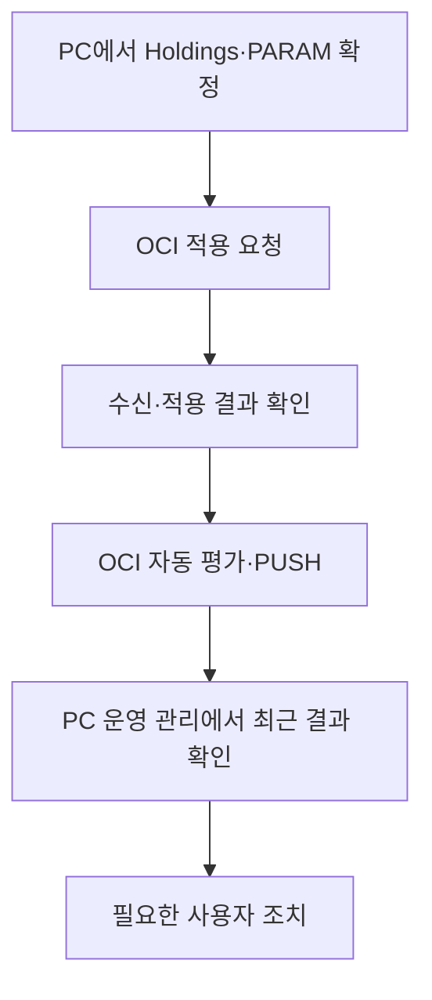
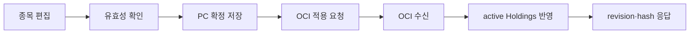
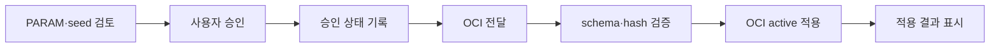

# 투자모델_v2 — PC 운영 연결·운영/진단 화면 분리 통합 설계 v1

- 작성일: 2026-08-05
- 문서 성격: 통합 설계서
- 상태: `DRAFT_FOR_REVIEW`
- 기준 문서: `PROGRAM_TRUTH.md` 조사 결과 및 2026-08-05 사용자 OCI 실측
- 개발 단위: 하나의 통합 개발
- 내부 구현 순서: 개발자가 승인된 범위 안에서 자율적으로 분할

---

## 0. 설계 판정

이번 작업은 고장 난 OCI 운영을 복구하는 작업이 아니다.

2026-08-05 사용자 실측을 기준으로 다음은 이미 `RUNTIME_VERIFIED · OPERATING`이다.

- OCI crontab 활성
- 07:20 시장 데이터 배치
- Market 08:00 PUSH
- Holdings 09:15 / 12:30 / 15:40 PUSH
- Spike 조건 실행
- Holdings 35종목 평가 로그
- Telegram 실제 발송 및 사용자 수신

따라서 이번 설계의 출발점은 다음과 같다.

> 정상 운영 중인 OCI 자동 운영은 그대로 보존한다.  
> PC의 잔여 연결을 완성하고, 실제 운영 기능과 시험·진단·미연결 기능을 화면 수준에서 분리한다.

이번 설계는 여러 개의 작은 Step으로 다시 나누지 않는다.

```text
통합 설계 1회
→ 개발자가 내부 작업 순서를 나눠 구현
→ 통합 검증 1회
→ 실제 사용 중 발견된 결함 보완
```

별도 `POC3-07A`, `POC3-07B` 같은 설계·PASS 게이트를 만들지 않는다.

---

## 1. 먼저 바로잡아 고정할 사실

### 1.1 OCI 자동 운영

OCI 자동 운영과 Telegram 발송은 미확인이나 복구 대상이 아니다. 현재 정상 운영 중이다.

소스에 crontab 설정 파일이 없거나 배포 revision이 확인되지 않았다는 사실은 관찰성·형상관리 문제다. 이를 근거로 실제 운영을 `RUNTIME_UNVERIFIED`로 되돌리지 않는다.

### 1.2 KOSPI

2026-08-05 KOSPI 실제 종가는 `6,598.26`이다.

따라서 `PROGRAM_TRUTH.md`에 남아 있는 “6,600대이므로 실제 KOSPI 스케일이 아니다”라는 판단은 폐기한다. 현재 증거만으로 KOSPI 적재를 데이터 품질 결함이나 별도 복구 대상으로 분류하지 않는다.

이번 작업에서는 다음만 유지한다.

- 기준일과 값의 출처 표시
- 종가와 장중가 구분
- 서로 다른 기준일을 한 시점처럼 합치지 않음

KOSPI 수집 source·산식·DB를 이번 작업에서 변경하지 않는다.

### 1.3 PC와 OCI의 책임

장비에 코드가 존재하는지만으로 책임 충돌을 판정하지 않는다. 목적을 기준으로 구분한다.

| 구분 | PC | OCI |
|---|---|---|
| 사용자 판단용 조회 | 수행 가능 | 운영 artifact 제공 가능 |
| Market Discovery 갱신 | 수행 가능 | 자동 PUSH 운영과 별개 |
| 보유 종목 판단용 현재가 조회 | 수행 가능 | 정식 운영 평가에도 별도 사용 |
| Holdings·PARAM 확정 | 공식 책임 | 수신·적용 |
| 자동 시세 최신화·평가 | 보조 조회일 뿐 운영 권위 아님 | 공식 운영 책임 |
| 자동 Telegram 발송 | 공식 경로 아님 | 공식 운영 책임 |
| 운영 성공·실패 기록 | 조회·표시 | 생성·보존 |

PC의 판단용 시세 조회 자체는 결함이 아니다. 다만 PC 조회값을 OCI 운영 결과처럼 표시하거나 PC에서 정식 Telegram 발송을 수행하는 것은 금지한다.

### 1.4 소스 존재와 PC 동작 여부

공유 함수·API·컴포넌트가 소스에 있다는 사실과 PC 운영 화면에서 정상 사용할 수 있다는 사실을 구분한다.

- 실제로 사용 가능한 운영 기능만 운영 화면에 둔다.
- 연결되지 않았거나 검증용인 기능은 별도 진단 화면으로 옮긴다.
- MOCK·placeholder를 정상 상태처럼 표시하지 않는다.
- 비활성 버튼으로 운영 기능이 있는 것처럼 꾸미지 않는다.

---

## 2. 현재 문제

현재 프로그램은 OCI 자동 운영은 정상이나 PC 쪽에 다음 문제가 남아 있다.

1. Holdings를 PC에 저장한 뒤 OCI에 반영됐는지 사용자가 같은 흐름에서 알 수 없다.
2. PARAM·seed를 확정한 뒤 OCI 전달·적용 여부가 화면 밖 수동 절차에 의존한다.
3. OCI의 최근 배치·평가·PUSH 성공 시각과 실패 원인을 PC에서 확인할 수 없다.
4. `oci_runtime_status_latest.json`의 오래된 시각과 실제 최신 cron 로그가 함께 존재해 어느 기록을 봐야 하는지 불명확하다.
5. 정식 runtime runner와 package fallback runner가 함께 남아 공식 운영 진입점이 하나로 고정되지 않았다.
6. PC 배포 revision과 OCI 배포 revision을 화면이나 운영 상태에서 확인할 수 없다.
7. 승인·알림 화면에 실제 운영, 수동 미리보기, 샘플 생성, 개발·테스트 기능이 섞여 있다.
8. `data_status`에는 진단 정보와 placeholder가 함께 있고 정상 운영 메뉴 안에 놓여 있다.
9. 기존 대시보드·고아 컴포넌트·미사용 API 후보가 정상 운영 기능과 같은 정보 구조 안에 남아 있다.
10. PC 소스의 Telegram 발송 가능성과 OCI 정식 발송 경계가 화면에서 명확하지 않다.

이 문제를 그대로 두면 사용자는 다음을 구분할 수 없다.

- 저장만 된 것인지 OCI에 적용된 것인지
- 실제 자동 운영 결과인지 PC 미리보기인지
- 정상 운영 기능인지 개발·테스트 기능인지
- 실패한 것인지 아직 확인하지 않은 것인지

---

## 3. 이번 통합 개발의 단일 목표

> 정상 운영 중인 OCI 자동 경로를 훼손하지 않고, PC에서 Holdings·PARAM의 OCI 반영과 OCI 운영 결과를 실제로 확인할 수 있게 하며, 운영 화면에서 시험·진단·MOCK·LEGACY 기능을 완전히 분리한다.

완료 후 사용자는 PC에서 다음 흐름을 수행할 수 있어야 한다.



동시에 정상 운영 화면에는 아래 항목이 없어야 한다.

- 샘플 데이터 생성
- 테스트용 PUSH 생성
- Telegram 시험 발송
- placeholder 카드
- raw JSON·artifact 경로
- 개발자 확인용 버튼
- 연결되지 않은 버튼
- LEGACY 화면 진입점

---

## 4. 변경 범위

### 4.1 포함

- PC 운영 화면과 진단·시험 화면의 정보구조 분리
- Holdings 저장·승인·OCI 적용 상태 연결
- PARAM·seed 승인·OCI 적용 상태 연결
- OCI 운영 상태를 PC에서 읽는 조회 경로
- OCI job별 최신 상태 기록 정규화
- PC·OCI 활성 revision과 적용 artifact hash 표시
- 정식 OCI runner 고정 및 fallback 경로 격리
- 정상 운영 메뉴에서 MOCK·LEGACY·테스트 기능 제거
- 현재 `PROGRAM_TRUTH.md`의 잘못된 판정 정정
- 현재 운영 절차와 사용자 조치 문구 정리

### 4.2 유지

- 현재 OCI crontab 실행 시각
- 현재 자동 Market·Holdings·Spike 운영
- 현재 Telegram 수신 계약
- 인간 최종 판단
- fail-closed·freshness·중복 발송 방지
- 기존 시장 데이터 DB와 Holdings·PARAM의 의미
- Market Discovery·Workbench·Holdings evidence 기능
- 정보 PUSH와 투자 판단 승인의 역할 분리

### 4.3 제외

- 신규 투자 알고리즘
- 신규 factor·label·threshold
- ML 학습·백테스트·튜닝
- 신규 외부 데이터 source
- 자동 BUY·SELL·리밸런싱·주문
- Telegram 메시지 내용·발송 시간·발송 횟수 변경
- 전체 디자인 시스템 교체
- 중앙 로그 플랫폼이나 별도 모니터링 제품 도입
- OCI 배포 자동화 체계 전면 개편
- KOSPI 적재 복구 또는 재수집

---

## 5. 화면 정보구조

화면은 세 종류로 구분한다.

| 종류 | 목적 | 허용 기능 |
|---|---|---|
| 판단·업무 화면 | 사용자가 실제 투자 판단과 자료 관리를 수행 | 실제 조회·저장·승인·적용 |
| 운영 관리 화면 | OCI 적용 상태와 자동 운영 결과 확인 | 실제 상태 조회, 실패 확인, 정식 재시도 진입 |
| 진단·시험 화면 | 연결 전 기능·개발 점검·MOCK·LEGACY 관리 | 진단 조회, 명시적 테스트, 미연결 상태 설명 |

### 5.1 정상 판단·업무 화면

다음 화면은 정상 운영 메뉴에 유지한다.

| 화면 | 유지 역할 | 금지되는 혼입 |
|---|---|---|
| 오늘의 투자 점검 | 오늘 볼 시장·보유·데이터 예외 요약 | 테스트 실행, raw status, MOCK 정상 표시 |
| ETF 비교하기 | 후보·보유·근거 비교 | 데이터 생성용 샘플 버튼 |
| 요즘 잘 오르는 ETF | PC 판단용 시장 조회·갱신 | OCI 자동 배치 제어 |
| ETF 구성종목 | 구성종목·중복률·NAV 상세 | source 시험 버튼 |
| AI 투자 세션 | AI 답변·사용자 판단 기록 | 자동 매매 제안 |
| 보유 현황 | PC 판단용 평가 조회 | OCI 평가인 것처럼 표시 |
| 종목 관리 | Holdings 편집·확정·OCI 적용 | 단순 저장을 OCI 적용 성공으로 표시 |
| 확인 근거 | 보유 종목 evidence 조회 | 진단 raw JSON |
| 승인·적용 | 실제 판단 초안 또는 PARAM의 승인·OCI 적용 | 정보 PUSH 테스트·샘플 생성 |

정상 화면은 실제 데이터 계약이 없는 영역을 만들지 않는다. 제공할 값이 없으면 기능 카드를 유지한 채 `준비 중`으로 두는 것이 아니라 해당 운영 영역에서 제거하고 진단 화면의 `미연결 기능` 목록으로 옮긴다.

### 5.2 운영 관리 화면 — 신규 독립 화면

메뉴명은 `운영 관리`로 한다. 이 화면은 테스트 화면이 아니라 실제 운영 상태를 확인하는 사용자 화면이다.

기본 노출 순서는 다음과 같다.

#### A. 전체 운영 상태

- `정상` / `주의` / `실패` / `확인 불가`
- OCI 상태 기준 시각
- PC 배포 revision
- OCI 배포 revision
- 마지막 상태 조회 성공 시각
- 다음 사용자 조치 한 줄

`확인 불가`를 `실패`로 바꾸지 않는다. 상태 조회 실패와 OCI job 실패를 분리한다.

#### B. 적용 상태

Holdings와 PARAM을 별도 행으로 표시한다.

| 표시 항목 | 의미 |
|---|---|
| PC 확정 revision | PC에서 마지막으로 확정한 버전 |
| PC content hash | 확정 artifact 식별값 |
| OCI 적용 revision/hash | OCI가 현재 사용 중이라고 확인한 값 |
| 상태 | 일치 / PC만 변경 / 전달 중 / 적용 실패 / 확인 불가 |
| 적용 시각 | OCI가 실제 active로 반영한 시각 |
| 사용자 조치 | 해당 관리 화면 이동 또는 오류 확인 |

운영 관리 화면에서 Holdings나 PARAM을 다시 편집하지 않는다. 편집·승인·적용의 공식 진입점은 각각 `종목 관리`, `승인·적용` 한 곳으로 유지한다.

#### C. OCI 자동 작업 상태

다음 job을 서로 덮어쓰지 않는 독립 행으로 표시한다.

- 시장 데이터 배치
- Market PUSH
- Holdings PUSH 오전
- Holdings PUSH 점심
- Holdings PUSH 장 마감 전
- Spike 감시·발송

각 행의 기본 노출값은 다음과 같다.

- 최근 시작 시각
- 최근 종료 시각
- 사용 데이터 기준일
- 처리 상태
- 처리 종목 수 또는 대상 수
- Telegram 발송 여부
- 중복 방지로 생략됐는지 여부
- 실패 단계와 사용자용 오류 요약

정상 행은 한 줄로 압축한다. 실패·stale·확인 불가 행을 위로 올린다. stack trace, 원격 경로, token, raw payload는 기본 화면에 노출하지 않는다.

#### D. 최근 이상과 필요한 조치

- 최근 실패 또는 stale만 기본 노출
- 설정 오류, 전달 실패, 데이터 freshness 실패, Telegram 실패를 구분
- 사용자가 조치할 수 없는 내부 오류에는 가짜 재시도 버튼을 두지 않음
- 재시도가 실제 정식 운영 동작인 경우에만 버튼 제공
- 재시도 버튼이 Telegram 중복 발송 가능성을 만들면 제공 금지

### 5.3 진단·시험 화면 — 신규 독립 화면

메뉴명은 `진단·시험`으로 한다. 정상 업무 메뉴와 시각적으로 분리된 마지막 관리 그룹에 둔다.

이 화면의 목적은 다음 세 가지다.

1. 현재 PC에서 연결되지 않은 기능의 위치와 상태 관리
2. 개발·검증용 기능 격리
3. MOCK·LEGACY·ORPHANED 후보의 가시화

화면은 아래 네 영역으로 구성한다.

#### A. 미연결 기능

각 항목은 다음만 표시한다.

- 기능명
- 기대 역할
- 현재 단절 지점
- 마지막 확인일
- 상태: `UNAVAILABLE` / `RUNTIME_UNVERIFIED` / `CONNECTED_BUT_BROKEN`
- 정상 운영 화면에 노출되지 않는 이유

연결되지 않은 기능에는 실행 버튼을 두지 않는다.

#### B. 진단 도구

- 현재 `DataStatusView`의 실제 진단 정보
- side effect가 없는 source·freshness·artifact 상태 조회
- 개발·검증용 상세 정보
- 필요 시 raw 값 펼치기

진단 화면 진입만으로 refresh, SSH/SCP, OCI job, Telegram 발송이 실행되면 안 된다.

#### C. 시험 기능

- 샘플 draft 생성
- 수동 미리보기
- 개발 호환성 확인

시험 기능은 실제 운영 결과와 다른 표시 체계를 사용한다. 결과에는 반드시 `TEST` 또는 `PREVIEW`를 표시한다.

PC에서 Telegram production channel로 직접 시험 발송하는 기능은 제공하지 않는다. Telegram 연결 확인은 OCI의 최근 실제 발송 결과를 읽는 방식으로 한다.

#### D. LEGACY·ORPHANED 관리

- 기존 대시보드
- `_orphaned/*` 컴포넌트
- 미사용 API 후보
- 오래된 backup artifact
- fallback runner

정상 메뉴로 직접 이동시키지 않는다. 사용 여부·소스 참조 여부·차단 상태만 관리한다.

### 5.4 메뉴 재배치

| 현재 항목 | 변경 후 위치 | 판단 |
|---|---|---|
| `today_check` | 정상 업무 유지 | 운영 요약만 표시 |
| `workbench` | 정상 업무 유지 | 변경 없음 |
| `market_discovery` | 정상 업무 유지 | PC 판단용 갱신임을 명시 |
| `holdings` | 정상 업무 유지 | PC 판단용 가격임을 명시 |
| `holdings_manage` | 정상 업무 유지 | 저장·OCI 적용 상태 연결 |
| `holdings_evidence` | 정상 업무 유지 | 변경 없음 |
| `approval` | `승인·적용`으로 역할 축소 | 실제 승인·적용만 유지 |
| `data_status` | `진단·시험`으로 흡수 | 정상 업무 메뉴에서 제거 |
| `dashboard` | LEGACY 관리 영역 | 정상 메뉴에서 제거 |
| `SampleDraftQuickButton` | 시험 기능 영역 | 정상 화면에서 제거 |
| Market/Spike 수동 draft preview | 시험 기능 영역 | 자동 PUSH 상태와 분리 |
| OCI 최근 실행 결과 | `운영 관리` | 실제 운영 조회 |

### 5.5 정상 화면 공통 동작

- 화면 진입은 읽기만 수행한다.
- OCI job·Telegram·SCP 같은 외부 부수효과를 자동 실행하지 않는다.
- 운영 상태 조회 실패 시 마지막 성공값을 현재값처럼 표시하지 않는다.
- 마지막 성공값을 보여줄 경우 `마지막 확인 시각`과 `현재 확인 불가`를 함께 표시한다.
- 내부 식별자·경로·raw JSON은 기본 숨김으로 둔다.
- 오류는 사용자가 할 수 있는 조치가 있을 때만 행동 버튼을 제공한다.
- 정상 화면에서 `테스트`, `샘플`, `임시`, `mock`, `developer` 기능을 제공하지 않는다.

---

## 6. Holdings 확정 → OCI 적용 설계

### 6.1 사용자 흐름



기본 동작은 `저장하고 OCI에 적용` 한 흐름으로 제공한다.

단, 저장과 원격 적용의 실제 상태는 분리해 기록한다. 원격 적용 실패를 숨기기 위해 PC 저장을 되돌리거나, PC 저장 성공을 OCI 적용 성공으로 표시하면 안 된다.

### 6.2 상태

| 상태 | 의미 | 화면 표현 |
|---|---|---|
| `PC_SAVED` | PC 저장 완료, OCI 적용 전 | OCI 미반영 |
| `TRANSFER_PENDING` | 전송 또는 적용 확인 중 | 적용 중 |
| `OCI_APPLIED` | OCI active hash와 일치 | 적용 완료 |
| `OUT_OF_SYNC` | PC와 OCI hash 불일치 | OCI 반영 필요 |
| `APPLY_FAILED` | 전송·검증·적용 실패 | 실패 단계와 조치 |
| `UNKNOWN` | OCI 상태 확인 불가 | 확인 불가 |

### 6.3 필수 계약

- PC 확정 revision
- canonical content hash
- PC 저장 시각
- OCI 수신 시각
- OCI 적용 시각
- OCI active revision/hash
- 적용 상태
- 실패 단계와 안전한 오류 코드

OCI는 받은 파일의 hash를 검증한 뒤 active로 반영한다. 불완전한 파일을 active 파일 위에 바로 덮어쓰지 않는다.

### 6.4 실패 처리

- PC 저장 성공 + OCI 적용 실패를 한 개의 성공 toast로 합치지 않는다.
- OCI 적용 실패 후 기존 OCI active Holdings는 유지한다.
- 중간 파일은 active로 승격하지 않는다.
- 재시도는 동일 revision/hash에 대해 idempotent해야 한다.
- Holdings 변경만으로 Telegram을 즉시 발송하지 않는다. 다음 정식 scheduler가 반영된 Holdings를 사용한다.

---

## 7. PARAM·seed 승인 → OCI 적용 설계

### 7.1 권위

- PC의 승인 이력과 active 상태 권위: 기존 `runtime_state.sqlite`
- OCI 전달물: 승인된 active PARAM의 불변 JSON projection
- OCI 실제 사용값: 전달받아 검증 후 active로 승격된 JSON

OCI에 PC의 SQLite 파일 자체를 복제하는 것을 완료 조건으로 삼지 않는다. 따라서 OCI의 `runtime_state.sqlite`가 0바이트였다는 관측은, OCI runner가 승인된 JSON projection을 정상 사용한다면 운영 결함이 아니다.

### 7.2 사용자 흐름



### 7.3 화면 원칙

- 현재 승인값과 변경 예정값의 차이를 먼저 보여준다.
- 승인 버튼과 OCI 적용 결과를 같은 카드 안에서 이어서 보여준다.
- `승인됨`과 `OCI 적용됨`을 별도 상태로 표시한다.
- PARAM을 변경하지 않은 평상시에는 반복 전송을 요구하지 않는다.
- OCI active revision/hash가 PC approved revision/hash와 다르면 `OUT_OF_SYNC`로 표시한다.

### 7.4 실패 처리

- schema 검증 실패 시 기존 OCI active PARAM 유지
- hash 불일치 시 적용 금지
- 전송 실패를 승인 취소로 바꾸지 않음
- 재시도 시 같은 승인 revision을 다시 생성하지 않음
- 적용 성공 전에는 `운영 반영 완료` 문구 금지

---

## 8. OCI 운영 상태 계약

### 8.1 목적

현재의 단일 오래된 status 파일 때문에 실제 최신 cron 실행과 화면 상태가 어긋나지 않도록, job별 최신 상태를 하나의 운영 조회 계약으로 제공한다.

이는 새로운 모니터링 시스템이 아니라 기존 로그·status artifact를 사용자 화면에서 안전하게 읽기 위한 최소 계약이다.

### 8.2 필수 필드

| 범주 | 필드 |
|---|---|
| 문서 | schema version, generated_at, OCI deployed revision |
| job 식별 | job kind, schedule slot 또는 trigger kind |
| 실행 | last_started_at, last_finished_at, status |
| 데이터 | data_as_of, freshness status, 대상 수 |
| Telegram | attempted, sent, skipped_duplicate, message id의 비민감 식별값 |
| 적용값 | active Holdings revision/hash, active PARAM revision/hash |
| 오류 | failed_stage, error_code, 사용자용 요약 |

### 8.3 상태 의미

- `SUCCESS`: 해당 job의 최신 실행이 정상 종료
- `SKIPPED_DUPLICATE`: 중복 방지 정책으로 정상 생략
- `SKIPPED_NO_TRIGGER`: Spike 등 조건 미충족으로 정상 생략
- `FAILED`: job 실행 실패
- `STALE`: 기대 갱신 시각을 지났으나 새로운 완료 기록 없음
- `UNKNOWN`: PC가 현재 OCI 상태를 확인하지 못함

`SKIPPED_DUPLICATE`와 `SKIPPED_NO_TRIGGER`를 실패로 표시하지 않는다.

### 8.4 기록 원칙

- Market·Holdings 각 슬롯·Spike 상태가 서로의 기록을 덮어쓰지 않는다.
- job 시작 시각과 완료 시각을 구분한다.
- Telegram 발송 성공과 job 전체 성공을 구분한다.
- status artifact 갱신 실패가 실제 Telegram 발송 성공을 지워버리지 않도록 로그와 결과를 분리한다.
- token, chat id, 개인 보유 상세, private payload를 상태 계약에 넣지 않는다.
- 현재 로그의 `private_fields_exposed` 의미를 소스에서 확인하고, 운영 상태에는 민감정보 값이 아닌 안전한 boolean 또는 제거된 결과만 남긴다.

### 8.5 PC 조회

- PC 화면 진입 시 상태 조회
- 사용자 `새로고침` 시 상태만 다시 조회
- 조회 동작은 OCI job이나 Telegram을 실행하지 않음
- 연결 실패 시 마지막 저장값과 현재 연결 실패를 함께 표시
- PC 캐시만으로 OCI가 정상이라고 단정하지 않음

---

## 9. 정식 runner와 fallback 정리

### 9.1 공식 경로

`run_three_push_runtime_oci.py`를 정식 운영 runner로 고정한다.

현재 crontab과 실제 발송이 이 경로를 사용한다는 사실을 개발 시작 시 실제 OCI 기준으로 다시 기록한다. 확인 결과가 다르면 임의 교체하지 않고 중단 조건에 따라 보고한다.

### 9.2 fallback 경로

`run_three_push_oci.py`는 다음 조건으로 격리한다.

- crontab에서 호출 금지
- 정상 운영 메뉴에서 실행 금지
- 자동 fallback 금지
- 진단·복구용으로 유지할 필요가 입증된 경우에만 `DIAGNOSTIC`으로 보존
- 소비자와 복구 절차가 없으면 `LEGACY` 후보로 기록

fallback runner가 실패 시 자동으로 실행되어 Telegram을 중복 발송하는 구조를 만들지 않는다.

### 9.3 스케줄 기록

저장소의 crontab 문서에서 `DRAFT`처럼 오해를 만드는 상태를 제거하고, 아래를 구분해 기록한다.

- 승인된 스케줄
- 2026-08-05 OCI 실측 스케줄
- 현재 OCI 배포 revision
- 마지막 확인일
- 적용 방법이 수동인지 자동인지

저장소 문서가 OCI 호스트 설정을 자동으로 변경하는 것처럼 표현하지 않는다.

---

## 10. 승인·정보 PUSH·시험 기능 분리

### 10.1 실제 승인·적용

정상 `승인·적용` 화면에는 다음만 둔다.

- 실제 사용자 판단 초안이 존재할 때의 검토·승인·기각
- 실제 PARAM·seed 승인과 OCI 적용
- 적용 결과와 실패 상태

기존 `push_kind`가 Market·Holdings·Spike 정보 PUSH만 나타낸다면 이를 투자 판단 초안으로 재분류하지 않는다.

실제 판단 초안을 식별하는 계약이 없다면 정상 화면에 빈 승인 카드를 만들지 않고, 해당 기능을 `미연결 기능`으로 진단 화면에 기록한다.

### 10.2 자동 정보 PUSH

Market·Holdings·Spike는 OCI scheduler가 수행하는 정보 알림이다.

- 정상 화면에서는 최근 실행 결과만 조회
- 사용자 승인 대기 목록에 넣지 않음
- 수동 draft 생성 버튼을 운영 실행처럼 표시하지 않음
- 자동 PUSH를 PC에서 다시 발송하지 않음

### 10.3 미리보기·샘플

다음은 모두 `진단·시험` 화면으로 이동한다.

- `SampleDraftQuickButton`
- Market PUSH 수동 draft 생성
- Spike PUSH 수동 draft 생성
- Holdings PUSH 수동 preview
- 개발 호환성 점검

미리보기 결과는 `PREVIEW`로 표시하고 운영 run·실제 발송 결과와 같은 목록에 합치지 않는다.

---

## 11. 운영 화면에서 제거할 상태와 표현

### 11.1 제거 대상

- `placeholder-card`
- 샘플 데이터로 채운 정상 상태
- 기능이 없는 비활성 실행 버튼
- 실제 조회 근거 없는 `정상`, `운영 중`, `최신`
- 테스트용 manual send
- raw status JSON
- artifact 절대 경로
- 환경변수명과 secret 존재 여부의 상세
- LEGACY 대시보드 메뉴

### 11.2 허용되는 unavailable 표현

정상 화면에서 필수 데이터가 일시적으로 없을 때는 다음만 허용한다.

- `확인 불가`
- 마지막 정상 확인 시각
- 사용자에게 미치는 영향
- 실제 조치가 있을 때의 이동 링크

장기간 연결되지 않은 기능 자체는 정상 화면에서 제거하고 진단 화면으로 옮긴다.

---

## 12. API·데이터 변경 원칙

이번 목표를 위해 최소 API와 상태 계약 추가는 허용한다. 과거의 `신규 API 금지`를 이유로 필수 종단 연결을 막지 않는다.

허용 범위는 다음뿐이다.

- Holdings OCI 적용 요청과 결과 조회
- PARAM·seed OCI 적용 요청과 결과 조회
- OCI 운영 상태 조회
- PC·OCI revision 및 active hash 조회

금지 범위는 다음과 같다.

- 신규 시장 데이터 source
- 신규 투자 지표
- 신규 주문·매매 API
- 범용 원격 실행 API
- UI에서 임의 shell 명령을 전달하는 API
- Telegram 임의 메시지 발송 API

원격 실행은 정해진 resource와 정해진 action만 허용한다. 사용자가 입력한 shell command, 경로, 원격 명령을 그대로 실행하는 구조는 금지한다.

---

## 13. 보안·실패 경계

- SSH key, Telegram token, chat id를 frontend에 전달하지 않는다.
- Backend 응답과 status artifact에 secret 값을 넣지 않는다.
- 오류 메시지는 내부 경로·명령·credential을 마스킹한다.
- OCI 적용은 임시 파일 수신 → schema/hash 검증 → atomic active 승격 순서로 처리한다.
- 기존 active Holdings·PARAM은 새 적용 성공 전까지 유지한다.
- 상태 조회 실패가 OCI 자동 운영을 중단시키면 안 된다.
- PC 화면 오류가 OCI cron을 비활성화하면 안 된다.
- 진단 화면 진입이 운영 데이터·DB·artifact를 변경하면 안 된다.
- 중복 발송 가능성이 있는 수동 재실행은 정상 화면에 제공하지 않는다.

---

## 14. 문서와 상태 갱신

통합 개발 완료 시 다음 문서를 갱신한다.

### `docs/PROGRAM_TRUTH.md`

- OCI 자동 운영을 `RUNTIME_VERIFIED · OPERATING`으로 유지
- KOSPI 스케일 오류 판단 삭제
- PC 판단용 시세 조회와 OCI 운영용 시세 평가의 목적 구분
- PC에 공유 발송 함수가 존재한다는 사실만으로 PC 정식 발송 경로라고 단정한 표현 정정
- Holdings·PARAM 적용 경로와 상태 계약 반영
- 운영 관리·진단 화면 분리 반영
- 정식/fallback runner 분류 반영
- PC·OCI 실제 배포 revision 반영

### `docs/STATE_LATEST.md`

- 이번 통합 개발의 실제 완료 상태
- OCI 기존 운영 보존 여부
- Holdings·PARAM 적용 검증 상태
- 운영 관리 화면 검증 상태
- 남은 런타임 gap

### `docs/backlog/BACKLOG.md`

- 실제로 이번 범위 밖에 남긴 항목만 기록
- 이번 작업에서 완료한 과거 잔여항목은 제거 또는 완료 표시

`PROGRAM_TRUTH.md`의 새 버전 파일을 별도로 만들지 않고 기존 파일을 갱신한다.

---

## 15. 완료 기준 AC

### 운영 기준선

- **AC-1**: OCI의 기존 Market·Holdings·Spike 스케줄과 Telegram 발송 계약이 변경되지 않는다.
- **AC-2**: 개발 후 OCI 자동 운영이 기존 시간표대로 계속 실행되고 실제 Telegram 수신이 유지된다.
- **AC-3**: PC 화면 진입·상태 조회·진단 화면 진입이 OCI job 또는 Telegram을 자동 실행하지 않는다.

### Holdings·PARAM 적용

- **AC-4**: Holdings 변경 후 PC 저장 revision/hash와 OCI active revision/hash를 구분해 확인할 수 있다.
- **AC-5**: Holdings 적용 성공 시에만 `OCI 적용 완료`로 표시된다.
- **AC-6**: Holdings 적용 실패 시 기존 OCI active Holdings가 유지되고 실패 단계가 표시된다.
- **AC-7**: PARAM·seed의 `승인됨`과 `OCI 적용됨` 상태가 분리된다.
- **AC-8**: PARAM 적용 성공 시 PC approved hash와 OCI active hash가 일치한다.
- **AC-9**: 동일 revision 재시도가 중복 revision이나 중복 운영 동작을 만들지 않는다.

### 운영 상태

- **AC-10**: PC 운영 관리 화면에서 PC·OCI 배포 revision을 확인할 수 있다.
- **AC-11**: 시장 배치·Market PUSH·Holdings 3슬롯·Spike의 최근 상태가 서로 독립적으로 표시된다.
- **AC-12**: 실제 최신 cron 실행이 존재할 때 오래된 단일 status 파일 때문에 전체 운영이 stale로 오표시되지 않는다.
- **AC-13**: `SUCCESS`, 정상 생략, `FAILED`, `STALE`, `UNKNOWN`이 구분된다.
- **AC-14**: 실패 단계와 사용자가 가능한 조치가 표시되며, 조치할 수 없는 오류에 가짜 버튼이 없다.
- **AC-15**: 운영 상태 응답과 화면에 token·chat id·민감 payload가 노출되지 않는다.

### 화면 분리

- **AC-16**: 정상 업무 메뉴에 샘플·테스트·MOCK·placeholder·LEGACY 기능이 없다.
- **AC-17**: `data_status`의 진단 기능은 별도 `진단·시험` 화면으로 이동한다.
- **AC-18**: 기존 대시보드는 정상 메뉴에서 제거되고 LEGACY 관리 대상으로 분류된다.
- **AC-19**: 수동 PUSH draft·샘플 생성·미리보기는 실제 자동 PUSH 상태와 분리된다.
- **AC-20**: 연결되지 않은 기능은 정상 화면의 비활성 카드가 아니라 진단 화면의 미연결 목록에서 관리된다.
- **AC-21**: PC에서 production Telegram 직접 발송 버튼이나 API를 제공하지 않는다.
- **AC-22**: 정상 화면의 모든 실행 버튼은 실제 동작하고 결과 상태를 확인할 수 있다.

### 데이터 의미와 문서

- **AC-23**: PC 판단용 가격과 OCI 운영 평가용 가격의 기준일·용도가 구분된다.
- **AC-24**: KOSPI 6,600대라는 이유만으로 데이터 품질 오류를 표시하거나 재수집하지 않는다.
- **AC-25**: 정식 OCI runner가 하나로 고정되고 fallback은 cron·정상 UI에서 호출되지 않는다.
- **AC-26**: OCI의 0바이트 `runtime_state.sqlite`가 실제 운영 입력이 아니라면 운영 결함 목록에서 제거되고, 실제 PARAM 입력 artifact가 명시된다.
- **AC-27**: `GET /runs` 등 미사용 후보는 실제 consumer 확인 후 운영·진단·LEGACY 중 하나로 분류되며 가짜 UI를 만들지 않는다.
- **AC-28**: `PROGRAM_TRUTH.md`, `STATE_LATEST.md`, 필요한 BACKLOG가 실제 구현·실측과 일치하게 갱신된다.

### 사용자 과업

- **AC-29**: 사용자는 종목 관리 화면에서 Holdings를 확정하고 OCI 적용 결과까지 확인할 수 있다.
- **AC-30**: 사용자는 PARAM·seed를 승인하고 OCI 적용 결과까지 확인할 수 있다.
- **AC-31**: 사용자는 운영 관리 화면에서 마지막 자동 운영 결과와 실패 원인을 확인할 수 있다.
- **AC-32**: 사용자는 정상 운영 기능과 진단·시험 기능을 메뉴와 화면만 보고 구분할 수 있다.
- **AC-33**: 실제 데이터가 표시된 PC 화면과 OCI·Telegram 실측에서 위 과업이 종단으로 확인되기 전에는 통합 개발을 완료로 판정하지 않는다.

---

## 16. 중단 조건

개발자가 아래 사실을 확인하면 정책을 임의로 바꾸지 않고 설계자에게 보고한다.

- 실제 OCI crontab이 `run_three_push_runtime_oci.py`가 아닌 다른 운영 runner를 사용함
- PC와 OCI 배포본 차이 때문에 어느 소스가 운영본인지 판정할 수 없음
- Holdings 또는 PARAM 적용을 위해 기존 운영 데이터를 삭제·변환해야 함
- 기존 active artifact를 보존한 atomic 적용이 불가능함
- 상태 조회 연결이 Telegram 중복 발송이나 cron 중단을 유발함
- 실제 판단 초안과 정보 PUSH를 구분할 source field가 없음에도 정상 승인 화면에 둘 중 하나를 임의 분류해야 함
- credential 처리 경계를 frontend 또는 사용자 입력 shell로 확장해야 함
- 현재 정상 Telegram 발송 계약을 변경해야만 구현 가능함

함수명, helper 위치, 컴포넌트 분리, 내부 호출 순서는 같은 계약 안에서 개발자가 결정한다.

---

## 17. BACKLOG

### 17.1 실시간 push 방식의 운영 상태 갱신

이 항목은 이번 범위에 넣으면 모니터링 구조가 커지므로 BACKLOG로 넘긴다.  
보류 사유: 화면 진입 조회와 수동 새로고침으로 현재 목표를 충족할 수 있다.  
보류된 위험: PC 화면을 계속 열어둔 경우 최신 상태 반영이 늦을 수 있다.  
재검토 트리거: 사용자가 장중 상시 모니터링 화면을 실제로 운영하게 될 때.

### 17.2 중앙 로그 수집·장기 이력 분석

이 항목은 이번 범위에 넣으면 별도 운영 플랫폼이 필요하므로 BACKLOG로 넘긴다.  
보류 사유: 이번 목표는 최근 성공·실패와 사용자 조치 확인이다.  
보류된 위험: 장기간 장애 패턴 분석은 제한된다.  
재검토 트리거: 반복 장애의 원인 분석에 최근 status와 OCI 로그만으로 부족할 때.

### 17.3 OCI 배포 자동화 전면 구축

이 항목은 이번 범위에 넣으면 배포 체계 전체 변경으로 커지므로 BACKLOG로 넘긴다.  
보류 사유: 이번에는 실제 PC·OCI revision 식별과 표시까지만 필요하다.  
보류된 위험: 사람이 배포한 설정과 저장소 문서가 다시 어긋날 수 있다.  
재검토 트리거: revision 불일치가 반복되거나 배포 누락이 실제 운영 장애를 만들 때.

---

## 18. 최종 완료 판정

이번 통합 개발의 완료 상태는 다음 세 가지로만 판정한다.

- `INTEGRATED_COMPLETE`
  - AC-1~AC-33 충족
  - OCI 기존 자동 운영 보존
  - Holdings·PARAM 적용과 운영 상태 조회 종단 확인
  - 운영·진단 화면 분리 완료

- `INTEGRATED_COMPLETE_WITH_DECLARED_RUNTIME_GAP`
  - 소스·화면·계약은 완료됐으나 사용자가 허용한 특정 OCI 실측만 남음
  - 남은 항목·영향·확인 방법이 명시됨
  - 핵심 적용 또는 Telegram 보존이 미확인이라면 이 상태를 사용할 수 없음

- `BLOCKED`
  - 중단 조건 때문에 핵심 종단 연결이나 기존 OCI 운영 보존을 보장할 수 없음

작은 내부 작업 하나가 끝났다는 이유로 중간 PASS를 선언하지 않는다. 최종 판정은 실제 PC → OCI → 자동 운영 결과까지 한 번에 본 뒤 내린다.

---

문서 끝.
