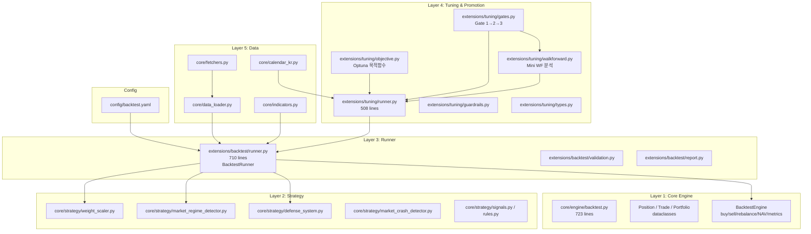
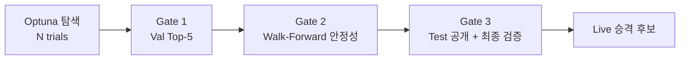

# Legacy Backtest Engine 전수 분석

> **목적:** `_archive/legacy_20260102/` 에 보관된 백테스트 엔진의 아키텍처·코드·의존성·데이터 흐름을 분석하여, 다른 AI(Gemini) 또는 개발자가 새 모듈러 아키텍처(`app/`)로 마이그레이션하거나 재구축할 때 필요한 모든 맥락을 제공합니다.

---

## 1. 현재 상태 요약

| 구분 | 상태 |
|---|---|
| **활성 코드 (`app/`, `backend/`)** | 백테스트 엔진 **0개** 파일. `reports/backtest/latest/backtest_result.json`은 36줄짜리 하드코딩 Mock |
| **아카이브 (`_archive/legacy_20260102/`)** | **완전한 백테스트 인프라** 존재 (엔진 + 전략 + 튜닝 + 게이트 + Walk-Forward) |
| **문서 (`docs/`)** | `python -m app.run_backtest` 참조하지만 해당 모듈 미존재 (유령 명령어) |

---

## 2. 아키텍처 개요



---

## 3. Layer 1: Core Engine (`core/engine/backtest.py`)

**파일:** `_archive/legacy_20260102/core/engine/backtest.py` (723 lines)

### 3.1 데이터 클래스

| 클래스 | 역할 | 주요 필드 |
|---|---|---|
| `Position` | 개별 포지션 | `symbol`, `quantity`, `entry_price`, `entry_date`, `current_price` |
| `Trade` | 거래 기록 | `date`, `symbol`, `action(BUY/SELL)`, `quantity`, `price`, `commission`, `tax`, `slippage`, `realized_pnl` |
| `Portfolio` | 포트폴리오 상태 | `cash`, `positions: Dict[str, Position]`, `trades: List[Trade]` |

### 3.2 BacktestEngine 클래스

**생성자 파라미터:**
```python
BacktestEngine(
    initial_capital=10_000_000,    # 초기 자본(1천만원)
    commission_rate=0.00015,       # 수수료율 0.015%
    slippage_rate=0.001,           # 슬리피지 0.1%
    max_positions=10,              # 최대 보유 종목
    rebalance_frequency="daily",   # 리밸런싱 주기
    rebalance_threshold=0.01,      # 리밸런싱 임계값 1%
    instrument_type="etf",         # 상품유형 (세율 결정)
    min_holding_days=0             # 최소 보유일
)
```

**핵심 메서드:**

| 메서드 | 역할 | 로직 요약 |
|---|---|---|
| `calculate_commission(amount)` | 수수료 계산 | `amount × commission_rate` |
| `calculate_slippage(price, action)` | 슬리피지 적용 | BUY: `price × (1+rate)`, SELL: `price × (1-rate)` |
| `can_buy(symbol, qty, price)` | 매수 가능 확인 | 최대 포지션 수 + 자금 여부 체크 |
| `execute_buy(...)` | 매수 실행 | 슬리피지 적용→평균단가 계산→Net/Gross 포트폴리오 동시 업데이트 |
| `execute_sell(...)` | 매도 실행 | 거래세(매도시만)→실현 손익 계산→포지션 청산 |
| `rebalance(target_weights, prices, date)` | 리밸런싱 | 비중 차이 > 임계값일 때 매수/매도, Best-Effort(자금부족 시 수량 조정), 미보유 종목 청산 |
| `update_nav(date, prices)` | NAV 업데이트 | Net + Gross 포트폴리오 양쪽 NAV 기록, Market Exposure 추적 |
| `get_performance_metrics()` | 성과 지표 계산 | 아래 표 참조 |
| `_check_engine_health(metrics)` | 헬스체크 | 변동성 0, 매도 없음, 비용 0 등 물리적 정합성 7개 항목 검증 |

**성과 지표 산출 공식:**

| 지표 | 공식 |
|---|---|
| CAGR | `((final/initial)^(1/years) - 1) × 100`, 달력일 기준 (365.25) |
| Sharpe | `mean(daily_returns) / std(daily_returns) × √252` |
| MDD | `abs(min(nav/cummax - 1)) × 100` (양수 반환) |
| Calmar | `CAGR / MDD` |
| Volatility | `std(daily_returns, ddof=1) × √252 × 100` |
| Win Rate (일별) | `count(daily_return > 0) / total_days × 100` |
| Win Rate (거래) | `winning_sell_trades / total_sell_trades × 100` |
| Cost Drag | `total_return_gross - total_return_net` |
| Exposure Ratio | `market_exposure_days / total_trading_days` |
| Yearly Stats | 연도별 수익률 + MDD 분해 |

**거래세율 테이블 (한국 시장):**

| 상품유형 | 세율 | 비고 |
|---|---|---|
| `stock` | 0.23% | 증권거래세 0.18% + 농특세 0.05% |
| `etf` | 0.0% | 면제 |
| `leveraged_etf` | 0.0% | 면제 |
| `reit` | 0.23% | 주식과 동일 |

---

## 4. Layer 2: Strategy (`core/strategy/`)

**9개 파일**, 전략 로직 전체를 구성:

| 파일 | 역할 |
|---|---|
| `weight_scaler.py` | 비중 스케일링 (RSI 스케일 → Regime 스케일 → 정규화) |
| `market_regime_detector.py` | 시장 레짐 감지 (Bull/Neutral/Bear) |
| `defense_system.py` | 방어 시스템 (포트폴리오/개별 Stop-Loss, 쿨다운) |
| `market_crash_detector.py` | 시장 폭락 감지 |
| `volatility_manager.py` | 변동성 관리 |
| `signals.py` | 매매 신호 생성 |
| `rules.py` | 매매 규칙 엔진 |
| `live_signal_generator.py` | 실시간 신호 생성기 |
| `us_market_monitor.py` | 미국 시장 모니터링 |

**비중 스케일링 파이프라인 (Runner에서 호출):**
```
① 모멘텀 스코어 기반 Equal Weight 할당
② RSI 기반 종목별 스케일링 (과매수 감소, 과매도 증가)
③ 시장 레짐 기반 전체 포지션 스케일링 (Bull:1.0, Neutral:0.8, Bear:0.5)
④ 정규화 (합 = 1.0)
```

---

## 5. Layer 3: Runner (`extensions/backtest/runner.py`)

**파일:** `_archive/legacy_20260102/extensions/backtest/runner.py` (710 lines)

### 5.1 BacktestRunner 클래스

**생성자:**
```python
BacktestRunner(
    initial_capital=10_000_000,
    commission_rate=0.00015,
    slippage_rate=0.001,
    max_positions=10,
    rebalance_frequency="daily",
    instrument_type="etf",
    enable_defense=True,
    min_holding_days=0
)
```

**핵심 메서드:**

| 메서드 | 역할 |
|---|---|
| `run(price_data, target_weights, start_date, end_date, ...)` | 백테스트 메인 루프 실행 |
| `_calculate_momentum_scores(price_data, date, lookback, rsi_period)` | 모멘텀 스코어 + RSI 계산 |
| `_calculate_rsi(close_prices, period)` | RSI 계산 (Wilder's Smoothing) |
| `_apply_rsi_scaling(weights, rsi_values, ...)` | RSI 기반 비중 조절 |
| `_get_rsi_exposure(rsi, oversold_boost)` | RSI→Exposure 계수 (0.0~1.2) |
| `run_batch(price_data, params_list, ...)` | 병렬 배치 실행 (`joblib`) |

**`run()` 메인 루프 파라미터:**
```python
run(
    price_data,                    # MultiIndex DataFrame (code, date)
    target_weights,                # Dict[str, float] — 유니버스로 활용
    start_date, end_date,
    lookback_days=60,              # 모멘텀 MA 룩백
    stop_loss=-0.10,               # 손절 비율
    take_profit=0.20,              # 익절 비율
    top_n=10,                      # Top-N 종목 수
    enable_rsi_scaling=True,       # RSI 스케일링 활성화
    rsi_period=14,                 # RSI 기간
    enable_regime_scaling=False,   # 레짐 스케일링
    market_index_data=None,        # KOSPI 지수 데이터
    regime_ma_short=50,            # 단기 MA
    regime_ma_long=200,            # 장기 MA
    adx_period=14,                 # ADX 기간
    adx_threshold=20.0             # ADX 임계값 (Chop Filter)
)
```

---

## 6. Layer 4: Tuning & Promotion (`extensions/tuning/`)

**12개 파일**, Optuna 기반 자동 파라미터 튜닝 + Live 승격 파이프라인:

### 6.1 핵심 데이터 타입 (`types.py`, 385 lines)

| 클래스 | 역할 |
|---|---|
| `BacktestMetrics` | 단일 구간 성과 지표 (sharpe, cagr, mdd, win_rate, exposure_ratio, 등) |
| `GuardrailChecks` | 가드레일 체크 결과 (min_trades≥30, min_exposure≥0.30, max_turnover≤24.0) |
| `LogicChecks` | RSI 실효성 검증 (실제로 영향을 줬는지) |
| `BacktestRunResult` | Train/Val/Test 분리 결과 — **Test는 튜닝 중 봉인** |
| `Period` | 기간 구조 (start, end, train, val, test 각각의 start/end) |
| `SplitConfig` | Train/Val/Test 분할 설정 (70/15/15, 최소 월수 제한) |
| `CostConfig` | 거래비용 설정 (편도 기준, `round_trip_cost` 프로퍼티) |
| `DataConfig` | 데이터 설정 (유니버스 코드 등) |

### 6.2 튜닝 실행 (`runner.py`, 508 lines)

**핵심 함수:**

```python
# 튜닝용 (Test 봉인)
run_backtest_for_tuning(
    params, start_date, end_date, lookback_months,
    trading_calendar, split_config, costs, data_config,
    use_cache=True, universe_codes=None, guardrail_config=None
) → BacktestRunResult

# 최종 보고서용 (Test 포함, Gate 2 통과 후만)
run_backtest_for_final(
    params, start_date, end_date, lookback_months,
    trading_calendar, split_config, costs, data_config, universe_codes
) → BacktestRunResult
```

**Train/Val/Test 분할:**
- Chronological split (시간순)
- 기본: Train 70%, Val 15%, Test 15%
- 최소 보장: Train 8개월, Val/Test 각 6개월
- **Test 봉인 원칙:** 튜닝(`run_backtest_for_tuning`) 시 Test 결과 `None`

**캐싱:**
- `extensions/tuning/cache.py`: 파라미터 해시 기반 메모리 캐시
- `compute_params_hash()`: 파라미터 → 결정론적 해시

### 6.3 Optuna 목적함수 (`objective.py`, 323 lines)

```python
TuningObjective(
    start_date, end_date, trading_calendar,
    lookbacks=[3, 6, 12],              # 멀티 룩백
    costs=CostConfig,
    param_ranges={...}                 # 파라미터 탐색 범위
)
```

**파라미터 탐색 범위 (config/backtest.yaml에서 로드):**

| 파라미터 | 범위 | 기본값 | 카테고리 |
|---|---|---|---|
| `ma_period` | 20~200 (step 10) | 60 | trend |
| `rsi_period` | 5~30 (step 1) | 14 | momentum |
| `stop_loss` | -20%~-5% (step 1) | -10% | risk |
| `volatility_filter` | 10~50 (step 5) | 25 | risk (비활성) |
| `rsi_overbought` | 60~90 (step 5) | 70 | momentum (비활성) |
| `rsi_oversold` | 10~40 (step 5) | 30 | momentum (비활성) |
| `rebalance_threshold` | 0.5~5.0% (step 0.5) | 1.0% | execution (비활성) |

**점수 결합 (멀티 룩백):**
- 방식: `min(scores)` 또는 `mean(scores) - std(scores)`
- 점수 공식: `Val_Sharpe - MDD_Penalty`

### 6.4 Live 승격 게이트 (`gates.py`, 526 lines)



| 게이트 | 조건 | 상세 |
|---|---|---|
| **Gate 1** | Val 기준 Top-N 선정 | Val Sharpe 상위 5개, 가드레일 통과 필수, 이상치(🔴) 없어야 함, params_hash 중복 제거 |
| **Gate 2** | Walk-Forward 안정성 | 3~5개 윈도우, `stability_score ≥ 1.0`, `win_rate ≥ 60%` |
| **Gate 3** | Test 공개 + 등록 | Gate 1+2 통과한 Trial만 Test 성과 공개, Live 후보로 등록 |

### 6.5 Walk-Forward 분석 (`walkforward.py`, 334 lines)

```python
MiniWalkForward(
    start_date, end_date, trading_calendar,
    train_months=12,
    val_months=3,
    outsample_months=3,
    stride_months=3
)
```

- 슬라이딩 윈도우: Train→Val→Outsample
- `stability_score = mean(outsample_sharpes) / (std + ε)`
- `win_rate = count(sharpe > 0) / total_windows`

### 6.6 가드레일 & 이상치 감지 (`guardrails.py`, 380 lines)

**가드레일 문턱:**

| 항목 | 조건 | 실패 코드 |
|---|---|---|
| 거래 수 | ≥ 30 | `LOW_TRADES` |
| Exposure 비율 | ≥ 30% | `LOW_EXPOSURE` |
| 연간 Turnover | ≤ 24회 | `HIGH_TURNOVER` |

**이상치 감지 (Anomaly Radar):**

| 항목 | 조건 | 심각도 |
|---|---|---|
| Sharpe 비정상 | 과도하게 높음 | 🔴 CRITICAL |
| CAGR 비정상 | 과도하게 높음 | 🔴 CRITICAL |
| MDD 비정상 | 너무 낮음 | 🟡 WARNING |

---

## 7. Layer 5: Data Infrastructure (`core/`)

| 파일 | 역할 | 비고 |
|---|---|---|
| `data_loader.py` | 가격 데이터 로더 | CSV/DB에서 MultiIndex DataFrame 생성 |
| `fetchers.py` | 외부 데이터 수집 | Naver/Yahoo Finance API |
| `indicators.py` | 기술적 지표 계산 | MA, RSI, ADX, Bollinger 등 |
| `calendar_kr.py` | 한국 거래일 캘린더 | 공휴일 제외 |
| `db.py` | SQLite DB 관리 | `data/backtest_history.db` |
| `metrics/performance.py` | 성과 계산 유틸리티 | |
| `risk/manager.py` | 리스크 관리 | |
| `risk/position.py` | 포지션 사이징 | |
| `risk/stop_loss_manager.py` | 손절 관리 | |

**가격 데이터 형식:**
```python
# MultiIndex DataFrame: (ticker_code, date) → price columns
# 컬럼: Open, High, Low, Close, Volume
price_data.loc["005930"]  # 삼성전자 전체 기간 가격
price_data.loc["005930", "2024-01-01":"2024-12-31"]  # 기간 필터
```

---

## 8. Config (`config/backtest.yaml`)

```yaml
backtest:
  default_start_date: '2022-01-01'
  default_end_date: '2025-11-30'
  initial_capital: 10000000
  max_positions: 10
  costs:
    korea:
      commission_rate: 0.00015
      slippage_rate: 0.001
      tax_rates: { stock: 0.0023, etf: 0.0, ... }
  regime_scaling:
    enabled: true
    position_ratios: { bull: 1.0, neutral: 0.8, bear: 0.5 }
  defense:
    enabled: true
    portfolio_stop_loss: -0.15
    individual_stop_loss: -0.10
    cooldown_days: 5
  split:
    train_ratio: 0.7
    val_ratio: 0.15
    test_ratio: 0.15
    min_train_days: 504  # ~2년
    min_val_days: 126    # ~6개월
    min_test_days: 126   # ~6개월
```

---

## 9. 실행 스크립트 (Phase 2)

`_archive/legacy_20260102/scripts/dev/phase2/` 에 실행 스크립트 존재:

| 스크립트 | 전략 |
|---|---|
| `run_backtest.py` | 기본 모멘텀 |
| `run_backtest_hybrid.py` | 하이브리드 (모멘텀 + RSI + 레짐) |
| `run_backtest_defense.py` | 방어 시스템 포함 |
| `run_backtest_crash_detection.py` | 폭락 감지 포함 |
| `run_backtest_volatility.py` | 변동성 관리 포함 |
| `run_backtest_krx_maps.py` | KRX 맵 어댑터 사용 |

**실행 진입점 (config/backtest.yaml):**
```yaml
execution:
  script_path: scripts/dev/phase2/run_backtest_hybrid.py
  local_only: true
  timeout: 3600  # 1시간
```

---

## 10. 의존성 목록

### Python 패키지
```
pandas        # DataFrame, 시계열 처리
numpy         # 수학 연산, 통계
optuna        # Bayesian 하이퍼파라미터 최적화
joblib        # 병렬 처리 (run_batch)
pyyaml        # YAML 설정 파싱
logging       # 로깅 (표준 라이브러리)
dataclasses   # 자료구조 (표준 라이브러리)
```

### 내부 모듈 의존 관계 (import 트리)
```
extensions/tuning/objective.py
  └── extensions/tuning/runner.py (run_backtest_for_tuning)
       └── extensions/tuning/split.py (create_period)
       └── extensions/tuning/cache.py (make_cache_key, get_global_cache)
       └── extensions/tuning/types.py (BacktestRunResult, CostConfig, ...)
       └── extensions/backtest/runner.py (BacktestRunner)
            └── core/engine/backtest.py (BacktestEngine)
            └── core/strategy/weight_scaler.py (WeightScaler)
  └── extensions/tuning/guardrails.py (check_guardrails, check_anomalies)

extensions/tuning/gates.py
  └── extensions/tuning/walkforward.py (MiniWalkForward)
  └── extensions/tuning/runner.py (run_backtest_for_final)
  └── extensions/tuning/guardrails.py
```

---

## 11. 전체 파이프라인 흐름 (End-to-End)

```
1. 데이터 수집 (fetchers.py → data_loader.py)
   → MultiIndex DataFrame (ticker, date → OHLCV)

2. 파라미터 탐색 (objective.py → Optuna)
   → N trials × M lookbacks (3,6,12개월)
   → 각 trial: run_backtest_for_tuning()
      → Train/Val split → BacktestRunner.run() → BacktestMetrics
      → Test 결과 = None (봉인)
   → 점수: Val_Sharpe - MDD_Penalty

3. Gate 1: Val Top-5 선정 (gates.py)
   → 가드레일 통과 + 이상치 없는 상위 5개

4. Gate 2: Walk-Forward 안정성 (walkforward.py)
   → 3~5 윈도우, stability_score ≥ 1.0, win_rate ≥ 60%

5. Gate 3: Test 공개 (gates.py → run_backtest_for_final)
   → Gate 1+2 통과 Trial만 Test 공개
   → Live 후보 등록

6. Live 적용
   → 확정 파라미터 → strategy_params_latest.json
   → 매일 실행: live_signal_generator.py
```

---

## 12. 마이그레이션 시 주의사항

### 12.1 반드시 유지해야 할 설계 원칙
1. **Test 봉인 원칙:** 튜닝 중 Test 데이터에 절대 접근 불가
2. **Fail-Closed:** 가드레일 미통과 = 탈락 (허용값 하향 조정 불가)
3. **Gross vs Net 추적:** 비용 차감 전/후 성과를 동시 기록하여 Cost Drag 측정
4. **헬스체크:** 변동성 0, 매도 없음, 비용 0 등 물리적 이상 감지
5. **결정론적 재현:** `compute_params_hash()` 기반 캐싱, 동일 파라미터 = 동일 결과

### 12.2 현재 아키텍처와의 갭
| 레거시 | 현재 모듈러 (`app/`) | 갭 |
|---|---|---|
| `core/data_loader.py` | `app/scoring/etf_scorer.py`의 가격 수집 | 부분적 대체 가능 |
| `core/engine/backtest.py` | **없음** | ❌ 핵심 – 새로 작성 필요 |
| `extensions/backtest/runner.py` | **없음** | ❌ 핵심 – 새로 작성 필요 |
| `extensions/tuning/*` | **없음** | ⚠️ Optuna 튜닝 없이 수동 파라미터 사용 중 |
| `config/backtest.yaml` | `state/guardrails/latest/guardrails_latest.json` | 부분적 중복 (execution guardrails만) |

### 12.3 세부 파일 목록 (마이그레이션 대상)

**필수 (Core):**
- `core/engine/backtest.py` (723 lines) — 엔진 본체
- `extensions/backtest/runner.py` (710 lines) — 전략 실행기
- `extensions/tuning/types.py` (385 lines) — 모든 자료구조 정의
- `extensions/tuning/runner.py` (508 lines) — 튜닝 실행기

**전략 (Strategy):**
- `core/strategy/weight_scaler.py` — 비중 스케일러
- `core/strategy/market_regime_detector.py` — 레짐 감지
- `core/strategy/defense_system.py` — 방어 시스템
- `core/strategy/signals.py` + `rules.py` — 신호/규칙

**품질 보증 (Quality):**
- `extensions/tuning/guardrails.py` (380 lines) — 가드레일
- `extensions/tuning/gates.py` (526 lines) — 승격 게이트
- `extensions/tuning/walkforward.py` (334 lines) — Walk-Forward
- `extensions/tuning/objective.py` (323 lines) — Optuna 목적함수

**인프라 (Infra):**
- `core/data_loader.py` — 데이터 로더
- `core/indicators.py` — 기술적 지표
- `core/calendar_kr.py` — 한국 거래일
- `config/backtest.yaml` — 설정
