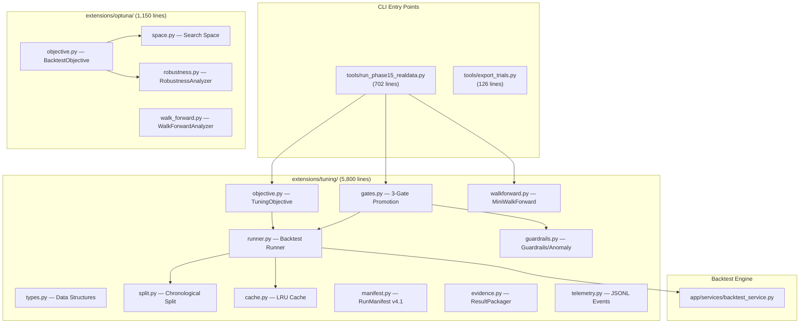
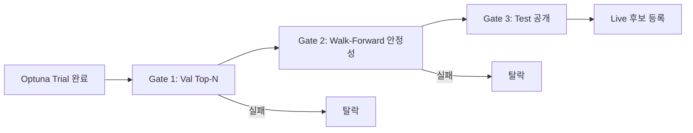

# Legacy Optuna Tuning Subsystem — Deep Analysis

> **Source**: `_archive/legacy_20260102/`  
> **Analyzed**: 2026-02-24  
> **Total Lines**: ~8,300+ across 22 source files, 13 tests, 2 CLI tools

---

## 1. Executive Summary

아카이브에는 **Optuna 기반 하이퍼파라미터 최적화 파이프라인**이 완전한 형태로 보존되어 있다. 단순한 그리드 서치가 아닌, **3-Gate 승격 체계**, **Multi-Lookback 평가**, **Walk-Forward 안정성 검증**, **로버스트니스 분석**, 그리고 **Telemetry/Evidence 인프라**까지 갖춘 프로덕션급 시스템이다.

### Key Metrics

| 항목 | 값 |
|---|---|
| Source Files | 22 (`extensions/optuna/` 5 + `extensions/tuning/` 12 + tools 2 + services 2 + entry 1) |
| Total Lines | ~8,300+ |
| Test Files | 13 (`tests/tuning/`) |
| Tuning Docs | 6 (`docs/tuning/00~05`) |
| Optuna DB Files | 44 (`data/tuning_runs/`) |
| Legacy Guide | `docs/guides/optuna.md` |

---

## 2. Architecture Overview



---

## 3. Package Breakdown

### 3.1 `extensions/optuna/` — 순수 Optuna 래퍼 (5 files, ~1,150 lines)

이 패키지는 Optuna API를 직접 래핑한 초기 구현체이다. `extensions/tuning/`이 이를 대체/강화한 v2.1 구현이다.

#### `space.py` (79 lines) — 하이퍼파라미터 검색 공간

| Function | Parameters | Range |
|---|---|---|
| `suggest_strategy_params()` | `ma_period` | 20~120 (step 10) |
| | `rsi_period` | 7~21 (step 2) |
| | `rsi_overbought` | 65~80 (step 5) |
| | `maps_buy_threshold` | -2.0~5.0 |
| | `maps_sell_threshold` | -10.0~-2.0 |
| | `rebalance_frequency` | weekly/biweekly/monthly |
| | `max_positions` | 5~20 (step 5) |
| | `min_confidence` | 0.0~0.3 |
| `suggest_risk_params()` | `portfolio_vol_target` | 0.08~0.20 |
| | `max_drawdown_threshold` | -0.25~-0.10 |
| | `cooldown_days` | 3~10 |
| | `max_correlation` | 0.5~0.85 |

#### `objective.py` (169 lines) — 백테스트 목적함수

**목적함수 공식**: `annual_return - λ · MDD` (기본 λ=2.0)

- 데이터를 `__init__`에서 1회 로드 (유니버스 + 가격 데이터)
- Trial 메타데이터: `annual_return`, `mdd`, `sharpe`, `total_return`, `volatility`, `win_rate`

#### `robustness.py` (357 lines) — 5가지 로버스트니스 테스트

| Test | 설명 | Iterations |
|---|---|---|
| Seed Variation | 시드만 바꿔서 결과 변동 측정 | 30 |
| Sample Drop | 데이터 5~20% 무작위 삭제 | 4 × 10 |
| Bootstrap | 복원 추출로 데이터 재구성 | 30 |
| Commission Sensitivity | 수수료 0%~0.05% 변화 | 5 |
| Slippage Sensitivity | 슬리피지 0%~0.5% 변화 | 5 |

출력: CSV 파일 + 95% 신뢰구간 로그

#### `walk_forward.py` (290 lines) — Walk-Forward 분석

- **Window Types**: `sliding` (고정 창), `expanding` (확장 창)
- 각 윈도우: Train 기간 Optuna 최적화 → Test 기간 검증
- 출력: 평균 검증 수익률, 평균 Sharpe, 승률

---

### 3.2 `extensions/tuning/` — 프로덕션 튜닝 체계 v2.1 (12 files, ~5,800 lines)

아카이브의 핵심. 모든 `docs/tuning/00~05` 문서에 대응하는 엄격한 구현.

#### `types.py` (385 lines) — 핵심 자료구조

| Dataclass | 역할 |
|---|---|
| `BacktestMetrics` | Sharpe, CAGR, MDD, 총수익률, 변동성, Calmar, 거래수, 승률, 노출비율, 연간 회전율, 신호일수, 주문수 |
| `GuardrailChecks` | 거래 ≥30, 노출 ≥30%, 회전율 ≤24 (`.passed`, `.failures`, `.failure_codes`) |
| `LogicChecks` | RSI 실효성 검증 (비중 조절 영향 일수 ≥ 10) |
| `DebugInfo` | 룩백/캐시/파라미터 추적 (params_hash, period_signature, effective_eval_start) |
| `BacktestRunResult` | Train/Val/Test 메트릭 + 가드레일 + 디버그 (Test 봉인 원칙) |
| `Period` | start/end + Train/Val/Test 기간 딕셔너리 |
| `SplitConfig` | Train 70% / Val 15% / Test 15% (최소 8/6/6개월) |
| `CostConfig` | 수수료 0.015% + 슬리피지 0.1% (편도) |
| `DataConfig` | 유니버스/가격/배당/상폐 설정 + 재현성 해시 |

```
상수:
- LOOKBACK_TRADING_DAYS: {3: 63, 6: 126, 12: 252}
- ANOMALY_THRESHOLDS: Sharpe > 5.0, CAGR > 100%, Trades < 30, Exposure < 30%
```

#### `split.py` (266 lines) — 시계열 분할

- **`snap_start()`**: 휴장일 → 다음 영업일
- **`snap_end()`**: 휴장일 → 이전 영업일
- **`calculate_split()`**: 최소개월 우선 (16개월 미만 거부, 20개월 미만 예외 모드 4/4/n)
- **`create_period()`**: Train/Val/Test `Period` 구조 생성

#### `objective.py` (323 lines) — Optuna 목적함수 v2.1

핵심 혁신: **Multi-Lookback Scoring**

```
final_score = combine([score_3M, score_6M, score_12M])
  - Option A (기본): min(scores) — 최악 구간 기준
  - Option B: mean - k·std — 균형형
```

- `calculate_score()`: `Val_Sharpe - max(0, |MDD| - 0.15) × 10`
- 중복 파라미터 자동 Prune (`params_hash` 추적)
- 가드레일 + 이상치 → 즉시 `-999.0` 반환

#### `runner.py` (508 lines) — 백테스트 실행기

- **`_run_single_backtest()`**: `BacktestService.run()` 호출 → `BacktestMetrics` 변환
  - Phase 3 Sanity Check: 거래 > 0인데 노출 0.0이면 `ValueError` 발생
- **`run_backtest_for_tuning()`**: Train + Val (Test 봉인)
  - Phase 2.2: Trailing Evaluation — Val 끝에서 `lookback_months`만큼만 평가
  - 캐시 키: params + lookback + period + costs + data_config 복합 해시
  - Invariant Check: result invalid인데 reason 없으면 CRITICAL dump + crash
- **`run_backtest_for_final()`**: Train + Val + **Test** (Gate 2 이후에만)

#### `gates.py` (526 lines) — 3-Gate 승격 체계



| Gate | 조건 | 비고 |
|---|---|---|
| Gate 1 | Val Sharpe Top-N + 가드레일 + 이상치 + MDD 일관성 + RSI 실효성 | `skip_*` flag는 TEST_MODE에서만 허용 |
| Gate 2 | stability_score ≥ 1.0, win_rate ≥ 60% | Walk-Forward 3~5 윈도우 |
| Gate 3 | Test 공개 + Val↓Test↑↑ 이상치 체크 | 항상 통과 (정보 제공 목적), 최종 선택은 수동 |

- `LivePromotionGate`: 후보 관리 + Gate 1→2→3 순차 실행
- `deduplicate_top_n_candidates()`: params_hash 기반 중복 제거
- 운영 허용 stage: `tuning, gate1_passed, gate2_passed, final` (`analysis`는 차단)

#### `guardrails.py` (380 lines) — 가드레일 + 이상치

| Type | Code | 조건 | Severity |
|---|---|---|---|
| Guardrail | `LOW_TRADES` | 거래 < 30 | Fail |
| Guardrail | `LOW_EXPOSURE` | 노출 < 30% | Fail |
| Guardrail | `HIGH_TURNOVER` | 연간 회전율 > 24 | Fail |
| Anomaly | `SHARPE_TOO_HIGH` | Sharpe > 5.0 | 🔴 Critical |
| Anomaly | `CAGR_TOO_HIGH` | CAGR > 100% | 🔴 Critical |
| Anomaly | `LOW_TRADES` | 거래 < 30 | 🟡 Warning |
| Anomaly | `LOW_EXPOSURE` | 노출 < 30% | 🟡 Warning |
| Anomaly | `VAL_TEST_DIVERGENCE` | Val Sharpe < 0 + Test > 1.5 | 🔴 Critical |

- `check_mdd_consistency()`: `|MDD_val| ≤ max(|MDD_train| × 1.2, 10%)`
- `aggregate_failure_reasons()`: 전체 시행에 대한 실패 사유 히스토그램
- `format_failure_summary()`: Top-N 실패 사유 출력

#### `walkforward.py` (334 lines) — 미니 Walk-Forward

- **윈도우 생성**: `generate_windows()` — Train/Val/Outsample 3구간, stride 이동
- **`MiniWalkForward.run()`**: 고정 파라미터로 각 윈도우 백테스트 실행
- **안정성 점수**: `mean_sharpe / (std_sharpe + 0.1)`
- **승률**: `Sharpe > 0인 윈도우 비율`
- **`to_gate2_format()`**: Gate 2 입력 형식 변환

#### `cache.py` (196 lines) — LRU 캐시

- 키: `params_hash + lookback + period범위 + costs + data_config` 복합 MD5
- `OrderedDict` 기반 LRU (max 1,000)
- 적중률 추적 (hits/misses)

#### `evidence.py` (475 lines) — 결과 보존

| Component | 역할 |
|---|---|
| `ResultPackager` | 3-layer safety net (정상 저장, excepthook, atexit) |
| `PreflightCheck` | Loader Authoritative Validation |
| `VerdictEngine` | 최종 판정 (PASS / WARN / FAIL) |
| `ReportGenerator` | 마크다운 리포트 생성 |

#### `telemetry.py` (430 lines) — 구조화 이벤트 로그

- JSONL 형식: `{ts, run_id, stage, event, severity, payload}`
- Singleton `TelemetryLogger` + 전역 편의 함수
- 이벤트: `RUN_START`, `TRIAL_END`, `GATE1_DECISION`, `WF_WINDOW_END`, `MANIFEST_SAVED` 등

#### `manifest.py` (500 lines) — RunManifest v4.1

| Section | Fields |
|---|---|
| Config | period, lookbacks, lookback_combination, trials, objective, split, guardrails, cost_assumptions |
| Data | universe_version, data_digest, universe_hash, sample_codes |
| Results | best_trial, all_trials_count, convergence_trial, search_coverage |
| Environment | code_version, python_version, optuna_version, random_seed |
| Engine Health | is_valid, warnings, data_quality |

---

## 4. CLI Tools

### `tools/run_phase15_realdata.py` (702 lines) — 메인 실행기

```
python -m tools.run_phase15_realdata \
    --runs 1 --trials 50 --seed 42 \
    --preset A --mode strict
```

- 3-Layer Safety Net: 정상 종료 + crash/exit hook으로 항상 결과 저장
- Loader Authoritative Preflight: 데이터 무결성 검증 후 시작
- Optuna TPE Sampler + SQLite Storage (`optuna.db`)
- Gate 1 → Mini Walk-Forward → Gate 2 → Gate 3 전체 파이프라인

### `tools/export_trials.py` (126 lines) — Trial 내보내기

```
python -m tools.export_trials --run-id <RUN_ID>
```

- Optuna SQLite → CSV + Top 3 마크다운 요약
- 실패 사유 통계 포함

---

## 5. Test Infrastructure (13 files)

| Test File | 검증 대상 |
|---|---|
| `test_smoke.py` | 전체 파이프라인 스모크 |
| `test_mini_tuning.py` | 미니 규모 전체 흐름 |
| `test_real_data_smoke.py` | 실제 데이터 5-trial 스모크 |
| `test_gate_e2e.py` | Gate 1→2→3 E2E 파이프라인 |
| `test_gate2_loop.py` | Gate 2 반복 안정성 |
| `test_replay_determinism.py` | 재현성 (같은 시드 → 같은 결과) |
| `test_cache_isolation.py` | 캐시 격리/무결성 |
| `test_lookback_effect_*` | 멀티 룩백 영향 검증 |
| `test_gate1_mdd_consistency_unit.py` | MDD 일관성 단위 테스트 |
| `test_logic_check_rsi_effect_unit.py` | RSI 실효성 단위 테스트 |

---

## 6. Tuning Run Data

`data/tuning_runs/` 에 44개의 실행 기록 보존:
- **기간**: 2025-12-27 ~ 2025-12-28 (2일간 집중 실행)
- **형식**: `real_YYYYMMDD_HHMMSS_<hash>/`
- **내용물**: `optuna.db`, `trials.csv`, `top3_candidates.md`, `run_manifest.json`, `telemetry.jsonl`

---

## 7. Migration Gap Analysis

### Active System (`app/backtest/`) vs Archive

| 기능 | Active (P164~P165) | Archive (Optuna/Tuning) |
|---|---|---|
| 단일 백테스트 | ✅ 완성 | ✅ 완성 |
| MDD/Sharpe 계산 | ✅ 보정 완료 (P165) | ✅ 자체 계산 |
| 하이퍼파라미터 최적화 | ❌ 없음 | ✅ Optuna TPE |
| Multi-Lookback | ❌ 없음 | ✅ 3/6/12M min 결합 |
| Walk-Forward | ❌ 없음 | ✅ 미니 WF (3-5 윈도우) |
| 3-Gate 승격 | ❌ 없음 | ✅ Gate 1→2→3 |
| 로버스트니스 분석 | ❌ 없음 | ✅ 5종 테스트 |
| 가드레일/이상치 | ❌ 없음 | ✅ 6종 가드레일 |
| 결과 보존 (Evidence) | ❌ 없음 | ✅ 3-layer safety |
| 텔레메트리 (JSONL) | ❌ 없음 | ✅ 구조화 이벤트 |
| Cockpit UI 연동 | ✅ 탭 존재 (P165) | ❌ 없음 |

### 마이그레이션 시 주의사항

> [!WARNING]
> - Archive 코드는 `core.*`, `infra.*` import를 사용 → `app.backtest.*`로 리매핑 필요
> - `extensions/tuning/runner.py`는 `app.services.backtest_service.BacktestService`를 직접 호출 → Active에서는 `app.backtest.engine` 사용
> - `extensions/optuna/`와 `extensions/tuning/`은 서로 독립적 구현 (optuna는 초기 버전, tuning은 v2.1)
> - 44개 Optuna DB 파일은 레거시 데이터로 마이그레이션 대상 아님

---

## 8. File Inventory

### `extensions/optuna/` (5 files)

| File | Lines | Description |
|---|---|---|
| `__init__.py` | 6 | Package init |
| `space.py` | 79 | 12-parameter search space (strategy + risk) |
| `objective.py` | 169 | `BacktestObjective`: annual_return - λ·MDD |
| `robustness.py` | 357 | `RobustnessAnalyzer`: 5 tests (seed/sample/bootstrap/cost) |
| `walk_forward.py` | 290 | `WalkForwardAnalyzer`: sliding/expanding window WF |

### `extensions/tuning/` (12 files)

| File | Lines | Description |
|---|---|---|
| `__init__.py` | 147 | Package facade (all exports) |
| `types.py` | 385 | Core dataclasses + constants |
| `runner.py` | 508 | `_run_single_backtest()` + `run_backtest_for_tuning()` + `run_backtest_for_final()` |
| `objective.py` | 323 | `TuningObjective` + `calculate_score()` |
| `gates.py` | 526 | `LivePromotionGate` + `check_gate1/2/3()` |
| `guardrails.py` | 380 | `check_guardrails()` + `check_anomalies()` + MDD/RSI checks |
| `walkforward.py` | 334 | `MiniWalkForward` + `generate_windows()` |
| `split.py` | 266 | `create_period()` + `snap_start/end()` |
| `cache.py` | 196 | `TuningCache` (LRU) + `make_cache_key()` |
| `manifest.py` | 500 | `RunManifest` v4.1 + CRUD |
| `evidence.py` | 475 | `ResultPackager` + `VerdictEngine` + `ReportGenerator` |
| `telemetry.py` | 430 | `TelemetryLogger` (JSONL) + event emitters |

### Tools & Services

| File | Lines | Description |
|---|---|---|
| `tools/run_phase15_realdata.py` | 702 | 메인 실행기 (E2E pipeline) |
| `tools/export_trials.py` | 126 | Trial CSV/MD 내보내기 |
| `app/services/tuning_service.py` | — | 튜닝 서비스 (API) |
| `app/services/tuning_analysis_service.py` | — | 분석 서비스 |

### Tests (13 files in `tests/tuning/`)

| File | Lines | Focus |
|---|---|---|
| `test_smoke.py` | 13,434 | Full pipeline smoke |
| `test_mini_tuning.py` | 15,896 | Mini-scale E2E |
| `test_real_data_smoke.py` | 12,695 | Real data 5-trial |
| `test_gate_e2e.py` | 17,104 | Gate 1→2→3 E2E |
| `test_gate2_loop.py` | 15,197 | Gate 2 stability loop |
| `test_replay_determinism.py` | 13,904 | Determinism verify |
| `test_cache_isolation.py` | 18,528 | Cache integrity |
| `test_lookback_effect_realistic.py` | 6,977 | Lookback effect |
| `test_lookback_effect_sanity.py` | 12,881 | Lookback sanity |
| `test_multilookback_affects_score.py` | 3,931 | Multi-lookback scoring |
| `test_gate1_mdd_consistency_unit.py` | 3,448 | MDD consistency unit |
| `test_logic_check_rsi_effect_unit.py` | 3,764 | RSI effect unit |
